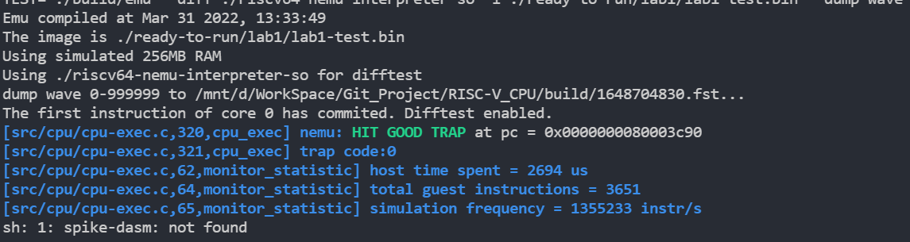
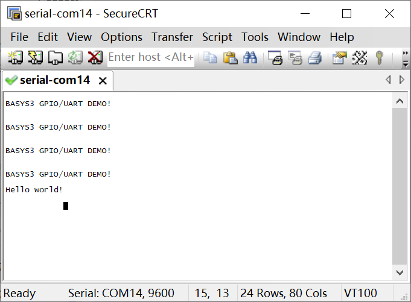

# RISC-V_CPU
计算机组成体系结构课程项目，本课程项目测试基于助教给出的测试框架，System Verilog源代码在`vsrc`文件夹中。

## 项目结构

RISC-V_CPU  
│── build：仿真测试时才会生成的目录  
│── difftest：仿真测试框架  
│── project-info：每次lab更新信息与实验文档  
│── ready-to-run：仿真测试文件目录  
│　　├── lab1：包含lab1相关的测试文件，需要关注其中的 .S 汇编文件  
│　　└── ...  
│── vivado  
│　　└── test1  
│　　　　　└── project：vivado项目工程目录  
│── vsrc：需要写的CPU代码所在目录  
│　　├── include：头文件目录  
│　　├── pipeline  
│　　　　　├── regfile：寄存器文件目录，寄存器组模块已给出  
│　　　　　├── execute：流水线执行阶段目录，alu模块已给出  
│　　　　　└── core.sv：五级流水线主体代码  
│　　├── ram：内存控制相关目录  
│　　├── util：访存接口相关目录  
│　　├── add_sources.tcl  
│　　├── mycpu_top_nodelay.sv：以下是项目头文件  
│　　├── mycpu_top.sv  
│　　├── SimTop.sv  
│　　└── VTop.sv  
│── xpm_memory：Xilinx的内存IP  
│── Makefile：仿真测试的命令汇总  
│── README.md: 此文件  

## lab1 RISC-V基本五级流水线
### 需要实现指令

addi xori ori andi lui jal beq ld sd add sub and or xor auipc jalr

利用转发和阻塞处理流水线导致的数据冒险与控制冒险。

### verilator仿真

共两个verilator仿真测试文件，`lab1a.S`与`lab1.S`，前者指令少，后者多了`R-type`的部分指令。

仿真操作：在Linux环境下，运行指令`make test-lab1`（或`make test-lab1a`）执行`lab1.S`（或`lab1a.S`）中的汇编指令。

通过指令`make test-lab1 VOPT="--dump-wave"`可生成此次仿真的波形图，默认在`build`文件夹下。

若通过仿真，会在终端输出`HIT GOOD TRAP`，此输出后伴随着报错，报错是因为后续指令问题，`lab1a.S`中指令提交到`3c90`即可。

verilator仿真结果：

### vivado仿真

vivado版本2018.3；

用vivado打开`vivado/test1/project/project_1.xpr`项目文件，然后运行两个`tcl`文件，文件位置：`vsrc/add_sources.tcl`与`vivado/src/add_sources.tcl`；运行方法：`Tools->run tcl scripts`；随后`Run Simulation`进行仿真。

仿真生成波形图后，点击上方**蓝色**三角（不是绿色），进行`run all`，若仿真通过，会在终端输出`Hello World!`。

vivado仿真结果：

### 上板验证

以上两个仿真通过后，在vivado中`Generate Bitstream`烧制bit流文件；（花费时间很长，在上述两个仿真通过后再进行）

连接实验板，并打开串口软件`SecureCRT`，点击快速连接（quick connect，也可以点击connect并找到串口参数）设置为串口（serial），波特率（Baud Rate）为9600，com端口（port）设置为电脑配置的端口后点击确定（电脑硬件配置的com端口可以在`我的电脑->属性->设备管理器`中查看）。

在vivado软件中点击`program device`，若验证成功，则可以在串口软件中看到`Hello World!`；若在vivado中先进行`program device`再打开串口软件，那么在串口软件后连接好后返回vivado界面，重新`program device`即可看到`Hello World!`。

上板串口显示结果：

