# lab 1中需要实现的指令与分析

## 一、需要实现的指令与具体功能

需要实现：addi xori ori andi lui jal beq ld sd add sub and or xor auipc jalr

指令的具体功能：

### 1、addi （I-type）

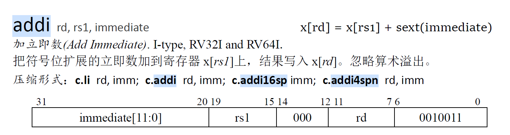

alu进行**加法运算**，结果写回寄存器rd，instruction[11 : 7]

立即数扩展：instruction[31 : 20]符号扩展作为加法运算一位加数；寄存器标号rs instruction[19 : 15]，读出regfile的数据作为加数

### 2、xori（I-type）

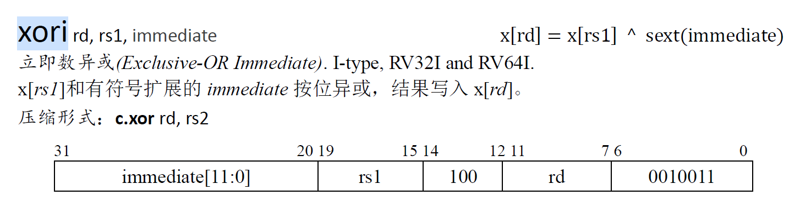

alu进行**异或运算**，结果写回寄存器rd，instruction[11 : 7]

立即数扩展：instruction[31 : 20]符号扩展作为一个运算数；寄存器标号rs instruction[19 : 15]，读出regfile的数据作为操作数2

### 3、ori（I-type）

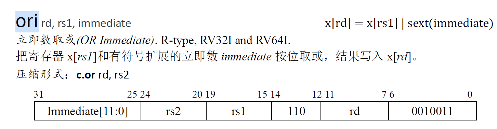

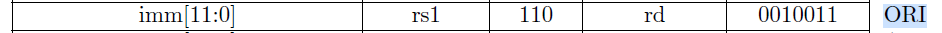

alu进行**或运算**，结果写回寄存器rd，instruction[11 : 7]

立即数扩展：instruction[31 : 20]符号扩展作为一个运算数；寄存器标号rs instruction[19 : 15]，读出regfile的数据作为操作数2

### 4、andi（I-type）

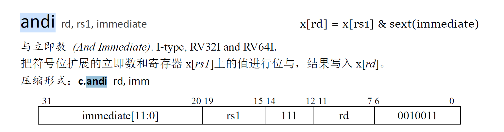

alu进行**与运算**，结果写回寄存器rd，instruction[11 : 7]

立即数扩展：instruction[31 : 20]共12位，符号扩展作为一个运算数；寄存器标号rs instruction[19 : 15]，读出regfile的数据作为操作数2

### 5、lui（U-type）


alu进行**UNKNOWN**运算，结果写回寄存器rd，instruction[11 : 7]

立即数扩展，instruction[21 : 12]共20位立即数，左移12位，低12位置0，高32位为符号扩展；

### 6、auipc （U-type）

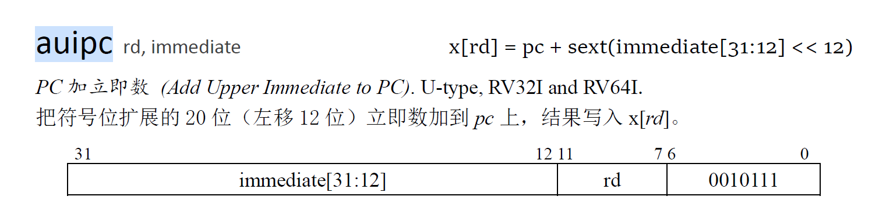

alu进行**加法**运算，结果写回寄存器rd，instruction[11 : 7]

立即数扩展，instruction[21 : 12]共20位立即数，左移12位，低12位置0，高32位为符号扩展；

将扩展后的64位立即数与64位pc相加，写回寄存器

### 7、add （R-type）

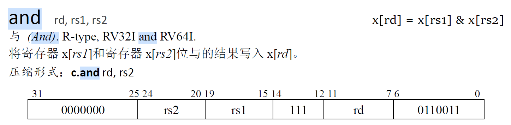

alu进行**加法**操作，结果写回寄存器；

### 8、sub （R-type）

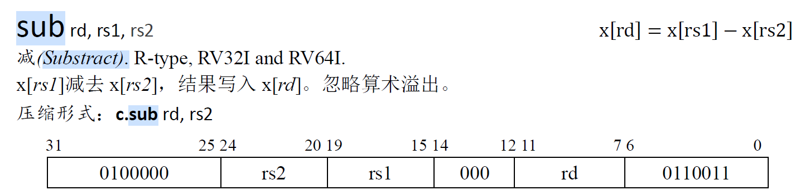

alu进行**减法**操作，结果写回寄存器；

### 9、and （R-type）

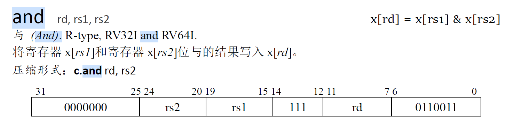

alu进行**与**操作，结果写回寄存器；

### 10、or （R-type）

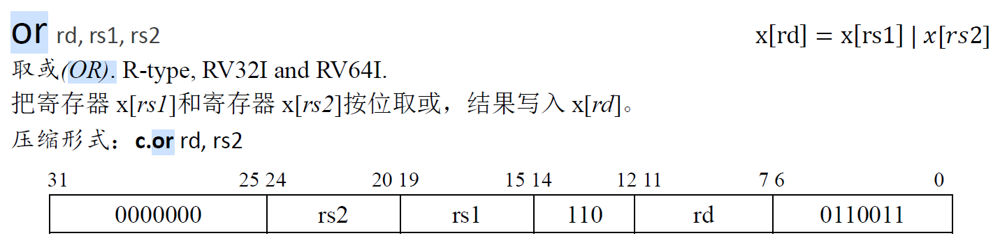

alu进行**或**操作，结果写回寄存器；

### 11、xor （R-type）

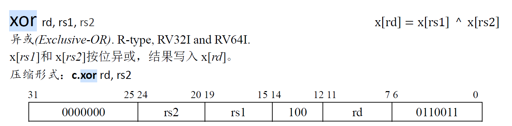

alu进行**异或**操作，结果写回寄存器；

### 12、ld （I-type）

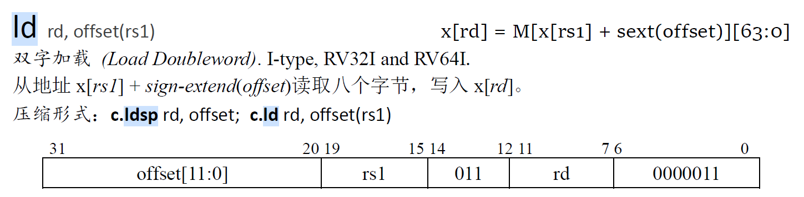

alu进行**加法**操作，结果（不是运算结果，而是访存结果）写回寄存器；

访存地址：从rs 1号instruction[19 : 15]寄存器中读取数据，和offset符号扩展后的结果相加（由alu完成）

### 13、sd （S-type）

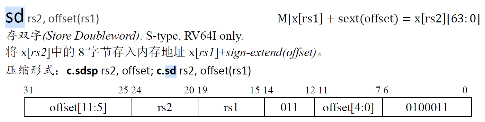

alu进行**加法**操作，结果不写回寄存器；

访存地址：从rs 1号（instruction[19 : 15]）寄存器中读取数据，与offset扩展后结果相加（由alu完成）

offset扩展：offset的[11 : 0]（12位）被打散在指令中，对应关系为：offset[11 : 5] = instruction[31 : 25]	offset[4 : 0] = instruction[11 : 7]

扩展后的offset为

```verilog
{
    { 52{instruction[31]} },			//offset[63 : 12]
    instruction[31 : 25],				//offset[11 : 5]
    instruction[11 : 7]					//offset[4 : 0]
}
```

写入内存的数据：rs 2号（instruction[24 : 20）寄存器中的数据

### 14、jal （J-type）

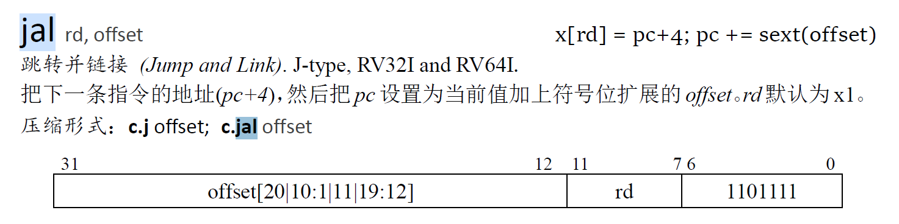

指令解释：有返回，无条件跳转指令；设置pc + 4为返回地址，存到寄存器rd中，instruction[11 : 7]；将pc跳转到pc + sext(offset)

offset值的20位 被打散存在instruction[31 : 12]位中，具体关系如下：

offset[20] = instruction[31]	offset[10 : 1] = instruction[30 : 21]	offset[11] = instruction[20]	offset[19 : 12] = instruction[19 : 12]

扩展后的offset（共64位）为：

```verilog
{ 
    {43{instruction[31]}}(符号扩展43位),  	//offset[63 : 21]
    instruction[31], 					  //offset[20]			
    instruction[19 : 12], 				  //offset[19 : 12]	
    instruction[20], 					  //offset[11]
    instruction[30 : 21], 				  //offset[10 : 1]
    0 									//offset[0]
}
```

alu进行**加**运算，结果写回寄存器rd，instruction[11 : 7]；

### 15、jalr（J-type）

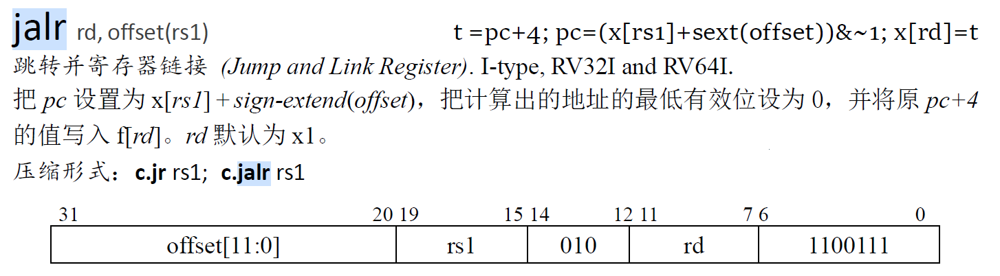

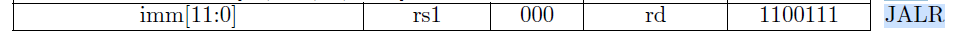

指令解释：有返回，无条件跳转指令；设置pc + 4为返回地址，存到寄存器rd中，instruction[11 : 7]；

将pc跳转到（pc + sext(offset)）& ~1；即计算得到的运算结果最低位取0；offset直接符号扩展即可；

### 16、beq （B-type）

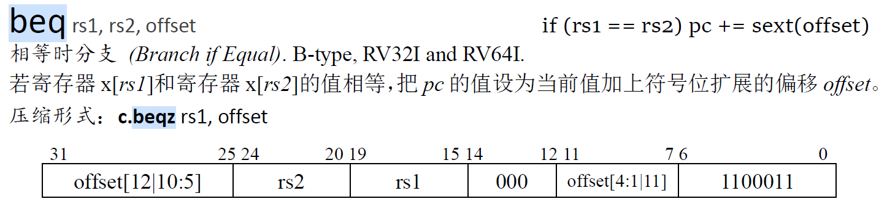

alu进行**equal**运算，结果不写回寄存器；

条件跳转，读取rs 1，instruction[19 : 15]与rs 2，instruction[24 : 20]寄存器的数据是否相等，相等则跳转pc，pc += sext(offset)

offset值的12位被打散存在instruction中，具体关系如下：

offset[12] = instruction[31]	offset[10 : 5] = instruction[30 : 25]	offset[4 : 1] = instruction[11 : 8]	offset[11] = instruction[7]

扩展后的offset为（共64位）：

```verilog
{
    {51{instruction[12]}},		//offset[63 : 13]
    instruction[31],		   //offset[12]
    instruction[7],			   //offset[11]
    instruction[30 : 25],       //offset[10 : 5]
    instruction[11 : 8],	    //offset[4 : 1]
    0						  //offset[0]
}
```

## 二、各流水段信号设计

流水线分为五个阶段：fetch（取指）、decode（译码）、excute（执行）、memory（访存）、writeback（写回）；

下面分析各阶段分别需要和产生什么信号（**暂不考虑流水线冲突问题**）：

### 1、fetch

fetch阶段需要得到pc的值并从指令存储器中取出instruction（32位）。

#### （1）输入端口信号

pc的可能取值：1、pc + 4 （正常执行）2、无条件跳转（jal、jalr）3、条件跳转（beq）

因此，fetch阶段需要pc的选择器控制信号：

​	1、是否进行无条件跳转	----	由decode阶段产生

​	2、是否进行条件跳转       ----	由excute阶段产生

同时，为了支持pc的跳转指令，fetch阶段需要跳转地址的信号，此次lab中需要实现的指令中只有jal，jalr与beq三条指令需跳转：

​	1、jal跳转：pc = pc + sext(immediate)；

​		pc和立即数扩展均在decode阶段完成，该指令的pc跳转地址信号可由decode阶段产生

​	2、jalr跳转：pc = ( x[rs1] + sext(immediate) ) & (~1)；

​		访问regfile与立即数扩展均在decode阶段完成，该指令的pc跳转地址可由decode阶段产生

​	3、beq跳转：pc = pc + sext(immediate)；

​		与jal指令计算方式相同，该指令的pc跳转地址可由decode阶段产生

因此，fetch阶段输入端口信号如下：

|               输入信号               |              产生信号的阶段               |
| :----------------------------------: | :---------------------------------------: |
|      jump（是否进行无条件跳转）      |          decode，译码后即可产生           |
|      b_jump（是否进行条件跳转）      |        excute，得到运算结果后产生         |
| j_add1（jal指令与beq指令跳转的地址） |       decode，进行立即数扩展后产生        |
|      j_add2（jalr指令跳转地址）      | decode，访问regfile并进行立即数扩展后产生 |

#### （2）输出端口信号

fetch阶段只需要计算得到正确的pc，并访问指令内存得到instruction即可；

因此，fetch阶段输出端口信号如下：

​	1、pc	----	指令地址

​	2、instruction	----	指令

### 2、decode

decode阶段需要进行如下操作：

1、对指令进行译码产生控制信号；2、从regfile中读取数据；3、进行立即数扩展，并计算跳转pc

（这里无需考虑是否需要跳转，是否跳转由特定控制信号控制，只需要将正确计算方式得到的pc算出即可；当跳转pc值有误时，说明该指令一定不是规定的跳转指令，会有控制信号将错误的pc值过滤掉；当特定的跳转信号成立时，说明**按跳转指令的格式**得到的**跳转pc计算方式**肯定是正确的）

#### （1）输入端口信号


#### （2）输出端口信号

