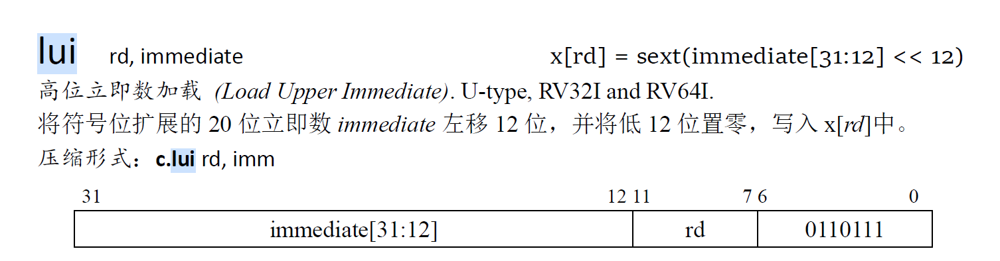
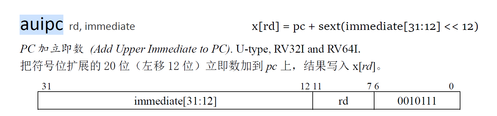
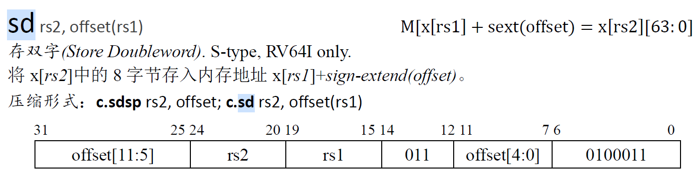

# lab 1分析与设计

lab 1最终需要实现一个基于RISC-V指令集的五级流水线cpu。

本次实验中我的思路为（此部分为实现完成后回述）：

​	首先分析待实现的指令，按照五级流水段划分的逻辑思路考虑指令在各阶段如何执行；

​	在对指令有一定了解后，结合指令需求分析各流水段依赖的信号，设计各级流水段的输入端口信号，并初步确定各级流水段的输出端口；

​	通过各模块输入端口信号依赖反推各级模块应该产生的输出信号；

​	综合信号在流水段间的产生与传输，确定各个模块的输出端口信号（此时端口基于单周期的数据通路设计），完成单周期实现；

​	确定流水线的数据部件结构为：五级流水段组合部件 + 流水寄存器部件；

​	分析流水寄存器连接后的流水线冒险与解决方式；

​	设计完善的流水寄存器（包括流水段之间的寄存器与处理冒险的寄存器）；

​	完成连线，实现完整的流水线cpu；

最终实现的五级流水线部件结构：

​	五级流水段的实现部件（基本组合逻辑），实现cpu的基本功能：

​		取指 ---- fetch，译码与访问regfile ---- decode，执行 ---- execute，访存 ---- memory，写回 ---- writeback

​	流水寄存器（时序逻辑，时钟上升沿触发），实现流水线数据传递与冒险处理：

​		

## 一、需要实现的指令与具体功能

需要实现：addi xori ori andi lui jal beq ld sd add sub and or xor auipc jalr

指令的具体功能：

### 1、addi （I-type）


alu进行**加法运算**，结果写回寄存器rd，instruction[11 : 7]

立即数扩展：instruction[31 : 20]符号扩展作为加法运算一位加数；寄存器标号rs instruction[19 : 15]，读出regfile的数据作为加数

### 2、xori（I-type）


alu进行**异或运算**，结果写回寄存器rd，instruction[11 : 7]

立即数扩展：instruction[31 : 20]符号扩展作为一个运算数；寄存器标号rs instruction[19 : 15]，读出regfile的数据作为操作数2

### 3、ori（I-type）


alu进行**或运算**，结果写回寄存器rd，instruction[11 : 7]

立即数扩展：instruction[31 : 20]符号扩展作为一个运算数；寄存器标号rs instruction[19 : 15]，读出regfile的数据作为操作数2

### 4、andi（I-type）


alu进行**与运算**，结果写回寄存器rd，instruction[11 : 7]

立即数扩展：instruction[31 : 20]共12位，符号扩展作为一个运算数；寄存器标号rs instruction[19 : 15]，读出regfile的数据作为操作数2

### 5、lui（U-type）



alu进行**UNKNOWN**运算，结果写回寄存器rd，instruction[11 : 7]

立即数扩展，instruction[21 : 12]共20位立即数，左移12位，低12位置0，高32位为符号扩展；

### 6、auipc （U-type）



alu进行**加法**运算，结果写回寄存器rd，instruction[11 : 7]

立即数扩展，instruction[21 : 12]共20位立即数，左移12位，低12位置0，高32位为符号扩展；

将扩展后的64位立即数与64位pc相加，写回寄存器

### 7、add （R-type）


alu进行**加法**操作，结果写回寄存器；

### 8、sub （R-type）


alu进行**减法**操作，结果写回寄存器；

### 9、and （R-type）


alu进行**与**操作，结果写回寄存器；

### 10、or （R-type）


alu进行**或**操作，结果写回寄存器；

### 11、xor （R-type）


alu进行**异或**操作，结果写回寄存器；

### 12、ld （I-type）


alu进行**加法**操作，结果（不是运算结果，而是访存结果）写回寄存器；

访存地址：从rs 1号instruction[19 : 15]寄存器中读取数据，和offset符号扩展后的结果相加（由alu完成）

### 13、sd （S-type）



alu进行**加法**操作，结果不写回寄存器；

访存地址：从rs 1号（instruction[19 : 15]）寄存器中读取数据，与offset扩展后结果相加（由alu完成）

offset扩展：offset的[11 : 0]（12位）被打散在指令中，对应关系为：offset[11 : 5] = instruction[31 : 25]	offset[4 : 0] = instruction[11 : 7]

扩展后的offset为

```verilog
{
    { 52{instruction[31]} },			//offset[63 : 12]
    instruction[31 : 25],				//offset[11 : 5]
    instruction[11 : 7]					//offset[4 : 0]
}
```

写入内存的数据：rs 2号（instruction[24 : 20）寄存器中的数据

### 14、jal （J-type）


指令解释：有返回，无条件跳转指令；设置pc + 4为返回地址，存到寄存器rd中，instruction[11 : 7]；将pc跳转到pc + sext(offset)

offset值的20位 被打散存在instruction[31 : 12]位中，具体关系如下：

offset[20] = instruction[31]	offset[10 : 1] = instruction[30 : 21]	offset[11] = instruction[20]	offset[19 : 12] = instruction[19 : 12]

扩展后的offset（共64位）为：

```verilog
{ 
    {43{instruction[31]}}(符号扩展43位),  	//offset[63 : 21]
    instruction[31], 					  //offset[20]			
    instruction[19 : 12], 				  //offset[19 : 12]	
    instruction[20], 					  //offset[11]
    instruction[30 : 21], 				  //offset[10 : 1]
    0 									//offset[0]
}
```

alu进行**加**运算，结果写回寄存器rd，instruction[11 : 7]；

### 15、jalr（J-type）


指令解释：有返回，无条件跳转指令；设置pc + 4为返回地址，存到寄存器rd中，instruction[11 : 7]；

将pc跳转到（pc + sext(offset)）& ~1；即计算得到的运算结果最低位取0；offset直接符号扩展即可；

### 16、beq （B-type）


alu进行**equal**运算，结果不写回寄存器；

条件跳转，读取rs 1，instruction[19 : 15]与rs 2，instruction[24 : 20]寄存器的数据是否相等，相等则跳转pc，pc += sext(offset)

offset值的12位被打散存在instruction中，具体关系如下：

offset[12] = instruction[31]	offset[10 : 5] = instruction[30 : 25]	offset[4 : 1] = instruction[11 : 8]	offset[11] = instruction[7]

扩展后的offset为（共64位）：

```verilog
{
    {51{instruction[12]}},		//offset[63 : 13]
    instruction[31],		   //offset[12]
    instruction[7],			   //offset[11]
    instruction[30 : 25],       //offset[10 : 5]
    instruction[11 : 8],	    //offset[4 : 1]
    0						  //offset[0]
}
```

## 二、各流水段模块输入端口设计

流水线分为五个阶段：fetch（取指）、decode（译码）、execute（执行）、memory（访存）、writeback（写回）；

下面分析各阶段分别需要什么信号，即模块输入端口（**暂不考虑流水线冒险问题**）：

### 1、fetch

fetch阶段需要得到pc的值并从指令存储器中取出instruction（32位）。

pc的可能取值：1、pc + 4 （正常执行）2、无条件跳转（jal、jalr）3、条件跳转（beq）

因此，fetch阶段需要pc的选择器控制信号：

​	1、是否进行无条件跳转	----	由decode阶段产生

​	2、是否进行条件跳转       ----	由execute阶段产生

同时，为了支持pc的跳转指令，fetch阶段需要跳转地址的信号，此次lab中需要实现的指令中只有jal，jalr与beq三条指令需跳转：

​	1、jal跳转：pc = pc + sext(immediate)；

​		pc和立即数扩展均在decode阶段完成，该指令的pc跳转地址信号可由decode阶段产生

​	2、jalr跳转：pc = ( x[rs1] + sext(immediate) ) & (~1)；

​		访问regfile与立即数扩展均在decode阶段完成，该指令的pc跳转地址可由decode阶段产生

​	3、beq跳转：pc = pc + sext(immediate)；

​		与jal指令计算方式相同，该指令的pc跳转地址可由decode阶段产生

因此，fetch模块的输入端口信号如下：

|          fetch输入端口信号           |                        产生信号的阶段                        |
| :----------------------------------: | :----------------------------------------------------------: |
|      jump（是否进行无条件跳转）      |                    decode，译码后即可产生                    |
|      b_jump（是否进行条件跳转）      |                 execute，得到运算结果后产生                  |
| j_addr（jal指令与beq指令跳转的地址） | decode，进pc计算后根据指令判断哪一个为跳转地址（判断是否为jalr） |

### 2、decode

decode阶段需要进行如下操作：

1、对指令进行译码产生控制信号；2、从regfile中读取数据；3、进行立即数扩展，

4、判断是否跳转并计算跳转pc  5、产生execute用到的计算数据（寄存器数据 / 立即数扩展）

（这里无需考虑是否需要跳转，是否跳转由特定控制信号控制，只需要将正确计算方式得到的pc算出即可；当跳转pc值有误时，说明该指令一定不是规定的跳转指令，会有控制信号将错误的pc值过滤掉；当特定的跳转信号成立时，说明**按跳转指令的格式**得到的**跳转pc计算方式**肯定是正确的）

（decode阶段的难点在于产生何种控制信号，这里暂不考虑，在各个阶段的输入端口确定后反推每个模块的输出端口）

​	（1）对指令进行译码，需要32位RISC-V指令instruction；	----	由fetch阶段产生

​	（2）从regfile中读取数据，需要拿到读取的regfile编号rs1与rs2；	----	由decode阶段自己产生

​	（这里rs1与rs2编号的读取不需要考虑指令种类，若存在的话，rs1均在instruction[19 : 15]，rs2均在instruction[24 : 20]）

​	（3）进行立即数扩展，需要明确立即数扩展类型（即指令类型）	----	由decode阶段自己产生；从指令中取出立即数，并根据指令类型做相应的扩展

​	（4）计算pc_nxt需要已知现有的pc以及更新pc用到的扩展后的立即数	----	由fetch阶段产生；

​	（5）产生execute用到的计算数据，需要确定两个计算数据的类型（立即数 + 寄存器 / 寄存器 + 寄存器，）及立即数的扩展方式（由不同指令决定）；	----	由decode阶段自己产生

​	（寄存器 + 寄存器的数据计算只出现在R-type的指令中，通过判断7位操作码确定第二个操作数是否为寄存器）

​		需要特殊注意的是，**auipc指令中两个操作数为pc和扩展后的立即数**！

decode的操作比较复杂，属于整个处理器的控制角色，几个操作之间虽有前后依赖，但在电路信号中没有顺序结构，信号同步产生后根据依赖关系进行异步更新；

可以确定，除了instruction与pc外，decode阶段执行的其余操作所依赖的信号都可以由自己译码与访问regfile产生；

因此，decode模块的输入端口信号如下：

| decode输入端口信号 |         产生信号的阶段          |
| :----------------: | :-----------------------------: |
|    instruction     |      fetch阶段，取值后产生      |
|         pc         | fetch阶段，在时钟上升沿更新得到 |

### 3、execute

execute阶段主要为alu操作，对两个操作数进行相应的运算得到结果。

所需信号为：

alu的操作信号alu_func；		----		由decode阶段产生

同时需要接受2个进行运算的操作数，将操作数运算得到计算结果；	----	由decode阶段产生；

在execute阶段，不需要考虑操作数的类型是寄存器数据、立即数扩展还是待备份的pc，这些在decode阶段处理，execute阶段屏蔽了对数据类型的判断，只需要拿到在该指令下，正确的两个操作数并进行运算即可；

该阶段的**计算结果后续的用途**（只考虑本次lab需要实现的16条指令），共四大类：

​	1、在R-type（add，sub，and，or，xor）、I-type（addi、xori、ori、andi）、U-type（lui、auipc）中：

​		execute阶段计算产生的结果**作为直接数据，在writeback（数据写回阶段）写入rd号寄存器**；

​		这些指令为上面顺序的1-11条指令，无需访问内存，既不写入也不读出；

​	2、在ld与sd（12、13）两条指令中：

​		execute阶段计算产生的结果**作为访存地址，在memory（访存阶段）作为访问的内存地址使用；**

​		其中ld指令为 将内存地址中的数据读出，写回rd号寄存器（rd编号为instruction[11 : 7]）；

​		sd指令为 将rs2号寄存器的数据（rs2编号为instruction[24 ： 20]），写入内存地址中；

​	3、在J-type（jal、jalr）中：

​		jal、jalr均为有返回、无条件跳转指令，因为有返回，所以需要将返回的指令地址（pc + 4）写入regfile；

​		因此，execute阶段计算产生的结果**作为备份pc，在writeback（数据写回阶段）写入rd号寄存器**；

​		不需要访存，与第1大类的指令在计算结果用途的方面一致；

​	4、在B-type（beq）中：

​		beq指令为无返回、有条件跳转指令，因为无返回，不需要进行数据备份写回的操作，也不需要进行访存；

​		execute阶段计算产生的结果仅仅作为是否满足跳转条件的信号，用来控制pc的选择；

​		该信号可用一个单独的1bit信号控制，而不需要用alu得到的64为运算结果，因此，**计算结果在后续没有使用**；

由此得到，execute模块的输入端口信号如下：

|      execute输入端口信号      |                        产生信号的阶段                        |
| :---------------------------: | :----------------------------------------------------------: |
| alu_func（alu的操作控制信号） |        decode阶段，在进行译码后得到应该进行的alu操作         |
| srca、srcb（alu的两个操作数） | decode阶段，解析指令后判断需要传入下一阶段的操作数是寄存器数据还是立即数 |

### 4、memory

memory阶段向data memory提供访存地址，并读出该地址上的数据；若写使能为真，将数据写入目标地址；在

（1）读取内存地址中的数据：

​	首先需要数据读使能，在memory需要读出的数据时，一定是要将读出的数据写入regfile，因此需要读使能，防止在非ld指令时读出的数据覆盖本应该写入regfile的计算结果；	----	由decode阶段产生；

​	其次需要内存的访问地址，在ld与sd指令中，访存的地址都是由execute计算得到	----	由execute阶段产生；

（2）在内存地址中写入数据，写入数据的信号三件套：

​	内存写使能	----	由decode阶段产生；写入的内存地址	----	由execute阶段产生；写入的数据	----	由decode阶段产生；

在当前需要实现的指令中，访存指令只有ld与sd，二者的访存地址都是由execute阶段产生，且在同一条指令中，要么是只读取内存数据，要么是只写入内存数据，因此地址无需重复传入；

因此，memory模块的输入端口信号如下：

|   memory输入端口信号    |              产生信号的阶段               |
| :---------------------: | :---------------------------------------: |
|  memread（读数据使能）  | decode阶段，译码后确定是否要读取内存数据  |
| memwrite（写数据使能）  | decode阶段，译码后确定是否要写入内存数据  |
| memdata（待写入的数据） | decode阶段，在读取regfile时得到寄存器数据 |
|  address（访存的地址）  |    execute阶段，由alu计算得到访存地址     |

### 5、writeback

writeback阶段只需要向regfile中写入准备好的数据，writeback阶段同样屏蔽了写入数据的选择（计算结果 / 备份pc / 内存数据），在前面的阶段中将写入的数据更新为指令要求的内容。

同样需要写入数据三件套：

​	regfile写使能	----	由decode阶段产生；写入的寄存器编号	----	由decode阶段产生；写入的数据	----	由memory阶段产生；

因此writeback模块的输入端口如下：

|    writeback输入端口信号    |                   产生信号的阶段                    |
| :-------------------------: | :-------------------------------------------------: |
|  regwrite（regfile写使能）  |       decode阶段，译码后确定是否要写回寄存器        |
|   dst（写入的寄存器编号）   |       decode阶段，译码后确定写回的寄存器编号        |
| regdata（写回寄存器的数据） | execute与memory阶段，由读使能确定选择写回的最终数据 |

注：以上所有模块输入端口信号的产生阶段，均为首次产生有效信号的阶段。实际流水线中，因大部分阶段为组合逻辑而非时序逻辑，为防止下一条指令的控制信号产生覆盖，每个阶段的信号输入都是由直接前驱的阶段传入。若信号首次产生的阶段与使用阶段不直接相连，则信号会在不同流水段间传输。

### 6、各流水段模块的初步输出端口

由此，为了为直接后续流水段提供所需信号，可以初步得到每个流水段的输出数据包如下：

fetch为decode直接提供的数据：

```verilog
typedef struct packed {
	u32 instruction;	 //指令
	u64 pc;
} fetch_data_t;
```

decode阶段为execute直接提供的数据：

```verilog
typedef struct packed {
	word_t srca, srcb;	//操作数
 	alu_func func;		//alu操作
} decode_data_t;
```

execute阶段为memory直接提供的数据：

```verilog
typedef struct packed {
    u1 memread;			//内存读使能
    u1 memwrite;		//内存写使能
    word_t memdata;		//待写入内存的数据
    word_t address;		//访存的地址
} execute_data_t;
```

memory阶段为writeback直接提供的数据：

```verilog
typedef struct packed {
	u1 regwrite;		//regfile写使能
	creg_addr_t dst;	//写回regfile编号
	word_t regdata;		//写回的数据
} memory_data_t;
```

注：以上数据端口忽略了各个流水段之间的数据信号传递，只是依靠后续流水段的需求得到的必要数据，后续为了数据的传输需要更新数据端口，当前端口只是最终端口的一个子集。

## 三、各流水段模块产生的输出信号

根据上述各流水段的输入端口所需信号反推各个端口产生的输出信号：（未考虑数据在各流水段间的传递）

### 1、fetch

decode阶段需要fetch阶段产生pc信号与instruction信号，其余各流水段不需要fetch阶段产生的信号；

因此fetch模块的输出端口信号如下：

| fetch产生的输出信号 |                信号使用流水段                |
| :-----------------: | :------------------------------------------: |
|         pc          | decode（产生跳转pc，将pc作为其中一个操作数） |
|     instruction     |       decode（译码产生一系列控制信号）       |

### 2、decode

（1）fetch阶段需要decode阶段产生的信号：jump（判断是否为无条件跳转）、j_addr（跳转的地址，由decode阶段过滤错误信号）

（2）execute阶段需要decode阶段产生的信号：srca、srcb（alu的两个操作数）、alu_func（alu操作指令）

（3）memory阶段需要decode阶段产生的信号：memread与memwrite（内存读写使能）、memdata（待写入内存的数据x[rs2]）

（4）writeback阶段需要decode阶段产生的信号：regwrite（regfile写使能）、dst（写入的寄存器编号）

因此decode模块的输出端口信号：

| decode产生的输出信号 |         信号使用流水段         |
| :------------------: | :----------------------------: |
|         jump         |  fetch（控制是否无条件跳转）   |
|        j_addr        |      fetch（跳转的地址）       |
|         srca         |       execute（操作数1）       |
|         srcb         |       execute（操作数2）       |
|       alu_func       |     execute（alu控制信号）     |
|       memread        |      memory（内存读使能）      |
|       memwrite       |      memory（内存写使能）      |
|       memdata        | memory（写入内存的数据x[rs2]） |
|       regwrite       |   writeback（寄存器写使能）    |
|         dst          | writeback（写回的寄存器编号）  |

### 3、execute

（1）fetch阶段需要execute阶段产生的信号：b_jump（判断是否进行条件跳转）

（2）memory阶段需要execute阶段产生的信号：address（访存地址，即alu运算结果）

因此execute模块的输出端口信号为：

| execute产生的输出信号 |                  信号使用流水段                   |
| :-------------------: | :-----------------------------------------------: |
|        b_jump         |             fetch（控制是否条件跳转）             |
|        result         | memory（访存地址）或writeback（写回寄存器的数据） |

### 4、memory

writeback阶段需要用到memory阶段产生的信号：regdata（写回寄存器的数据，即alu运算结果和memory读取数据选择的结果）

因此memory模块的输出端口信号为：

| memory产生的输出信号 |        信号使用流水段         |
| :------------------: | :---------------------------: |
|       regdata        | writeback（写回寄存器的数据） |

## 四、各流水段输出端口设计

汇总由各流水段产生的信号及经流水段传输的信号后，确定各流水段模块的输出端口信号如下（system verilog代码实现）：

### 1、fetch

```verilog
typedef struct packed {
	u32 instruction;	 //指令
	u64 pc;				//pc
} fetch_data_t;
```

### 2、decode

```verilog
// decode流水段产生的控制信号
typedef struct packed {
    // fetch控制信号
    u1 jump;				//无条件跳转
    // execute控制信号
    alu_func func;			// alu操作
    // memory控制信号
    u1 memread;				// 内存读使能
    u1 memwrite;			// 内存写使能
    // writeback控制信号
    u1 regwrite;			// regfile写使能
    creg_addr_t dst;		// 写回regfile编号
} decode_control_t;

// decode阶段产生的信号
typedef struct packed {
    u64 j_addr;				//跳转pc的地址（在decode进行选择将多余的地址过滤掉）
	word_t srca, srcb;		// 操作数
    word_t memdata;			// 待写入内存的数据，x[instruction[24 : 20]]
    decode_control_t ctl;	// 控制信号
} decode_data_t;
```

### 3、execute

```verilog
// execute阶段传递的控制信号
typedef struct packed {
    // fetch控制信号
    u1 b_jump;				// 条件跳转
    // memory控制信号
    u1 memread;				// 内存读使能
    u1 memwrite;			// 内存写使能
    // writeback控制信号
    u1 regwrite;			// regfile写使能
    creg_addr_t dst;		// 写回regfile编号
} execute_control_t;

// execute阶段产生的信号
typedef struct packed {
    word_t memdata;			// 待写入内存的数据
    word_t result;			// 计算结果，可能作为访存地址，也可能作为regfile写回数据
    execute_control_t ctl;	// 控制信号
} execute_data_t;
```

### 4、memory

```verilog
typedef struct packed {
	u1 regwrite;			// regfile写使能
	creg_addr_t dst;		// 写回regfile编号
	word_t regdata;			// 写回的数据
} memory_data_t;
```

## 五、流水线冒险分析

流水线设计指令执行中有三大冒险：

结构冒险（硬件条件不支持），控制冒险（主要体现在跳转指令不能正确取指）与数据冒险（指令间的数据依赖关系）；

本次lab主要考虑后两者：控制冒险与数据冒险。

### 1、控制冒险（control hazard）

在此次lab中，控制冒险主要出现在三个跳转指令：jal、jalr与beq；前两个与第三个也有不同，下面分析：

#### （1）无条件跳转指令（jal与jalr）导致的控制冒险

二者不同处在于跳转的目标pc计算方式不同，其余逻辑相同，这里以jal为例**逐周期**做冒险分析；（不考虑与数据冒险耦合的情况）

记pc更新为jal对应pc的时刻（更新pc肯定是在时钟上升沿）为第一个时钟周期开始：

**第一个时钟周期：**

​	fetch阶段：更新pc，并取指更新instruction得到jal指令（更新instruction在时钟上升沿后很短时间段内完成），并准备好要传给`fetch_decode`寄存器的数据（pc与instruction）；

​	后续流水段无信息；

**第二个时钟周期：**

​	fetch阶段：pc被更新为pc + 4，取指得到pc的下一条指令（当前不该执行的指令，**产生控制冒险**），并将pc和instruction送到`fetch_decode`寄存器，准备在下个时钟上升沿更新寄存器；（**这次更新应该被阻止从而避免错误指令流入后续流水段**）

​	decode阶段：pc和instruction更新为跳转指令，并对其译码产生一系列控制信号，其中包括跳转指令`jump`与计算得到的跳转地址`j_addr`，这两个信号由组合逻辑接到fetch阶段的pcselect选择器选择得到正确的跳转pc，并将该pc接到fetch阶段的寄存器输入端，当下个时钟上升沿到来时会把pc更新为跳转后的pc，然后正确执行；同时decode阶段会产生execute阶段需要的有效数据（jal指令中即为pc与regfile写使能），在周期结束前将要在下个时钟上升沿传递给`decode_execute`寄存器的数据准备完成。

​	后续流水段无信息；

**第三个时钟周期：**

​	fetch阶段：pc在该周期被更新为正确的跳转地址，并取指得到本该在jal后随即执行的指令，在该周期结束时（下个时钟上升沿）将pc和instruction更新到`fetch_decode`中，同时拿到pc + 4准备更新；

​	decode阶段：若不对`fetch_decode`寄存器加以处理，decode在该周期会拿到pc后紧跟着的那条错误指令，并译码产生错误的执行结果，从而影响后续的流水段进行正确执行，应该阻止`fetch_decode`寄存器更新为pc后的那条指令。因此在时钟上升沿时，该寄存器的复位信号应该为有效，从而过滤掉本该读取的错误指令，通过复位信号将`fetch_decode`寄存器的内容修改为气泡；即**在上一个周期（对jal指令进行译码的周期）中，应该修改`fetch_decode`寄存器的复位信号为有效，产生气泡，阻塞**；

​	execute阶段：alu拿到跳转指令jal的两个操作数（64位pc与常数4）与一系列控制信号，进行运算得到跳转的返回地址，并将要写入`execute_memory`寄存器的数据准备好；

​	后续流水段无信息；

在以后的时钟周期中，pc已经正常更新，通过**产生一个周期的气泡**，解决无条件跳转指令产生的控制冒险。

#### （2）有条件跳转（beq）指令导致的控制冒险

beq与上述两条指令的区别在于，beq需要通过execute阶段运算产生的结果判断是否跳转，即在execute阶段才能确定跳转结果，会导致fetch阶段和decode阶段流入两条错误的指令。下面逐周期分析产生的错误指令情况；

记pc更新为beq对应pc的时刻（更新pc肯定是在时钟上升沿）为第一个时钟周期开始：

**第一个时钟周期：**

​	fetch阶段：更新pc，并取指更新instruction得到beq指令，并准备好要传给`fetch_decode`寄存器的数据（pc与instruction）；

​	后续流水段无信息；

**第二个时钟周期：**

​	fetch阶段：pc被更新为pc + 4并取指，错误指令1流入流水线；同时该指令的信息准备传入`fetch_decode`寄存器；这次信息的传递应该被阻止，但控制信号不便于生成，因此放到下个周期处理；

​	decode阶段：beq指令被decode流水段拿到并译码，在该周期中计算出beq指定的跳转地址并由组合逻辑连接到`pcselect`上，但跳转指令的控制信号无法生成；

​	后续流水段无信息；

**第三个时钟周期**：

​	fetch阶段：pc被更新为pc + 4 + 4并取指，错误指令2进入流水线；同时该指令信息准备传入`fetch_decode`寄存器，该信息应该被阻止在第四个时钟上升沿进入`fetch_decode`寄存器（寄存器复位信号）；

​	decode阶段：pc + 4指令被译码，产生不该产生的控制信号与数据1，**这些数据即将进入`decode_execute`寄存器，应该被阻止**（和上面一样通过寄存器复位信号将下一阶段将要传到`decode_execute`寄存器的错误数据过滤掉，从而离开流水线）；

​	execute阶段：beq指令被执行，得到jump信号为true；这时应该将上个时钟周期得到的beq指令跳转地址通过组合逻辑连接到		`pcselect`上，同时将beq的跳转指令也通过组合逻辑连接到`pcselect`作为pc选择器信号，控制正确的跳转地址在下个周期进入流水线；

​	后续流水线无信息；

**第四个时钟周期：**

​	fetch阶段：pc更新为beq的跳转地址并取值，在流水线中进入两条错误指令后，得到真正应该执行的指令；并准备将信息传递给`fetch_decode`寄存器；

​	decode阶段：若在第三个周期不加以控制信号处理的话，decode流水段拿到pc + 4 + 4地址上的指令（也就是第二条错误指令信息），产生不该产生的控制信号与数据2；因此**第三个时钟周期中，应该生成`fetch_decode`寄存器复位信号，防止第二个错误的指令信息（未译码）进入decode流水段**；

​	execute阶段：若在第三个周期不加以处理的话，execute阶段将拿到pc + 4地址指令的操作信息（也就是第一条错误指令的译码信息）并进行错误的执行；因此，**在第三个时钟周期中，应该生成`decode_execute`寄存器的复位信号，防止第一个错误指令的译码信息进入execute流水段；**

​	memory阶段：beq指令到达访存阶段，`memread`与`memwrite`信号均为0，不进行任何状态改变；

​	后续流水线无信息；

在以后的时钟周期中，pc已经正常更新，通过**产生两个周期的气泡**，解决无条件跳转指令产生的控制冒险。

#### （3）综合两种控制冒险的解决方案

#### （4）无条件跳转与条件跳转指令相邻

两个跳转指令相邻着进入流水线（第二个进入流水线的指令为错误指令），共两种情况：先有条件后无条件；先无条件后有条件；


可以发现，在上述解决方案下，跳转指令相邻进入流水线不会对指令的正确执行造成影响。

### 2、数据冒险（data hazard）

## 六、流水寄存器设计

在各流水段间插入流水寄存器，实现流水线工作。流水寄存器需要考虑流水线中的气泡与阻塞等问题。
