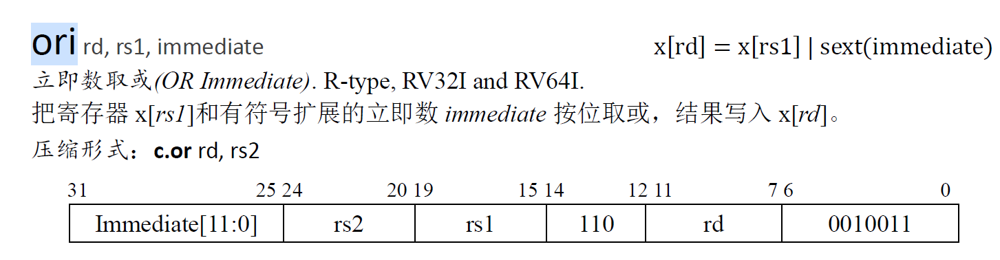
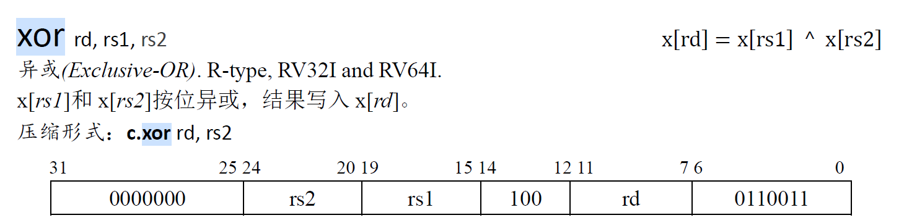

# lab 1分析与设计

lab 1最终需要实现一个基于RISC-V指令集的五级流水线cpu。

本次实验中我的思路为（此部分为实现完成后回述）：

​	首先分析待实现的指令，按照五级流水段划分的逻辑思路考虑指令在各阶段如何执行；

​	在对指令有一定了解后，结合指令需求分析各流水段依赖的信号，设计各级流水段的输入端口信号，并初步确定各级流水段的输出端口；

​	通过各模块输入端口信号依赖反推各级模块应该产生的输出信号；

​	综合信号在流水段间的产生与传输，确定各个模块的输出端口信号（此时端口基于单周期的数据通路设计），完成单周期实现；

​	确定流水线的数据部件结构为：五级流水段组合部件 + 流水寄存器部件；

​	分析流水寄存器连接后的流水线冒险与解决方式；

​	设计完善的流水寄存器（包括流水段之间的寄存器与处理冒险的寄存器）；

​	完成连线，实现完整的流水线cpu；

最终实现的五级流水线部件结构：

​	五级流水段的实现部件（基本组合逻辑），实现cpu的基本功能：

​		取指 ---- fetch，译码与访问regfile ---- decode，执行 ---- execute，访存 ---- memory，写回 ---- writeback

​	流水寄存器（时序逻辑，时钟上升沿触发），实现流水线数据传递与冒险处理：

​		

## 一、需要实现的指令与具体功能

需要实现：addi xori ori andi lui jal beq ld sd add sub and or xor auipc jalr

指令的具体功能：

### 1、addi （I-type）


alu进行**加法运算**，结果写回寄存器rd，instruction[11 : 7]

立即数扩展：instruction[31 : 20]符号扩展作为加法运算一位加数；寄存器标号rs instruction[19 : 15]，读出regfile的数据作为加数

### 2、xori（I-type）


alu进行**异或运算**，结果写回寄存器rd，instruction[11 : 7]

立即数扩展：instruction[31 : 20]符号扩展作为一个运算数；寄存器标号rs instruction[19 : 15]，读出regfile的数据作为操作数2

### 3、ori（I-type）




alu进行**或运算**，结果写回寄存器rd，instruction[11 : 7]

立即数扩展：instruction[31 : 20]符号扩展作为一个运算数；寄存器标号rs instruction[19 : 15]，读出regfile的数据作为操作数2

### 4、andi（I-type）


alu进行**与运算**，结果写回寄存器rd，instruction[11 : 7]

立即数扩展：instruction[31 : 20]共12位，符号扩展作为一个运算数；寄存器标号rs instruction[19 : 15]，读出regfile的数据作为操作数2

### 5、lui（U-type）


alu进行**UNKNOWN**运算，结果写回寄存器rd，instruction[11 : 7]

立即数扩展，instruction[21 : 12]共20位立即数，左移12位，低12位置0，高32位为符号扩展；

### 6、auipc （U-type）


alu进行**加法**运算，结果写回寄存器rd，instruction[11 : 7]

立即数扩展，instruction[21 : 12]共20位立即数，左移12位，低12位置0，高32位为符号扩展；

将扩展后的64位立即数与64位pc相加，写回寄存器

### 7、add （R-type）


alu进行**加法**操作，结果写回寄存器；

### 8、sub （R-type）


alu进行**减法**操作，结果写回寄存器；

### 9、and （R-type）


alu进行**与**操作，结果写回寄存器；

### 10、or （R-type）


alu进行**或**操作，结果写回寄存器；

### 11、xor （R-type）



alu进行**异或**操作，结果写回寄存器；

### 12、ld （I-type）


alu进行**加法**操作，结果（不是运算结果，而是访存结果）写回寄存器；

访存地址：从rs 1号instruction[19 : 15]寄存器中读取数据，和offset符号扩展后的结果相加（由alu完成）

### 13、sd （S-type）


alu进行**加法**操作，结果不写回寄存器；

访存地址：从rs 1号（instruction[19 : 15]）寄存器中读取数据，与offset扩展后结果相加（由alu完成）

offset扩展：offset的[11 : 0]（12位）被打散在指令中，对应关系为：offset[11 : 5] = instruction[31 : 25]	offset[4 : 0] = instruction[11 : 7]

扩展后的offset为

```verilog
{
    { 52{instruction[31]} },			//offset[63 : 12]
    instruction[31 : 25],				//offset[11 : 5]
    instruction[11 : 7]					//offset[4 : 0]
}
```

写入内存的数据：rs 2号（instruction[24 : 20）寄存器中的数据

### 14、jal （J-type）


指令解释：有返回，无条件跳转指令；设置pc + 4为返回地址，存到寄存器rd中，instruction[11 : 7]；将pc跳转到pc + sext(offset)

offset值的20位 被打散存在instruction[31 : 12]位中，具体关系如下：

offset[20] = instruction[31]	offset[10 : 1] = instruction[30 : 21]	offset[11] = instruction[20]	offset[19 : 12] = instruction[19 : 12]

扩展后的offset（共64位）为：

```verilog
{ 
    {43{instruction[31]}}(符号扩展43位),  	//offset[63 : 21]
    instruction[31], 					  //offset[20]			
    instruction[19 : 12], 				  //offset[19 : 12]	
    instruction[20], 					  //offset[11]
    instruction[30 : 21], 				  //offset[10 : 1]
    0 									//offset[0]
}
```

alu进行**加**运算，结果写回寄存器rd，instruction[11 : 7]；

### 15、jalr（J-type）


指令解释：有返回，无条件跳转指令；设置pc + 4为返回地址，存到寄存器rd中，instruction[11 : 7]；

将pc跳转到（pc + sext(offset)）& ~1；即计算得到的运算结果最低位取0；offset直接符号扩展即可；

### 16、beq （B-type）


alu进行**equal**运算，结果不写回寄存器；

条件跳转，读取rs 1，instruction[19 : 15]与rs 2，instruction[24 : 20]寄存器的数据是否相等，相等则跳转pc，pc += sext(offset)

offset值的12位被打散存在instruction中，具体关系如下：

offset[12] = instruction[31]	offset[10 : 5] = instruction[30 : 25]	offset[4 : 1] = instruction[11 : 8]	offset[11] = instruction[7]

扩展后的offset为（共64位）：

```verilog
{
    {51{instruction[12]}},		//offset[63 : 13]
    instruction[31],		   //offset[12]
    instruction[7],			   //offset[11]
    instruction[30 : 25],       //offset[10 : 5]
    instruction[11 : 8],	    //offset[4 : 1]
    0						  //offset[0]
}
```

## 二、各流水段模块输入端口设计

流水线分为五个阶段：fetch（取指）、decode（译码）、execute（执行）、memory（访存）、writeback（写回）；

下面分析各阶段分别需要什么信号，即模块输入端口（**暂不考虑流水线冒险问题**）：

### 1、fetch

fetch阶段需要得到pc的值并从指令存储器中取出instruction（32位）。

pc的可能取值：1、pc + 4 （正常执行）2、无条件跳转（jal、jalr）3、条件跳转（beq）

因此，fetch阶段需要pc的选择器控制信号：

​	1、是否进行无条件跳转	----	由decode阶段产生

​	2、是否进行条件跳转       ----	由execute阶段产生

同时，为了支持pc的跳转指令，fetch阶段需要跳转地址的信号，此次lab中需要实现的指令中只有jal，jalr与beq三条指令需跳转：

​	1、jal跳转：`pc = pc + sext(immediate)`；

​		pc和立即数扩展均在decode阶段完成，该指令的pc跳转地址信号可由decode阶段产生

​	2、jalr跳转：`pc = ( x[rs1] + sext(immediate) ) & (~1)`；

​		访问regfile与立即数扩展均在decode阶段完成，该指令的pc跳转地址可由decode阶段产生

​	3、beq跳转：`pc = pc + sext(immediate)`；

​		与jal指令计算方式相同，该指令的pc跳转地址可由decode阶段产生

因此，fetch模块的输入端口信号如下：

|           fetch输入端口信号            |                        产生信号的阶段                        |
| :------------------------------------: | :----------------------------------------------------------: |
|      `jump`（是否进行无条件跳转）      |                    decode，译码后即可产生                    |
|      `b_jump`（是否进行条件跳转）      |                 execute，得到运算结果后产生                  |
| `j_addr`（jal指令与beq指令跳转的地址） | decode，进pc计算后根据指令判断哪一个为跳转地址（判断是否为jalr） |

### 2、decode

decode阶段需要进行如下操作：

1、对指令进行译码产生控制信号；2、从regfile中读取数据；3、进行立即数扩展，

4、判断是否跳转并计算跳转pc  5、产生execute用到的计算数据（寄存器数据 / 立即数扩展）

（这里无需考虑是否需要跳转，是否跳转由特定控制信号控制，只需要将正确计算方式得到的pc算出即可；当跳转pc值有误时，说明该指令一定不是规定的跳转指令，会有控制信号将错误的pc值过滤掉；当特定的跳转信号成立时，说明**按跳转指令的格式**得到的**跳转pc计算方式**肯定是正确的）

（decode阶段的难点在于产生何种控制信号，这里暂不考虑，在各个阶段的输入端口确定后反推每个模块的输出端口）

​	（1）对指令进行译码，需要32位RISC-V指令instruction；	----	由fetch阶段产生

​	（2）从regfile中读取数据，需要拿到读取的regfile编号`rs1`与`rs2`；	----	由decode阶段自己产生

​	（这里`rs1`与`rs2`编号的读取不需要考虑指令种类，若存在的话，`rs1`均在`instruction[19 : 15]`，`rs2`均在`instruction[24 : 20]`）

​	（3）进行立即数扩展，需要明确立即数扩展类型（即指令类型）	----	由decode阶段自己产生；从指令中取出立即数，并根据指令类型做相应的扩展

​	（4）计算`pc_nxt`需要已知现有的pc以及更新pc用到的扩展后的立即数	----	由fetch阶段产生；

​	（5）产生execute用到的计算数据，需要确定两个计算数据的类型（立即数 + 寄存器 / 寄存器 + 寄存器，）及立即数的扩展方式（由不同指令决定）；	----	由decode阶段自己产生

​	（寄存器 + 寄存器的数据计算只出现在R-type的指令中，通过判断7位操作码确定第二个操作数是否为寄存器）

​		需要特殊注意的是，**auipc指令中两个操作数为pc和扩展后的立即数**！

decode的操作比较复杂，属于整个处理器的控制角色，几个操作之间虽有前后依赖，但在电路信号中没有顺序结构，信号同步产生后根据依赖关系进行异步更新；

可以确定，除了instruction与pc外，decode阶段执行的其余操作所依赖的信号都可以由自己译码与访问regfile产生；

因此，decode模块的输入端口信号如下：

| decode输入端口信号 |         产生信号的阶段          |
| :----------------: | :-----------------------------: |
|   `instruction`    |      fetch阶段，取值后产生      |
|        `pc`        | fetch阶段，在时钟上升沿更新得到 |

### 3、execute

execute阶段主要为alu操作，对两个操作数进行相应的运算得到结果。

所需信号为：

alu的操作信号`alu_func`；		----		由decode阶段产生

同时需要接受2个进行运算的操作数，将操作数运算得到计算结果；	----	由decode阶段产生；

在execute阶段，不需要考虑操作数的类型是寄存器数据、立即数扩展还是待备份的pc，这些在decode阶段处理，execute阶段屏蔽了对数据类型的判断，只需要拿到在该指令下，正确的两个操作数并进行运算即可；

该阶段的**计算结果后续的用途**（只考虑本次lab需要实现的16条指令），共四大类：

​	1、在R-type（add，sub，and，or，xor）、I-type（addi、xori、ori、andi）、U-type（lui、auipc）中：

​		execute阶段计算产生的结果**作为直接数据，在writeback（数据写回阶段）写入rd号寄存器**；

​		这些指令为上面顺序的1-11条指令，无需访问内存，既不写入也不读出；

​	2、在ld与sd（12、13）两条指令中：

​		execute阶段计算产生的结果**作为访存地址，在memory（访存阶段）作为访问的内存地址使用；**

​		其中ld指令为 将内存地址中的数据读出，写回rd号寄存器（rd编号为`instruction[11 : 7]`）；

​		sd指令为 将`rs2`号寄存器的数据（`rs2`编号为`instruction[24 ： 20]`），写入内存地址中；

​	3、在J-type（jal、jalr）中：

​		jal、jalr均为有返回、无条件跳转指令，因为有返回，所以需要将返回的指令地址（`pc + 4`）写入regfile；

​		因此，execute阶段计算产生的结果**作为备份pc，在writeback（数据写回阶段）写入rd号寄存器**；

​		不需要访存，与第1大类的指令在计算结果用途的方面一致；

​	4、在B-type（beq）中：

​		beq指令为无返回、有条件跳转指令，因为无返回，不需要进行数据备份写回的操作，也不需要进行访存；

​		execute阶段计算产生的结果仅仅作为是否满足跳转条件的信号，用来控制pc的选择；

​		该信号可用一个单独的1 bit信号控制，而不需要用alu得到的64为运算结果，因此，**计算结果在后续没有使用**；

由此得到，execute模块的输入端口信号如下：

|       execute输入端口信号       |                        产生信号的阶段                        |
| :-----------------------------: | :----------------------------------------------------------: |
| `alu_func`（alu的操作控制信号） |        decode阶段，在进行译码后得到应该进行的alu操作         |
| `srca、srcb`（alu的两个操作数） | decode阶段，解析指令后判断需要传入下一阶段的操作数是寄存器数据还是立即数 |

### 4、memory

memory阶段向data memory提供访存地址，并读出该地址上的数据；若写使能为真，将数据写入目标地址；在

（1）读取内存地址中的数据：

​	首先需要数据读使能，在memory需要读出的数据时，一定是要将读出的数据写入regfile，因此需要读使能，防止在非ld指令时读出的数据覆盖本应该写入regfile的计算结果；	----	由decode阶段产生；

​	其次需要内存的访问地址，在ld与sd指令中，访存的地址都是由execute计算得到	----	由execute阶段产生；

（2）在内存地址中写入数据，写入数据的信号三件套：

​	内存写使能	----	由decode阶段产生；写入的内存地址	----	由execute阶段产生；写入的数据	----	由decode阶段产生；

在当前需要实现的指令中，访存指令只有ld与sd，二者的访存地址都是由execute阶段产生，且在同一条指令中，要么是只读取内存数据，要么是只写入内存数据，因此地址无需重复传入；

因此，memory模块的输入端口信号如下：

|    memory输入端口信号     |              产生信号的阶段               |
| :-----------------------: | :---------------------------------------: |
|  `memread`（读数据使能）  | decode阶段，译码后确定是否要读取内存数据  |
| `memwrite`（写数据使能）  | decode阶段，译码后确定是否要写入内存数据  |
| `memdata`（待写入的数据） | decode阶段，在读取regfile时得到寄存器数据 |
|  `address`（访存的地址）  |    execute阶段，由alu计算得到访存地址     |

### 5、writeback

writeback阶段只需要向regfile中写入准备好的数据，writeback阶段同样屏蔽了写入数据的选择（计算结果 / 备份pc / 内存数据），在前面的阶段中将写入的数据更新为指令要求的内容。

同样需要写入数据三件套：

​	regfile写使能	----	由decode阶段产生；写入的寄存器编号	----	由decode阶段产生；写入的数据	----	由memory阶段产生；

因此writeback模块的输入端口如下：

|     writeback输入端口信号     |                   产生信号的阶段                    |
| :---------------------------: | :-------------------------------------------------: |
|  `regwrite`（regfile写使能）  |       decode阶段，译码后确定是否要写回寄存器        |
|   `dst`（写入的寄存器编号）   |       decode阶段，译码后确定写回的寄存器编号        |
| `regdata`（写回寄存器的数据） | execute与memory阶段，由读使能确定选择写回的最终数据 |

注：以上所有模块输入端口信号的产生阶段，均为首次产生有效信号的阶段。实际流水线中，因大部分阶段为组合逻辑而非时序逻辑，为防止下一条指令的控制信号产生覆盖，每个阶段的信号输入都是由直接前驱的阶段传入。若信号首次产生的阶段与使用阶段不直接相连，则信号会在不同流水段间传输。

### 6、各流水段模块的初步输出端口

由此，为了为直接后续流水段提供所需信号，可以初步得到每个流水段的输出数据包如下：

fetch为decode直接提供的数据：

```verilog
typedef struct packed {
	u32 instruction;	 //指令
	u64 pc;
} fetch_data_t;
```

decode阶段为execute直接提供的数据：

```verilog
typedef struct packed {
	word_t srca, srcb;	//操作数
 	alu_func func;		//alu操作
} decode_data_t;
```

execute阶段为memory直接提供的数据：

```verilog
typedef struct packed {
    u1 memread;			//内存读使能
    u1 memwrite;		//内存写使能
    word_t memdata;		//待写入内存的数据
    word_t address;		//访存的地址
} execute_data_t;
```

memory阶段为writeback直接提供的数据：

```verilog
typedef struct packed {
	u1 regwrite;		//regfile写使能
	creg_addr_t dst;	//写回regfile编号
	word_t regdata;		//写回的数据
} memory_data_t;
```

注：以上数据端口忽略了各个流水段之间的数据信号传递，只是依靠后续流水段的需求得到的必要数据，后续为了数据的传输需要更新数据端口，当前端口只是最终端口的一个子集。

## 三、各流水段模块产生的输出信号

根据上述各流水段的输入端口所需信号反推各个端口产生的输出信号：（未考虑数据在各流水段间的传递）

### 1、fetch

decode阶段需要fetch阶段产生pc信号与instruction信号，其余各流水段不需要fetch阶段产生的信号；

因此fetch模块的输出端口信号如下：

| fetch产生的输出信号 |                信号使用流水段                |
| :-----------------: | :------------------------------------------: |
|        `pc`         | decode（产生跳转pc，将pc作为其中一个操作数） |
|    `instruction`    |       decode（译码产生一系列控制信号）       |

### 2、decode

（1）fetch阶段需要decode阶段产生的信号：jump（判断是否为无条件跳转）、`j_addr`（跳转的地址，由decode阶段过滤错误信号）

（2）execute阶段需要decode阶段产生的信号：`srca`、`srcb`（alu的两个操作数）、`alu_func`（alu操作指令）

（3）memory阶段需要decode阶段产生的信号：`memread`与`memwrite`（内存读写使能）、`memdata`（待写入内存的数据`x[rs2]`）

（4）writeback阶段需要decode阶段产生的信号：`regwrite`（regfile写使能）、`dst`（写入的寄存器编号）

因此decode模块的输出端口信号：

| decode产生的输出信号 |         信号使用流水段         |
| :------------------: | :----------------------------: |
|        `jump`        |  fetch（控制是否无条件跳转）   |
|       `j_addr`       |      fetch（跳转的地址）       |
|        `srca`        |       execute（操作数1）       |
|        `srcb`        |       execute（操作数2）       |
|      `alu_func`      |     execute（alu控制信号）     |
|      `memread`       |      memory（内存读使能）      |
|      `memwrite`      |      memory（内存写使能）      |
|      `memdata`       | memory（写入内存的数据x[rs2]） |
|      `regwrite`      |   writeback（寄存器写使能）    |
|        `dst`         | writeback（写回的寄存器编号）  |

### 3、execute

（1）fetch阶段需要execute阶段产生的信号：b_jump（判断是否进行条件跳转）

（2）memory阶段需要execute阶段产生的信号：address（访存地址，即alu运算结果）

因此execute模块的输出端口信号为：

| execute产生的输出信号 |                  信号使用流水段                   |
| :-------------------: | :-----------------------------------------------: |
|       `b_jump`        |             fetch（控制是否条件跳转）             |
|       `result`        | memory（访存地址）或writeback（写回寄存器的数据） |

### 4、memory

writeback阶段需要用到memory阶段产生的信号：`regdata`（写回寄存器的数据，即alu运算结果和memory读取数据选择的结果）

因此memory模块的输出端口信号为：

| memory产生的输出信号 |        信号使用流水段         |
| :------------------: | :---------------------------: |
|      `regdata`       | writeback（写回寄存器的数据） |

## 四、各流水段输出端口设计

汇总由各流水段产生的信号及经流水段传输的信号后，确定各流水段模块的输出端口信号如下（system verilog代码实现）：

### 1、fetch

```verilog
typedef struct packed {
	u32 instruction;	 //指令
	u64 pc;				//pc
} fetch_data_t;
```

### 2、decode

```verilog
// decode流水段产生的控制信号
typedef struct packed {
    // fetch控制信号
    u1 jump;				//无条件跳转
    // execute控制信号
    alu_func func;			// alu操作
    // memory控制信号
    u1 memread;				// 内存读使能
    u1 memwrite;			// 内存写使能
    // writeback控制信号
    u1 regwrite;			// regfile写使能
    creg_addr_t dst;		// 写回regfile编号
} decode_control_t;

// decode阶段产生的信号
typedef struct packed {
    u64 j_addr;				//跳转pc的地址（在decode进行选择将多余的地址过滤掉）
	word_t srca, srcb;		// 操作数
    word_t memdata;			// 待写入内存的数据，x[instruction[24 : 20]]
    decode_control_t ctl;	// 控制信号
} decode_data_t;
```

### 3、execute

```verilog
// execute阶段传递的控制信号
typedef struct packed {
    // fetch控制信号
    u1 b_jump;				// 条件跳转
    // memory控制信号
    u1 memread;				// 内存读使能
    u1 memwrite;			// 内存写使能
    // writeback控制信号
    u1 regwrite;			// regfile写使能
    creg_addr_t dst;		// 写回regfile编号
} execute_control_t;

// execute阶段产生的信号
typedef struct packed {
    word_t memdata;			// 待写入内存的数据
    word_t result;			// 计算结果，可能作为访存地址，也可能作为regfile写回数据
    execute_control_t ctl;	// 控制信号
} execute_data_t;
```

### 4、memory

```verilog
typedef struct packed {
	u1 regwrite;			// regfile写使能
	creg_addr_t dst;		// 写回regfile编号
	word_t regdata;			// 写回的数据
} memory_data_t;
```

## 五、流水线冒险分析

流水线设计指令执行中有三大冒险：

结构冒险（硬件条件不支持），控制冒险（主要体现在跳转指令不能正确取指）与数据冒险（指令间的数据依赖关系）；

本次lab主要考虑后两者：控制冒险与数据冒险。

### 1、控制冒险（control hazard）

在此次lab中，控制冒险主要出现在三个跳转指令：jal、jalr与beq；前两个与第三个也有不同，目前通过分支静态预测的方式处理控制冒险，下面分析：

#### （1）无条件跳转指令（jal与jalr）导致的控制冒险

二者不同处在于跳转的目标pc计算方式不同，其余逻辑相同，这里以jal为例**逐周期**做冒险分析；（不考虑与数据冒险耦合的情况）

记pc更新为jal对应pc的时刻（更新pc肯定是在时钟上升沿）为第一个时钟周期开始：

**第一个时钟周期：**

​	fetch阶段：更新pc，并取指更新instruction得到jal指令（更新instruction在时钟上升沿后很短时间段内完成），并准备好要传给`fetch_decode`寄存器的数据（pc与instruction）；

​	后续流水段无信息；

**第二个时钟周期：**

​	fetch阶段：pc被更新为pc + 4，取指得到pc的下一条指令（当前不该执行的指令，**产生控制冒险**），并将pc和instruction送到`fetch_decode`寄存器，准备在下个时钟上升沿更新寄存器；（**这次更新应该被阻止从而避免错误指令流入后续流水段**）

​	decode阶段：pc和instruction更新为跳转指令，并对其译码产生一系列控制信号，其中包括跳转指令`jump`与计算得到的跳转地址`j_addr`，这两个信号由组合逻辑接到fetch阶段的pcselect选择器选择得到正确的跳转pc，并将该pc接到fetch阶段的寄存器输入端，当下个时钟上升沿到来时会把pc更新为跳转后的pc，然后正确执行；同时decode阶段会产生execute阶段需要的有效数据（jal指令中即为pc与regfile写使能），在周期结束前将要在下个时钟上升沿传递给`decode_execute`寄存器的数据准备完成。

​	后续流水段无信息；

**第三个时钟周期：**

​	fetch阶段：pc在该周期被更新为正确的跳转地址，并取指得到本该在jal后随即执行的指令，在该周期结束时（下个时钟上升沿）将pc和instruction更新到`fetch_decode`中，同时拿到pc + 4准备更新；

​	decode阶段：若不对`fetch_decode`寄存器加以处理，decode在该周期会拿到pc后紧跟着的那条错误指令，并译码产生错误的执行结果，从而影响后续的流水段进行正确执行，应该阻止`fetch_decode`寄存器更新为pc后的那条指令。因此在时钟上升沿时，该寄存器的复位信号应该为有效，从而过滤掉本该读取的错误指令，通过复位信号将`fetch_decode`寄存器的内容修改为气泡；即**在上一个周期（对jal指令进行译码的周期）中，应该修改`fetch_decode`寄存器的复位信号为有效，产生气泡，阻塞**；

​	execute阶段：alu拿到跳转指令jal的两个操作数（64位pc与常数4）与一系列控制信号，进行运算得到跳转的返回地址，并将要写入`execute_memory`寄存器的数据准备好；

​	后续流水段无信息；

在以后的时钟周期中，pc已经正常更新，通过**产生一个周期的气泡**，解决无条件跳转指令产生的控制冒险。

#### （2）有条件跳转（beq）指令导致的控制冒险

beq与上述两条指令的区别在于，beq需要通过execute阶段运算产生的结果判断是否跳转，即在execute阶段才能确定跳转结果，会导致fetch阶段和decode阶段流入两条错误的指令。下面逐周期分析产生的错误指令情况；

记pc更新为beq对应pc的时刻（更新pc肯定是在时钟上升沿）为第一个时钟周期开始：

**第一个时钟周期：**

​	fetch阶段：更新pc，并取指更新instruction得到beq指令，并准备好要传给`fetch_decode`寄存器的数据（pc与instruction）；

​	后续流水段无信息；

**第二个时钟周期：**

​	fetch阶段：pc被更新为pc + 4并取指，错误指令1流入流水线；同时该指令的信息准备传入`fetch_decode`寄存器；这次信息的传递应该被阻止，但控制信号不便于生成，因此放到下个周期处理；

​	decode阶段：beq指令被decode流水段拿到并译码，在该周期中计算出beq指定的跳转地址并由组合逻辑连接到`pcselect`上，但跳转指令的控制信号无法生成；

​	后续流水段无信息；

**第三个时钟周期**：

​	fetch阶段：pc被更新为pc + 4 + 4并取指，错误指令2进入流水线；同时该指令信息准备传入`fetch_decode`寄存器，该信息应该被阻止在第四个时钟上升沿进入`fetch_decode`寄存器（寄存器复位信号）；

​	decode阶段：pc + 4指令被译码，产生不该产生的控制信号与数据1，**这些数据即将进入`decode_execute`寄存器，应该被阻止**（和上面一样通过寄存器复位信号将下一阶段将要传到`decode_execute`寄存器的错误数据过滤掉，从而离开流水线）；

​	execute阶段：beq指令被执行，得到jump信号为true；这时应该将上个时钟周期得到的beq指令跳转地址通过组合逻辑连接到		`pcselect`上，同时将beq的跳转指令也通过组合逻辑连接到`pcselect`作为pc选择器信号，控制正确的跳转地址在下个周期进入流水线；

​	后续流水线无信息；

**第四个时钟周期：**

​	fetch阶段：pc更新为beq的跳转地址并取值，在流水线中进入两条错误指令后，得到真正应该执行的指令；并准备将信息传递给`fetch_decode`寄存器；

​	decode阶段：若在第三个周期不加以控制信号处理的话，decode流水段拿到pc + 4 + 4地址上的指令（也就是第二条错误指令信息），产生不该产生的控制信号与数据2；因此**第三个时钟周期中，应该生成`fetch_decode`寄存器复位信号，防止第二个错误的指令信息（未译码）进入decode流水段**；

​	execute阶段：若在第三个周期不加以处理的话，execute阶段将拿到pc + 4地址指令的操作信息（也就是第一条错误指令的译码信息）并进行错误的执行；因此，**在第三个时钟周期中，应该生成`decode_execute`寄存器的复位信号，防止第一个错误指令的译码信息进入execute流水段；**

​	memory阶段：beq指令到达访存阶段，`memread`与`memwrite`信号均为0，不进行任何状态改变；

​	后续流水线无信息；

在以后的时钟周期中，pc已经正常更新，通过**产生两个周期的气泡**，解决无条件跳转指令产生的控制冒险。

#### （3）综合两种控制冒险的解决方案

由上述分析，在原有的单周期框架上得到一个解决两种控制冒险的方案：

原有的单周期框架中，不管条件还是无条件跳转，都是由decode流水段产生跳转的地址（结合流水线就是第二个时钟周期中）；而两个不同跳转的控制信号确是在不同流水段产生的：jal与jalr跳转信号在decode阶段产生（第二个时钟周期），beq跳转信号在execute阶段产生（第三个时钟周期）。因此在流水线的框架中，二者间存在一个时钟周期差，导致地址丢失与信号复杂。解决方式为调整组合逻辑连线方式，跳转指令的跳转地址虽然都能够在decode阶段产生，但为了兼容beq的控制信号，将跳转地址从decode阶段传递给execute阶段，由execute通过组合逻辑将处理后的跳转信号与跳转地址接到`pcselect`从而实现二者信号的统一处理（即延迟一个周期传递pc与jump信号）。

修改后的组合逻辑直接插入流水寄存器的控制冒险情况与有条件跳转导致的控制冒险一致；

在此组合逻辑的基础上加入流水寄存器`fetch_decode`与`decode_execute`，为了处理控制冒险，将两个寄存器设置复位信号reset，reset信号通过组合逻辑连接到execute流水段中的jump信号（这里的jump信号是综合条件与无条件跳转后的信号，即只要跳转就为true），按此结构逐周期分析：

**第一个时钟周期：**

​	fetch阶段更新pc读取到跳转指令（下面简称为jump）；后续流水段无信息；

**第二个时钟周期：**

​	fetch阶段更新为pc + 4，读取到错误指令1；decode阶段得到jump指令译码产生信号与数据准备给execute；后续流水段无信息；

**第三个时钟周期：**

​	fetch阶段更新为pc + 4 + 4，读取到错误指令2；decode阶段得到错误指令1产生信号与数据准备给execute；execute阶段拿到jump指令的数据，产生跳转信号为true，接收到decode阶段的跳转地址；跳转信号与跳转地址传给`pcselect`，同时跳转信号作为`fetch_decode`与`decode_execute`寄存器的复位信号；

**第四个时钟周期：**

​	fetch阶段更新为跳转地址并取指；decode阶段因为`fetch_decode`寄存器复位插入气泡，没有读取到错误指令2的指令信息，产生空的信号；execute阶段因为`decode_execute`寄存器复位插入气泡，没有读取到错误指令1的译码信息，进行空运算不改变任何状态；memory阶段进行jump指令的访存执行；

**第五个时钟周期：**

​	fetch阶段更新为跳转地址 + 4，decode阶段为跳转后的指令译码，execute阶段空执行，memory阶段空执行，writeback按jump指令写回所需信息；回归正常流水线执行。

由此，**通过在跳转指令与目标指令之间插入两个气泡，过滤掉这两个时钟周期进入流水线的错误指令，在jump取指后的第三个周期读到正确的目标指令并执行，解决控制冒险，使流水线回归正常。**

#### （4）无条件跳转与条件跳转指令相邻

两个跳转指令相邻着进入流水线（第二个进入流水线的指令为错误指令），共两种情况：先有条件后无条件；先无条件后有条件；

在上面的解决方案下，无论跳转指令与目标指令间插入的错误指令1、2是什么指令：错误指令1会被译码，但译码产生的信号在decode阶段不会通过组合逻辑影响fetch阶段（该过程已经被删除），decode阶段后，信息无法通过`decode_execute`寄存器，会被过滤掉也不会影响正确的跳转；错误指令2会被读取，但无法通过`fetch_decode`寄存器，因此不会译码产生状态影响。

可以发现，在上述解决方案下，跳转指令相邻进入流水线不会对指令的正确执行造成影响。

### 2、数据冒险（data hazard）

数据冒险由数据相关导致，数据相关有三大类：写后读（RAW），读后写（WAR），写后写（WAW）

写后读，某一地址上的数据要先完成写操作，然后才能读，即下一条指令依赖于上一条指令的执行结果，必须先将结果写入之后再由下一条指令来读。如果先读的话读到的是旧值，不是运算的正确输入。例如：

```assembly
SUB R1, R2, R3;		(R2) - (R3) -> (R1)
ADD R4, R5, R1; 	(R5) + (R1) -> (R4)
```

读后写，某一地址上的数据要先完成读操作（需要用到读的数据），然后才能写（否则导致数据丢失），即指令在读取某一数据之前其读取的对象先被相关的指令写入了运算结果，这导致了读取的数据不是原来的数据，而是下一条指令运行的结果。例如：

```assembly
STA M, R2;			(R2) -> (M内存单元)
ADD R2, R4, R5;		(R4) + (R5) -> (R2)
```

写后写，对同一个器件写入数据的时候，要保证先写后写，即最后将要输出的值为后一条指令的执行结果，可是这条指令却先执行并写入了，之后执行了上一条指令的写入操作，对应于输出的结果而言就出现冲突了。例如：

```assembly
SUB R1, R2, R3;		(R2) - (R3) -> (R1)
ADD R1, R4, R5; 	(R4) + (R5) -> (R1)
```

此次lab主要考虑写后读导致的数据冒险情况，问题在于从regfile中读取数据时，前面的指令还未更新无法取到正确的数据。

#### （1）decode与execute冲突

例如：`SUB R1, R2, R3`与`ADD R4, R1, R5`两条指令，Sub指令在writeback阶段把计算结果写回寄存器更新`R1`；但在Sub指令处于execute阶段时，Add指令就开始读取regfile中的数据，拿到了`R1`中未更新的数据，导致执行结果出错。这种情况可以用旁路（即转发）`forward`的方式解决。

在Sub指令的execute执行周期中，应该写入`R1`的数据已经计算得到并将在下一个时钟周期传入`execute_memory`寄存器。可通过转发流水寄存器来提前将要写回regfile的数据传到所需的地方。这时有两种数据转发的解决方案：

方案一：在execute还在执行的周期中，不经过`execute_memory`寄存器，将得到的计算机结果直接存入转发单元（上升沿存入），并在execute阶段增加数据选择器，从转发单元数据、`decode_execute`寄存器读到的数据中进行选择并计算。

方案二：通过`execute_memory`寄存器后将数据连接在旁路单元上，在execute的下一个上升沿Add指令用到的数据会经过`execute_memory`寄存器，然后再到下一个时钟上升沿数据更新到转发单元上可以被alu取到，需要延迟一个周期。

因此，**在execute阶段将计算结果与要写回的寄存器编号通过组合逻辑作为输入连接到转发单元，转发单元中的暂存数据与信号作为输出数据连接到execute阶段的数据选择器进行数据过滤选择。**

#### （2）decode与memory冲突

例如：`LD M, R1`与`ADD R2, R1, R3`两条指令，LD指令在writeback阶段把访存得到的数据写入寄存器更新`R1`；但在LD指令处于execute阶段时，Add指令就开始读取regfile中的数据，拿到了`R1`中未更新的数据，导致执行结果出错。这种情况需要结合转发并进行一周期的阻塞来解决。

因为Add指令需要的数据需要在memory阶段才能读出得到，因此只靠转发是不能在一周期内解决数据问题的，**需要添加阻塞信号，让靠前的流水段停住，等待靠后流水段产生的数据就位后继续执行。**

#### （3）decode与writeback冲突

在writeback阶段，cpu准备要写入的数据，然后在下个周期上升沿写入regfile。这就会导致此时还未写入的数据被丢失而取到错误的数据。解决方式：一、可以采取阻塞的方式，遇事不决就阻塞，等数据就位后再执行；二、**增加一层转发，把将要写入regfile的数据与寄存器编号存入转发寄存器，使用数据时从转发单元中取数据。**

### 3、结构冒险（structure hazard）

主要在于寄存器堆regfile既读又写，端口冲突导致。

## 六、流水线冒险部件设计

在各流水段间插入流水寄存器，实现流水线工作。流水寄存器需要考虑流水线中的气泡与阻塞等问题。

（跳转与数据冲突的结合：decode阶段直接读取regfile并进行操作计算地址，错误的数据没有经过转发的数据选择器）

### 1、forward

forward寄存器需要完成流水段数据的前推与暂存。一共有3个转发路径：

```verilog
execute	->	execute;		// 将execute计算出的数据转发到execute数据选择器
memory	->	execute;		// 将memory从内存中读出的数据转发到execute数据选择器
writeback	->	execute;	// 将准备写入regfile的数据转发到execute的数据选择器
```

三个寄存器类似，以第一种为例：

forward寄存器中应存储的数据：要写回regfile的数据（即转发的数据），要写回的寄存器编号；forward寄存器应该在时钟上升沿触发，更新得到对应寄存器编号与它要写回的数据。

forward的输入模块接到的是对应数据所在流水段的组合逻辑输出端口，在上升沿更新并输出，输入输出端口为一个普通的寄存器。

#### forward模块端口

转发器中数据的更新：转发器的输入端需要写使能，写使能就是转发器对应的流水段指令是否要写回寄存器；如果需要，那么就更新转发器，不管后续指令是否需要；如果不需要，就把转发器输出数据的有效信号置为0，即当前转发器中存数据的无效，不参与execute阶段数据的选择。由此可以得到forward的输入输出端口分别如下（未写时钟信号）：

| forward输入端口 |               信号作用               |
| :-------------: | :----------------------------------: |
|      `clk`      |             全局时钟信号             |
|   `regwrite`    |      判断数据是否会写入regfile       |
|      `dst`      | 转发器存储的数据将会更新的寄存器编号 |
|     `data`      |         转发器前推的关键数据         |

| forward输出端口 |           信号作用           |
| :-------------: | :--------------------------: |
|     `valid`     |   转发器中存的数据是否有效   |
|      `dst`      | 转发器数据要更新的寄存器编号 |
|     `data`      |      转发器存的前推数据      |

### 2、hazard

hazard负责生成各种流水线控制信号，最重要的是流水线各段的阻塞信号、清除信号，以及数据选择器的控制信号；部件内部为组合逻辑。逐信号分析：

#### （1）阻塞信号

阻塞信号，作用于流水寄存器，用一个信号表示阻塞，若阻塞为真，则不处理；若阻塞为假，则正常更新寄存器（复位或正确更新）；用这种方式来使级数较低的流水段停下来（不是清除，而是暂停，保持原值），级数较高的流水段继续流动使所需数据就位。

此次lab中需要阻塞的情况为memory阶段导致的数据冒险，这种情况下无法简单地通过转发寄存器解决，需要阻塞一周期。

站在ld指令执行的角度看，我们应该阻止的是ld后一条指令通过`execute_memory`寄存器向后流动，在ld指令执行访存阶段时，把ld后一条指令阻塞在execute阶段，也就是在ld指令访存的周期中，要生成`fetch`，`fetch_decode`，`decode_execute`阶段的阻塞信号，使其保持现有的流水状态，同时在访存阶段插入一个周期的气泡（`execute_memory`复位）。

所以**阻塞信号产生的逻辑**为：条件1、当前周期的execute指令阶段取的任一寄存器编号`rt`或`rs`与当前周期的memory阶段指令要写回的寄存器编号`rd`一致（即当前execute阶段指令计算的时候依赖上一个指令的写回结果）；条件2、当前周期的memory阶段指令的`memread`信号为1（即上一条指令写回的结果要在memory阶段才能得到）且`regwrite`为1（即上条指令要写回）；

阻塞时三个寄存器的阻塞信号同步，而其他寄存器不存在阻塞的情况，因此**hazard只需产生一个阻塞信号**，满足上述条件的话阻塞信号为1，阻塞更新pc的寄存器，由fetch向decode阶段传递数据的寄存器`fetch_decode`与由decode阶段向execute阶段传递数据的寄存器`decode_execute`（同时需要使`execute_memory`寄存器清除数据，从而插入一个气泡）。

#### （2）清除信号

清除信号，作用于流水寄存器，用一个信号表示清除，在不阻塞的情况下，若清除为真，则复位清除信号，反之则正常更新寄存器；用这种方式在流水线中插入气泡；可以不结合阻塞从而清除流水线中的错误指令，也可以结合阻塞暂停流水线的流动。

此次lab中需要清除流水寄存器的信号的情况有两种：

第一为上述的memory阶段数据转发的问题，配合阻塞信号完成流水线的暂停；第二种为在需要跳转时清除流入流水线的两条错误指令（几种跳转在跳转指令均在execute周期修改pc统一处理）；

前者需要清除的寄存器为（插入一个气泡，即需要清除一个寄存器信号）：`execute_memory`寄存器，条件如上；

后者需要清除的寄存器为（插入两个气泡，即需要清除两个寄存器信号）：`fetch_decode`与`decode_execute`寄存器，条件为execute阶段的指令判断出为跳转，分支预测错误，那么此时把流入的两条错误指令清除保证流水线正确执行；

因为两种情况下涉及到清除的三个寄存器不同步，因此hazard应该产生两个清除信号，满足上述条件一时，控制`execute_memory`的清除信号为1；满足上述条件二时，控制信号2为1。

#### 考虑清除信号与阻塞信号的优先级问题：

**memory满足条件一，execute满足条件二时的特殊情况**：execute阶段为jump指令，用到memory阶段得到的数据，此时正确的执行顺序应该时先写回数据，让execute计算出正确的跳转地址，然后跳转到目标地址接着执行；当前设计下的执行过程为：memory阶段满足阻塞条件，阻塞信号为1，清除信号1为1，execute满足跳转条件，清除信号2为1；那么下个周期上升沿时，

若阻塞信号优先级高的话，`fetch`寄存器不更新，`fetch_decode`寄存器不更新，`decode_execute`寄存器不更新，`execute_memory`寄存器清除；那么在下一个周期上沿，execute阶段拿到正确的数据，计算出正确的跳转地址并准备更新pc，**跳转指令为1，仍然满足清除条件2，清除信号2为1**；decode阶段译码的为错误指令1，fetch拿到的指令是错误指令2；memory为空信号，阻塞条件不满足，阻塞信号为0；再向后执行时：fetch阶段更新到正确的跳转地址，并正确取值，fetch阶段为跳转后的指令1；`fetch_decode`寄存器清除，错误指令2流出流水线，decode阶段替换为一个气泡；`decode_execute`寄存器清除，错误指令1的译码信息清除，流出流水线，execute阶段替换为一个气泡；memory阶段开始执行jump的指令（无操作）；writeback阶段开始执行ld指令，准备好数据去写入regfile；下一个周期上升沿，ld数据写入regfile，fetch阶段为正确指令2，decode为正确指令1，execute为气泡，memory为气泡，writeback为jump；流水线回归正常。因此**阻塞信号优先级比清除信号优先级高可行**。

若清除信号优先级高的话，`fetch`寄存器不更新，`fetch_decode`寄存器清除，`decode_execute`寄存器清除，`execute_memory`寄存器清除；那么在下一个周期上沿，fetch阶段数据不变，仍为错误指令2；decode阶段为空数据，execute阶段为空数据，从而导致pc寄存器的跳转信号为0，`pc_select`会选择pc + 4，进而导致错误指令流入流水线；memory阶段为空数据，writeback阶段为ld；此时阻塞条件不满足，因此阻塞信号为0，清除条件不满足，因此清除信号为0，流水线正常流动。那么在后续周期中，会执行错误指令2与几个空指令气泡，而不会进行跳转，同时后续pc的更新为逐个 + 4，而与跳转无关，流水线无法回归正常。因此**清除信号优先级比阻塞信号优先级高不可行**。

#### （3）forward数据选择信号

hazard需要协调三个转发器的工作，产生需要的转发数据与控制信号（在hazard中做一层选择，从三个转发单元中选择；从hazard输出后接到execute阶段的数据选择器上，再进行一次选择）。三个转发器的中的信息都是`dst` + `foward_data`的数据，`dst`为数据将要写入的寄存器编号。

因为转发是为了把数据前推到execute阶段使用，因此在hazard中做转发的条件为：execute阶段中读的两个寄存器编号（实际的读操作在decode阶段实现，但读到的是错误的数据，因此需要更新进行过滤），与此时三个转发器中的某一`dst`一致，说明转发器中有需要前推的数据，则选择数据的控制信号为1；若三个转发器的`dst`与寄存器编号均不一致，那么就不需要进行数据更新。

当前面连续几条数据都要写入相同的寄存器时（即三个转发器中不止一个的`dst`与寄存器编号一致），应该由流水级最小的流水段转发器更新数据，因为它是最后一个要写入目标寄存器的数据，因此hazard中的判断逻辑应该是串行的逻辑。

指令的一个操作数不是寄存器数据的情况：

memory冲突时，在这前一个周期的execute数据进入转发器的问题：即访存的地址被作为要写入的数据传入转发器，会导致错误的前推数据被选择，解决方式为：execute阶段转发器的write端口信号接成`regwrite && ~memread`，即写入寄存器数据并且不是访存指令时才会把结果作为数据传入转发器。

#### （4）hazard模块端口

hazard模块需要完成以上三个功能，逐功能来看：

阻塞信号，需要明确execute阶段的`rs`与`rt`编号，编号来自于`decode_execute`的输出信号；需要明确memory阶段的`dst`，`dst`来自于`execute_memory`的输出信号；需要明确memory阶段的是否要访存和写回，控制信号`memread`与`regwrite`

清除信号，情况一与阻塞信号一致，需要信号如上；情况二需要明确execute阶段指令的跳转信号，信号来自`execute`的输出信号；

forward数据信号，为了协调forward的工作，hazard需要拿到三个转发器的全部输出信号进行协调处理，同时也应该明确当前的execute阶段的`rs`与`rt`编号，从而判读是否需要转发；

因此hazard模块的输入输出端口如下：

| hazard输入端口信号  |            信号作用             |
| :-----------------: | :-----------------------------: |
|     `rs`与`rt`      | execute阶段指令取数的寄存器编号 |
|        `dst`        |  memory阶段要写回的寄存器编号   |
|     `regwrite`      |    memory阶段指令要写回数据     |
|      `memread`      |      memory阶段要访问内存       |
|       `jump`        |      execute阶段的跳转信号      |
|  `foward_execute`   |        转发器1的输出信号        |
|  `forward_memory`   |        转发器2的输出信号        |
| `forward_writeback` |        转发器3的输出信号        |

这里`dst`不能用转发器中的`dst`代替，因为当检测memory阶段发生数据冒险准备阻塞的周期时，转发器中还没有更新为从memory中前推的数据。

| hazard输出端口信号 |                          信号作用                           |
| :----------------: | :---------------------------------------------------------: |
|      `stall`       | 流水线阻塞信号，阻塞`pc`，`fetch_decode`，`decode_execute`  |
|      `clear1`      |         流水线寄存器清除信号1，清除`execute_memory`         |
|      `clear2`      | 流水线寄存器清除信号2，清除`fetch_decode`与`decode_execute` |
|     `srca_mux`     |                       操作数a更新选择                       |
|   `srca_forward`   |                   操作数a更新的转发器数据                   |
|     `srcb_mux`     |                       操作数b更新选择                       |
|   `srcb_forward`   |                   操作数b更新的转发器数据                   |

## 七、整体实现

