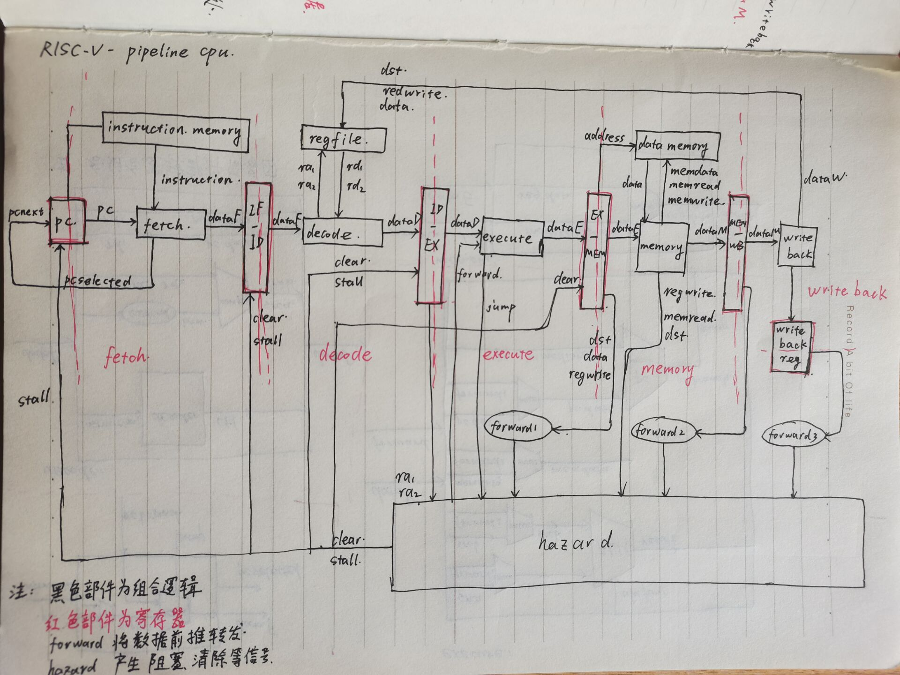
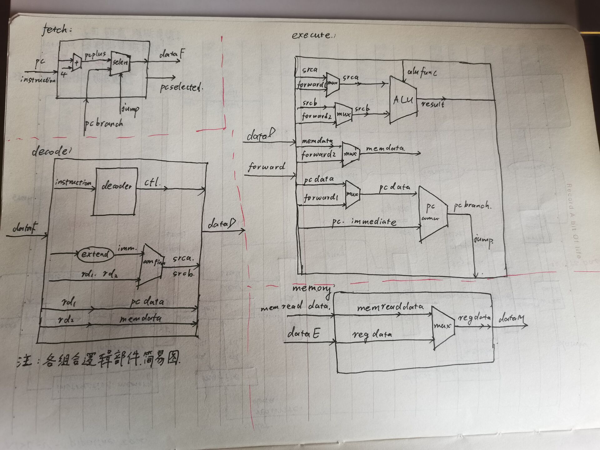
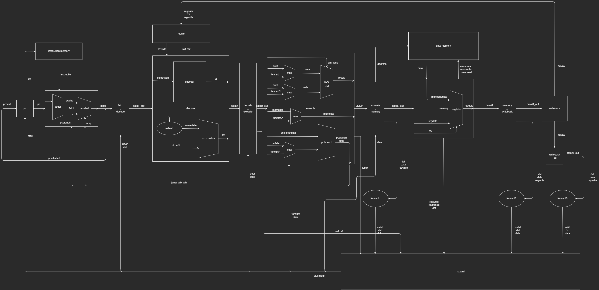
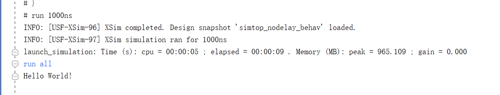

# lab 1 实验报告

20302010043 苏佳迪

## 一、五级流水线简易电路图

手绘的简易整体流水线电路图如下：

流水段的组合部件简易电路图如下：

drawio绘制电路图如下：

## 二、流水线冒险分析

### 1、控制冒险

在此次lab中，控制冒险主要出现在三个跳转指令：jal、jalr与beq；通过分支静态预测的方式处理控制冒险。

#### （1）无条件跳转指令（jal与jalr）导致的控制冒险

两条指令不同处在于跳转的目标pc计算方式不同，其余逻辑相同。在跳转指令在decode阶段时，fetch将pc选择为正确的跳转地址，需要让此时fetch阶段的指令流出流水线，通过将`fetch_decode`寄存器清除（复位信号），**产生一个周期的气泡**，解决无条件跳转指令产生的控制冒险。

#### （2）有条件跳转（beq）指令导致的控制冒险

beq需要通过execute阶段运算产生的结果判断是否跳转，即在execute阶段才能确定跳转结果，会导致fetch阶段和decode阶段流入两条错误的指令。在跳转指令在execute阶段时，fetch将pc选择为正确的跳转地址，需要让此时fetch阶段与decode阶段的指令流出流水线，通过将`fetch_decode`与`decode_execute`寄存器清除，**产生两个气泡**，解决无条件跳转指令产生的控制冒险。

#### （3）综合两种控制冒险的解决方案

由上述分析，在原有的单周期框架上得到一个解决两种控制冒险的方案：

调整组合逻辑连线方式，跳转指令的跳转地址虽然都能够在decode阶段产生，但为了兼容beq的控制信号，将跳转地址从decode阶段传递给execute阶段，由execute通过组合逻辑将处理后的跳转信号与跳转地址接到`pcselect`从而实现二者信号的统一处理（即延迟一个周期传递pc与jump信号）。

**通过在跳转指令与目标指令之间插入两个气泡，过滤掉这两个时钟周期进入流水线的错误指令，在jump取指后的第三个周期读到正确的目标指令并执行，解决控制冒险，使流水线回归正常。**

#### （4）电路实现

对应到电路上，将execute流水段得到的`jump`信号和`j_addr`地址连到`pcselect`上，确保下一个周期pc的正确跳转；同时将jump作为`fetch_decode`与`decode_execute`寄存器的清除信号，将下个周期decode与execute流水段的指令变为气泡，保持流水线状态不变。

### 2、数据冒险

#### （1）decode与execute冲突

方案一：在execute还在执行的周期中，不经过`execute_memory`寄存器，将得到的计算机结果直接存入转发单元（上升沿存入），并在execute阶段增加数据选择器，从转发单元数据、`decode_execute`寄存器读到的数据中进行选择并计算。

方案二：通过`execute_memory`寄存器后将数据连接在旁路单元上，在execute的下一个上升沿指令用到的数据会经过`execute_memory`寄存器，然后再到下一个时钟上升沿数据更新到转发单元上可以被alu取到，需要延迟一个周期。

为避免组合逻辑循环，这里采用方案二，**经过`execute_memory`寄存器，在下一个周期将execute的计算结果转发到execute阶段使用。**

#### （2）decode与memory冲突

因为指令需要的数据需要在memory阶段才能读出得到，因此只靠转发是不能在一周期内解决数据问题的，**需要添加阻塞信号，让流水级较低的流水段停住，等待较高级流水段产生的数据就位后继续执行。**

当发生冲突时，站在ld指令执行的角度看，我们应该阻止的是ld后一条指令通过`execute_memory`寄存器向后流动，在ld指令执行访存阶段时，把ld后一条指令阻塞在execute阶段，也就是在ld指令访存的周期中，要生成`fetch`，`fetch_decode`，`decode_execute`阶段的阻塞信号，使其保持现有的流水状态，同时在访存阶段插入一个周期的气泡（`execute_memory`复位）。

#### （3）decode与writeback冲突

在writeback阶段，cpu准备要写入的数据，然后在下个周期上升沿写入regfile。这就会导致此时还未写入的数据被丢失而取到错误的数据。解决方式：一、可以采取阻塞的方式，遇事不决就阻塞，等数据就位后再执行；二、**增加一层转发，把将要写入regfile的数据与寄存器编号存入转发寄存器，使用数据时从转发单元中取数据。**

#### （4）decode中跳转pc的计算

decode阶段直接读取regfile并进行操作计算地址，错误的数据没有经过转发的数据选择器。解决方案：把计算跳转地址的任务放到execute流水段，由decode流水段读取并传递数据给execute流水段；**在execute流水段中通过转发数据更新用来计算pc的数据，从而保证得到正确的跳转地址。**

#### （5）电路实现

首先是与execute冲突：

用三个转发器（纯组合逻辑），分别将`execute_memory`、`memory_writeback`与`writeback_reg`寄存器的数据连线接到hazard模块；

在hazard模块中，判断当前execute阶段的指令是否需要转发数据（`ra1`与`ra2`是否与三个转发器的`dst`相等），如果需要转发就将数据连线接到execute阶段作为转发数据；

在execute模块中，增加几个数据选择器，用来从转发数据和原数据中选择得到正确数据，然后在计算结果（或pc）。

其次是与memory冲突时阻塞与插入气泡：

在hazard模块中产生阻塞信号。**阻塞信号产生的逻辑**为：条件1、当前周期的execute指令阶段取的任一寄存器编号`rt`或`rs`与当前周期的memory阶段指令要写回的寄存器编号`rd`一致；条件2、当前周期的memory阶段指令的`memread`信号为1（即上一条指令写回的结果要在memory阶段才能得到）且`regwrite`为1（即上条指令要写回）；

阻塞时三个寄存器的阻塞信号同步，而其他寄存器不存在阻塞的情况，因此**hazard只需产生一个阻塞信号**，满足上述条件的话阻塞信号为1，阻塞更新pc的寄存器，由fetch向decode阶段传递数据的寄存器`fetch_decode`与由decode阶段向execute阶段传递数据的寄存器`decode_execute`，同时需要使`execute_memory`寄存器清除数据，从而插入一个气泡。阻塞一个周期，结束后通过转发解决数据冲突。

这里还应该考虑**阻塞信号与清除信号的优先级问题**

阻塞信号的产生逻辑如上，清除信号的情况有两种：

第一为memory阶段数据转发的问题，配合阻塞信号完成流水线的暂停；第二种为在需要跳转时清除流入流水线的两条错误指令（几种跳转在跳转指令均在execute周期修改pc统一处理）；前者需要清除的寄存器为：`execute_memory`寄存器，条件如上；后者需要清除的寄存器为：`fetch_decode`与`decode_execute`寄存器，条件为execute阶段的指令判断出为跳转，分支预测错误，需要把流入的两条错误指令清除保证流水线正确执行；

那么在**memory满足条件一，execute满足条件二时的特殊情况**：execute阶段为jump指令，用到memory阶段得到的数据，此时正确的执行顺序应该时先写回数据，让execute计算出正确的跳转地址，然后跳转到目标地址接着执行；当前设计下的执行过程为：memory阶段满足阻塞条件，阻塞信号为1，清除信号1为1，execute满足跳转条件，清除信号2为1；那么下个周期上升沿时，

若阻塞信号优先级高的话，`fetch`寄存器不更新，`fetch_decode`寄存器不更新，`decode_execute`寄存器不更新，`execute_memory`寄存器清除；那么在下一个周期上沿，execute阶段拿到正确的数据，计算出正确的跳转地址并准备更新pc，**跳转指令为1，仍然满足清除条件2，清除信号2为1**；decode阶段译码的为错误指令1，fetch拿到的指令是错误指令2；memory为空信号，阻塞条件不满足，阻塞信号为0；再向后执行时：fetch阶段更新到正确的跳转地址，并正确取值，fetch阶段为跳转后的指令1；`fetch_decode`寄存器清除，错误指令2流出流水线，decode阶段替换为一个气泡；`decode_execute`寄存器清除，错误指令1的译码信息清除，流出流水线，execute阶段替换为一个气泡；memory阶段开始执行jump的指令（无操作）；writeback阶段开始执行ld指令，准备好数据去写入regfile；下一个周期上升沿，ld数据写入regfile，fetch阶段为正确指令2，decode为正确指令1，execute为气泡，memory为气泡，writeback为jump；流水线回归正常。因此**阻塞信号优先级比清除信号优先级高可行**。

若清除信号优先级高的话，`fetch`寄存器不更新，`fetch_decode`寄存器清除，`decode_execute`寄存器清除，`execute_memory`寄存器清除；那么在下一个周期上沿，fetch阶段数据不变，仍为错误指令2；decode阶段为空数据，execute阶段为空数据，从而导致pc寄存器的跳转信号为0，`pc_select`会选择pc + 4，进而导致错误指令流入流水线；memory阶段为空数据，writeback阶段为ld；此时阻塞条件不满足，因此阻塞信号为0，清除条件不满足，因此清除信号为0，流水线正常流动。那么在后续周期中，会执行错误指令2与几个空指令气泡，而不会进行跳转，同时后续pc的更新为逐个 + 4，而与跳转无关，流水线无法回归正常。因此**清除信号优先级比阻塞信号优先级高不可行**。

因此**阻塞信号优先级比清除信号优先级高**。

最后是与writeback冲突：

为了实现writeback阶段还未写回寄存器的数据被使用，增加一周期延迟，拿到数据`dataW_out`作为第三层转发器的输入数据。`dataW_out`并不做为流水线的任何阶段，只是起到一个单纯的暂存writeback写回的数据的功能，不增加整个流水线的延迟。

## 三、测试结果

1、verilator仿真结果

2、vivado仿真结果

3、上板测试结果

