# lab 2分析与设计

lab 2共有三个任务：在原五级流水线的基础上增加实现的指令；实现握手总线；实现不同粒度的内存读写；

## 一、增加实现的指令与功能

### 1、bne（B-type）

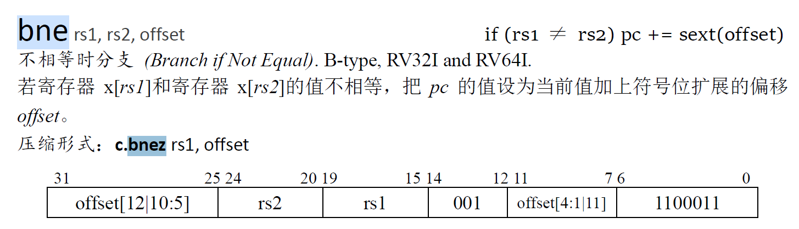

若`rs1`与`rs2`的数据不相等，进行跳转；跳转的目标pc为pc + immediate；立即数的[12 : 1]被打散存在指令中，扩展后的立即数为：

```verilog
immediate = {
    {51{instruction[31]}},	// immediate [63 : 13]	
    instruction[31],		// immediate [12]
    instruction[7],			// immediate [11]
    instruction[30 : 25],	// immediate [10 : 5]
    instruction[11 : 8], 	// immediate [4 : 1]
    0 						// immediate [0]
};
```

alu操作数为两个寄存器数据，操作为`not_equal`；

### 2、blt（B-type）

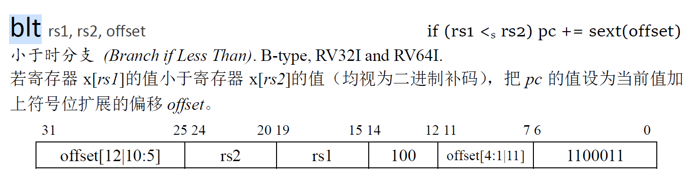

若`rs1`号寄存器的数据 < `rs2`号寄存器的数据，进行跳转（此处>=运算为把寄存器数据视为**二进制补码，即有符号数**后得到的计算结果）；跳转目标pc为pc + immediate；立即数的[12 : 1]被打散存在指令中，扩展后的立即数与`bne`指令一致；

alu操作数为两个寄存器数据，操作为`less`；

### 3、bge（B-type）

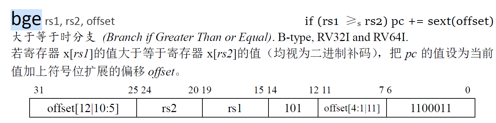

若`rs1`号寄存器的数据 >= `rs2`号寄存器的数据，进行跳转（此处>=运算为把寄存器数据视为**二进制补码，即有符号数**后得到的计算结果）；跳转目标pc为pc + immediate；立即数的[12 : 1]被打散存在指令中，扩展后的立即数与`bne`指令一致；

alu操作数为两个寄存器数据，操作为`greater`；

### 4、bltu（B-type）


若`rs1`号寄存器的数据 < `rs2`号寄存器的数据，进行跳转（此处<运算为把寄存器数据视为**无符号数**后得到的计算结果）；跳转目标pc为pc + immediate；立即数的[12 : 1]被打散存在指令中，扩展后的立即数与`bne`指令一致；

alu操作数为两个寄存器数据，操作为`less_u`；

### 5、bgeu（B-type）

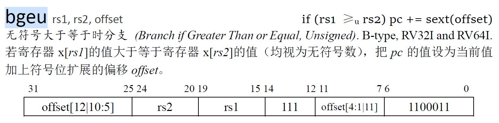

若`rs1`号寄存器的数据 >= `rs2`号寄存器的数据，进行跳转（此处<运算为把寄存器数据视为**无符号数**后得到的计算结果）；跳转目标pc为pc + immediate；立即数的[12 : 1]被打散存在指令中，扩展后的立即数与`bne`指令一致；

alu操作数为两个寄存器数据，操作为`greater_u`；

### 6、slti（I-type）

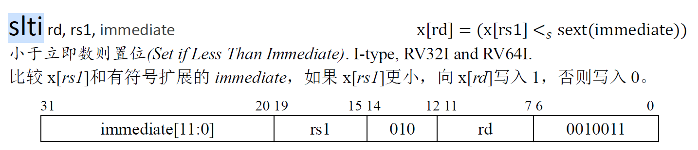

比较`rs1`寄存器数据与扩展后的立即数，把比较的结果写入`rd`寄存器（0或1）：若`[rs1]` < `immediate`为1，反之为0。（此处比较为**二进制补码即有符号数**的比较）

alu操作数1为寄存器数据，操作数2为扩展后的立即数，立即数扩展为正常符号扩展（到64位）；alu操作为`less`；

###  7、sltiu（I-type）

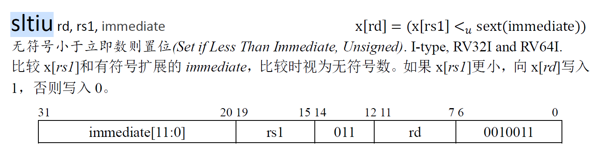

比较`rs1`寄存器数据与扩展后的立即数，把比较的结果写入`rd`寄存器（0或1）：若`[rs1]` < `immediate`为1，反之为0。（此处比较为**无符号数**的比较）

alu操作数1为寄存器数据，操作数2为扩展后的立即数，立即数扩展为正常符号扩展（到64位）；alu操作为`less_u`；

### 8、slli（I-type）

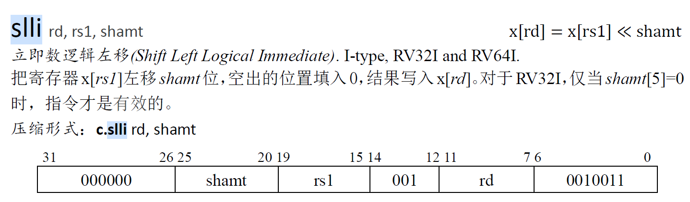

把`rs1`的数据左移`shamt`位，低位补0，结果写入`rd`；（因为实现位`RV64I`，所以`shamt`始终有效）；`shamt`为6位，无符号扩展到64：

```verilog
immediate = { 
    58'b0, 
    shamt			//instruction[25 : 20]
};
```

alu操作数1为寄存器数据，操作数2为扩展后的`shamt`，alu操作为`shiftl`；

### 9、srli（I-type）

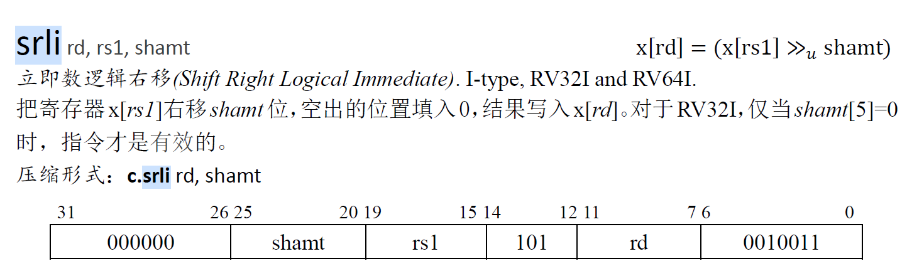

把`rs1`的数据右移`shamt`位，高位补0，结果写入`rd`；`shamt`为6位，无符号扩展到64位；

alu操作数1为寄存器数据，操作数2为扩展后的`shamt`，alu操作为`shiftr`；

### 10、srai（I-type）

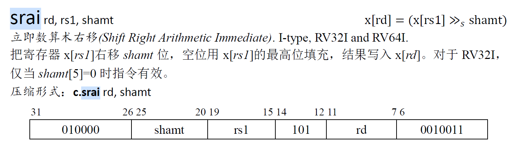

把`rs1`的数据**算数右移**，空位用`rs1`的最高位补充，结果写入`rd`；`shamt`为6位，无符号扩展到64；

alu操作数1为寄存器数据，操作数2为扩展后的`shamt`；alu操作为`shiftr_s`；

### 11、addiw（I-type）

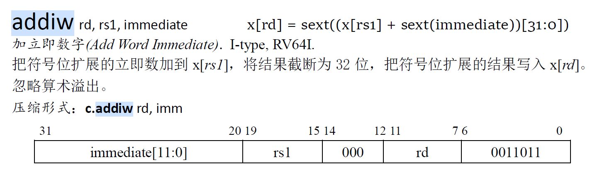

将`rs1`与扩展后的立即数相加，结果截断为32位，低32位取计算结果，高32位符号扩展；

alu操作数1为寄存器数据，操作数2为扩展后的立即数；alu操作为`add`；

计算出结果后需要进行32位截断（decode阶段产生截断信号）；

### 12、slliw（I-type）

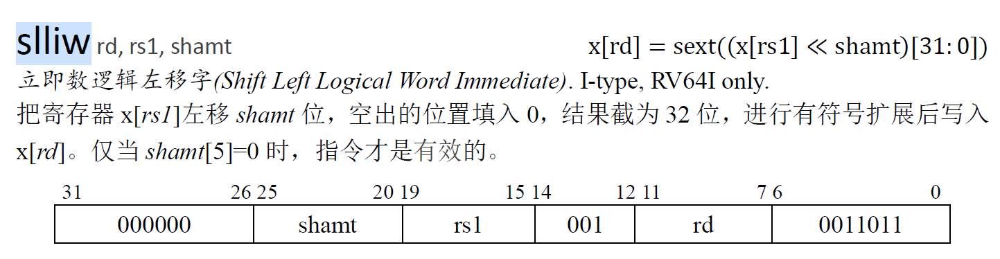

将`rs1`进行逻辑左移`shamt`位（需要无符号扩展），结果截断为32位，低32位取计算结果，高32位符号扩展；

alu操作数1为寄存器数据，操作数2为扩展后的立即数；alu操作为`shiftl`；

计算出结果后需要进行32位截断（decode阶段产生截断信号）；`shamt[5] = 0`时才进行操作。

### 13、srliw（I-type）

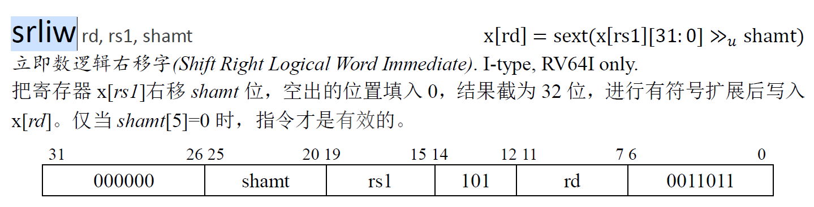

将`rs1`进行逻辑右移`shamt`位（需要无符号扩展），结果截断为32位，低32位取计算结果，高32位符号扩展；

alu操作数1为寄存器数据，操作数2为扩展后的立即数；alu操作为`shiftr`；

### 14、sraiw（I-type）

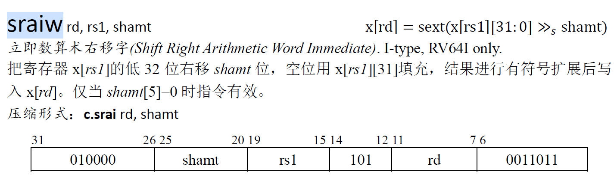

取`rs1`的低32位，进行算数右移`shamt`位，空位符号扩展；

alu操作数1为寄存器数据，操作数2为扩展后的立即数；alu操作为`shiftr_s`；

计算出结果后需要进行32位截断（decode阶段产生截断信号）；`shamt[5] = 0`时才进行操作。

### 15、sll（R-type）

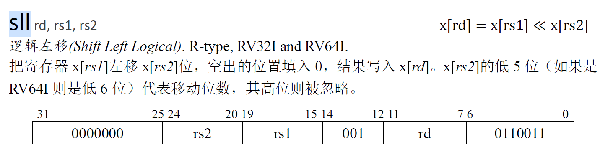

把`rs1`寄存器数据左移`rs2`位（逻辑左移），结果写入`rd`寄存器；`rs2`的数据经过处理得到`srcb`：

```verilog
srcb = {
    58'b0,			// 高位补0
    rd2[5 : 0]		// rd2的低六位作为移位数据
}
```

alu操作数1为寄存器数据`[rs1]`，操作数2为经过处理的寄存器数据`[rs2]`；alu操作为`shiftl`；

### 16、slt（R-type）

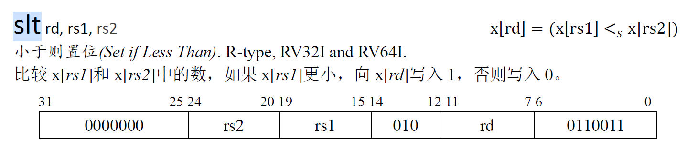

比较`rs1`号寄存器与`rs2`号寄存器的数据大小，若`rs1`小结果为1，反之为0；把结果写入`rd`；

alu操作数为两个寄存器数据，alu操作为`less`；

### 17、sltu（R-type）

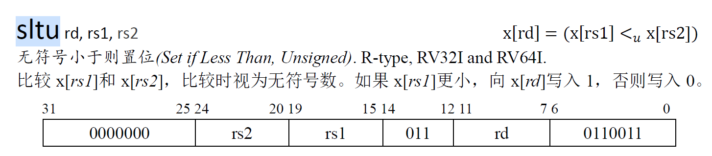

比较`rs1`号寄存器与`rs2`号寄存器的数据大小，若`rs1`小结果为1，反之为0；把结果写入`rd`；（小于为无符号比较小于）

alu操作数为两个寄存器数据，alu操作为`less_u`；

### 18、srl（R-type）

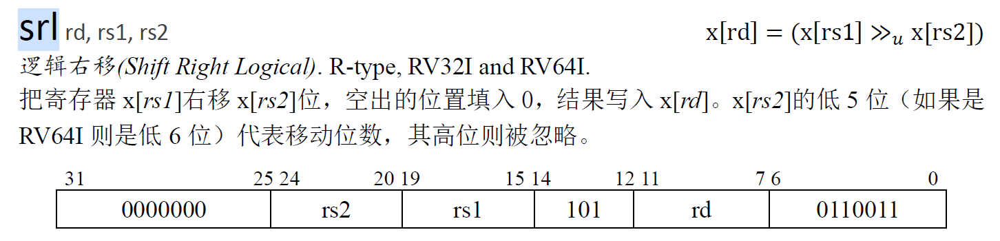

把`rs1`寄存器数据右移`rs2`位（逻辑右移），结果写入`rd`寄存器；`rs2`的数据经过处理得到`srcb`，处理同`sll`

alu操作数1为寄存器数据`[rs1]`，操作数2为经过处理的寄存器数据`[rs2]`；alu操作为`shiftr`；

### 19、sra（R-type）

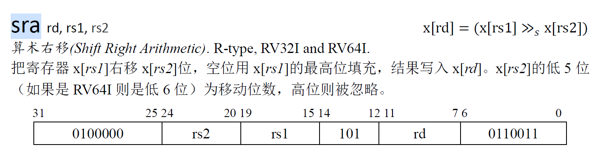

把`rs1`寄存器数据右移`rs2`位（算术右移），结果写入`rd`寄存器；`rs2`的数据经过处理得到`srcb`，处理同`sll`；

alu操作数1为寄存器数据`[rs1]`，操作数2为经过处理的寄存器数据`[rs2]`；alu操作为`shiftr_s`；

### 20、addw（R-type）

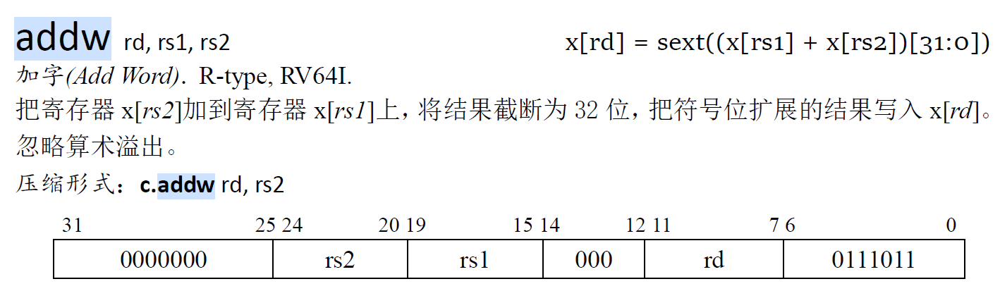

将`rs1`与`rs2`相加，结果截断为32位，低32位取计算结果，高32位符号扩展；

alu操作数1为寄存器数据，操作数2为扩展后的立即数；alu操作为`add`；

计算出结果后需要进行32位截断（decode阶段产生截断信号）；

### 21、subw（R-type）

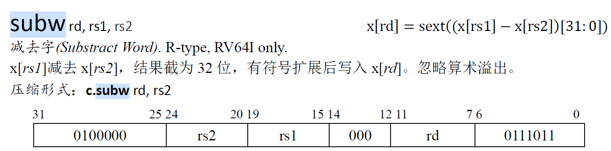

将`rs1`与`rs2`相减，结果截断为32位，低32位取计算结果，高32位符号扩展；

alu操作数1为寄存器数据，操作数2为扩展后的立即数；alu操作为`sub`；

计算出结果后需要进行32位截断（decode阶段产生截断信号）；

### 22、sllw（R-type）

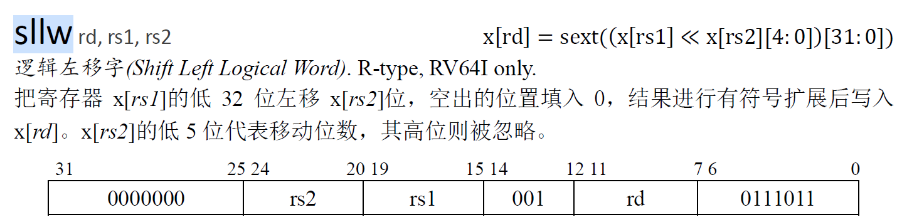

取`rs1`逻辑左移`rs2`位，`rs2`寄存器数据处理后得到一个5位数据，为移位的位数：

```verilog
shamt = {
    59'b0,			// 高位补0
    rs2[4 : 0]		// 低5位
}
```

结果取低32位，高32位符号扩展；

alu操作数1为寄存器数据，操作数2为扩展后的立即数；alu操作为`shiftl`；移位后需要进行立即数扩展

### 23、srlw（R-type）

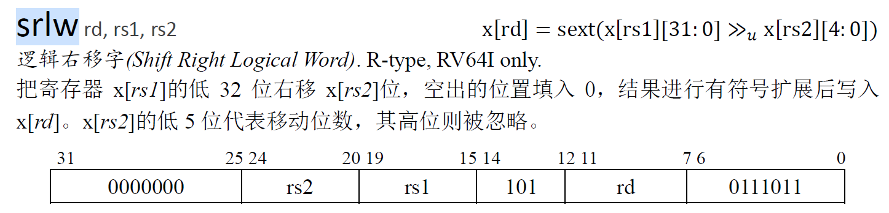

取`rs1`逻辑右移`rs2`位，`rs2`寄存器数据处理后得到一个5位数据，为移位的位数，处理同`sllw`

结果取低32位，高32位符号扩展；

alu操作数1为寄存器数据，操作数2为扩展后的立即数；alu操作为`shiftr`；移位后需要进行立即数扩展

### 24、sraw（R-type）

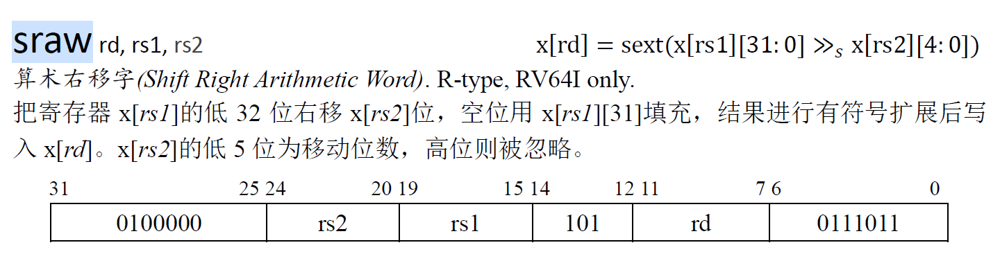

取`rs1`算术右移`rs2`位，`rs2`寄存器数据处理后得到一个5位数据，为移位的位数，处理同`sllw`

结果取低32位，高32位符号扩展；

alu操作数1为寄存器数据，操作数2为扩展后的立即数；alu操作为`shiftr_s`；移位后需要进行立即数扩展；

## 二、实现增加指令添加的逻辑

### 1、alu的操作类型

alu的操作在原有的基础上添加以下操作：

`not_equal`：判断`srca`和`srcb`是否不相等；

`less`：若`srca` < `srcb`，结果为1，反之为0；（按补码比较）

`greater`：若`srca` > `srcb`，结果为1，反之为0；（按补码比较）

`less_u`：若`srca` < `srcb`，结果为1，反之为0；（按无符号整数比较）

`greater_u`：若`srca` > `srcb`，结果为1，反之为0；（按无符号整数比较）

`shiftl`：把`srca`逻辑左移`srcb`位；

`shiftr`：把`srca`逻辑右移`srcb`位；

`shiftr_s`：把`srca`算数右移`srcb`位；

### 2、立即数的扩展类型

在原有的基础上，增加一种`decode`阶段的立即数扩展情况：

即移位的情况下，将`shamt`从6位无符号扩展为64位，便于在execute阶段直接计算；处理如下：

```verilog
immediate = { 
    58'b0, 
    shamt			//instruction[25 : 20]
};
```

### 3、操作数的处理类型

同样是处理移位的逻辑，当进行R-type的移位操作，需要将操作数2处理为相应的移位数，两种情况：

（1）64位操作

```verilog
srcb = {
    58'b0,			// 高位补0
    rd2[5 : 0]		// rd2的低六位作为移位数据
}
```

（2）32位操作

```verilog
srcb = {
    59'b0,			// 高位补0
    rd2[4 : 0]		// rd2的低五位作为移位数据
}
```

### 4、alu的操作过程

由于存在32位运算的几条指令：`addiw`、`slliw`……

这些指令需要在32位的背景下进行运算，然后扩展为64位的数据。在此基础上将alu修改为三个过程：

（1）计算前的截取数据（两个操作数都要截断）：根据信号判断是否需要对数据进行截断处理；

（2）将处理后的数据交由运算单元计算；

（3）计算后对数据进行位扩展：根据信号判断是否需要截断32位高位符号扩展；

因为在32位运算的情况下，截断和位扩展的操作其实是运算的一部分，因此一并放在alu中进行，减少execute流水段复杂的处理逻辑。

## 三、握手总线

握手总线主要用来处理访存（包括指令访存和数据访存，且**仅是读内存，而不参与写内存**）的问题，在访存的时候，由于访存周期的不确定性，不能简单地按周期进行流水，需要引入握手总线协议从而处理访存。

**把每次访存看作一次请求和响应的过程，请求标志着一次访存任务的开始，即访存地址和访存使能就位，响应标志着一次访存任务的结束，即访存得到的数据就位。**请求和响应模块的端口分别如下，以data为例：

**访存请求端口**：

```verilog
typedef struct packed {
    logic valid; // in request?
    addr_t addr; // target address
    // ...
} dbus_req_t;
```

在请求端口中，`valid`信号表示访存任务是否开始（即是否进行访存请求），后续流水线的状态会根据访存的情况进行调整；`addr`信号表示访存地址。

**访存响应端口**：

```verilog
typedef struct packed {
    logic addr_ok;	// 此次lab（总线上）的总线协议中用不到
    logic data_ok; // is the field "data" valid? 
    word_t data; // the data read from cache
} dbus_resp_t;
```

`data_ok`信号表示访存请求的响应已就位（在此次的总线协议下），此时的`data`信号就是从memory中读取到的指令或数据。当`data_ok`信号为有效低电平时（有效是指`req.valid`信号为1，即访存请求发出），说明访存还未结束，此时`data`信号就是无效数据。

综上：请求端口的`valid`信号标志着访存请求的发出（即开始访存指令）；响应端口的`data_ok`信号标志着访存请求的结束（即读到正确的内存数据）。

总线协议如下：

> - `req.valid`为0时， `resp.data_ok` 为不定值。
> - `req.valid`为1期间，代表一次访存请求。在此期间， `req.valid` 与 `req.addr` 不允许改变。
> - `req.valid` 为1时，检查`resp.data_ok` 。如果为1，则下个时钟的上升沿表示一次握手，本次访存结束。如果握手后 `req.valid` 仍为1，则视为新的一次请求。

## 四、流水线改动

握手总线主要改动在于涉及访存的流水段：`fetch`与`memory`；考虑如何通过信号和连线引入握手总线。

### 1、fetch流水段

当前fetch阶段取指的代码如下：

```verilog
assign ireq.valid = 1;				// 始终取指令
assign ireq.addr = pc;				// 设置指令pc
assign instruction = iresp.data;	// 得到读取的指令
```

取指的过程不像数据访存一样需要设置读使能，写使能等等，只需要发请求将pc传给`req`，得到`resp`的响应数据即可。

引入握手总线后，取指指令改为以下过程：

- 将pc传给`ireq`，**发起取指请求**，等待`iresp`的响应；

- 判断`iresp.data_ok`，为低电平时说明**响应数据未就位**，继续等待（保持流水线状态）；

- 当`iresp.data_ok`为高电平时，说明**响应数据已就位**，此时由于是组合电路，instruction会直接得到取指的指令（在`data_ok`设置为高电平的同一周期），同时准备进行一次握手；

- 在`iresp.data_ok`为高电平的下一个周期上升沿，进行一次握手；握手标志着一次访存指令结束，因此需要**将请求与响应的对应状态参数复位**：请求端口的状态参数有`valid`，响应状态参数有`data_ok`，需要将两条信号置为低电平（若有下一条指令再修改）。

因此，引入握手总线后fetch流水段的取指代码如下：

```verilog
// 发请求
assign ireq.valid = 1;			// 发出取指请求
assign ireq.addr = pc;			// 设置请求参数
// 得到响应
assign instruction = iresp.data;// 得到指令
// 处理握手
always@(posedge clk) begin
    // 若完成一次访存请求
    if (ireq.valid == 1 && iresp.data_ok == 1) begin
        ireq.valid = 0;
    end
end
```

同时需要保证在访存期间`req.data`与`req.valid`不能改变，所以不能有其他地方修改`ireq`。

为保证每个周期都在取指，**`ireq.valid`信号应该默认为1，不需要握手处理。**

### 2、memory流水段

当前memory流水段访存代码如下：

```verilog
assign dreq.valid = dataE_out.ctl.memwrite;					// 由execute阶段的信号控制发访存请求
assign dreq.strobe = (dataE_out.ctl.memwrite) ? '1 : '0;	// 设置读写位数
assign dreq.addr = (dataE_out.ctl.memread | dataE_out.ctl.memwrite) ? dataE_out.result : '0;	//地址
assign memread_data = dresp.data;							// 得到响应数据
```

同样在引入握手总线后的访存增加为以下过程：

- 设置请求参数`dreq.valid`将`addr`传给`dreq`，**发起取指请求**，等待`dresp`的响应；
- 判断`dresp.data_ok`，为低电平时说明**响应数据未就位**，继续等待（保持流水线状态）；
- 当`dresp.data_ok`为高电平时，说明**响应数据已就位**，此时由于是组合电路，instruction会直接得到取指的指令（在`data_ok`设置为高电平的同一周期），同时准备进行一次握手；
- 在`dresp.data_ok`为高电平的下一个周期上升沿，进行一次握手；握手标志着一次访存指令结束，因此需要**将请求与响应的对应状态参数复位**：请求端口的状态参数有`valid`，响应状态参数有`data_ok`，需要将两条信号置为低电平（若有下一条指令再修改）。

因此引入握手总线后访存（读内存）的代码如下：

```verilog
// 发访存请求
assign dreq.valid = dataE_out.ctl.memwrite|| dataE_out.ctl.memread;	// 由memory阶段的信号控制发访存请求
// 设置请求参数
assign dreq.strobe = (dataE_out.ctl.memwrite) ? '1 : '0;	// 设置读写位数
assign dreq.addr = (dataE_out.ctl.memread | dataE_out.ctl.memwrite) ? dataE_out.result : '0;	//地址
// 接收响应数据
assign memread_data = dresp.data;							// 得到响应数据
// 处理握手
always@(posedge clk) begin
    // 若完成一次访存请求
    if (dreq.valid == 1 && dresp.data_ok == 1) begin
        dreq.valid = 0;
    end
end
```

可以考虑把处理握手的寄存器写为一个单独的模块。

### 3、流水线的改动

由于访存延迟的存在，流水线不能总是正常地流动，需要在访存延迟时进行阻塞（前端插入气泡，后端保持原状态）。

#### （1）fetch取指导致的流水段改动

在还没有取出指令时对流水线进行阻塞，只阻塞fetch流水段，后续流水段让其继续流动，同时插入气泡。即需要保持`pc`寄存器的数据，同时对`fetch_decode`寄存器进行复位清除逻辑，也就是插入气泡，使得到指令前的错误数据不会进入流水线。

即给`pc`添加阻塞信号，阻塞条件为`ireq.valid == 1 && iresp.data_ok == 0`；给`fetch_decode`寄存器添加复位信号，复位条件为与`pc`的阻塞信号相同。

```verilog
assign stall = ireq.valid == 1 && iresp.data_ok == 0;
assign flush = ireq.valid == 1 && iresp.data_ok == 0;
```

对**`pc`的阻塞信号与`fetch_decode`的清除信号**的逻辑如下：

当`ireq.valid == 1 && iresp.data_ok == 0`时，说明发起了一次访存请求并且响应数据未就位，此时需要阻塞`fetch`流水段，并在`decode`阶段插入气泡；

```verilog
assign stall = ireq.valid == 1 && iresp.data_ok == 0;
assign flush = ireq.valid == 1 && iresp.data_ok == 0;
// 注：此信号并非包含所有情况
```

对响应数据的获得无需进行判断，只需要连线即可，若数据还未就位，由于阻塞和清除信号的存在不会有错误指令流入流水线。

#### （2）memory访存导致的流水线改动

memory访存时需要阻塞的流水段：`fetch`、`decode`、`execute`与`memory`，即产生`pc`、`fetch_decode`、`decode_execute`与`execute_memory`寄存器的阻塞信号；

需要清除的流水段：`writeback`，由于`memory`的数据未就位，`writeback`执行完后应该插入一个气泡，即`memory_writeback`寄存器的清除信号；

```verilog
assign stall = dreq.valid == 1 && dresp.data_ok == 0;
assign flush = dreq.valid == 1 && dresp.data_ok == 0;
```

`dreq.valid`信号的逻辑：

```verilog
assign dreq.valid = dataE_out.ctl.memwrite || dataE_out.ctl.memread;
```

握手逻辑：

```verilog
// 访存完成时进行一次握手
always@(posedge clk) begin
    if(dreq.valid == 1 && dresp.data_ok == 1) begin
        dreq.valid = 0;
    end
end
```

#### （3）仲裁分析

仲裁体现在`ireq.valid`和`dreq.valid`同时为1时，内存会屏蔽一个访存请求，（`vsrc/util/CBusArbiter.sv`是一个实现的仲裁器，默认为`dreq`请求优先）

在执行`dreq`的访存期间，`ireq.valid`始终为1，`iresp.data_ok`始终为0，`dreq.valid`为1，在数据握手前，`dresp.data_ok`为0，按照上面的流水线控制连线来看:

- `pc`始终被阻塞；
- `fetch_decode`寄存器同时有`stall`信号与`flush`信号，由于阻塞优先级高，因此`fetch_decode`寄存器阻塞；
- `decode_execute`寄存器由于访存被阻塞；
- `execute_memory`由于访存延迟被阻塞；
- `memory_writeback`寄存器在执行完首个指令后被插入气泡；

在`dreq`访存数据就位的下个周期上升沿，`dreq.valid`为0，仲裁器不再屏蔽`ireq`，进行取指的访存，此时各个流水线的信号如下：

- `pc`被阻塞，等待`fetch`阶段的数据就位
- `fetch_decode`被插入气泡；
- `decode_execute`正常执行，从`decode`阶段流入的是气泡指令，不影响流水线状态；
- `execute_memory`与`memory_writeback`同样执行气泡；

综上：在当前仲裁器和流水线的阻塞与清除信号影响下，出现两个访存请求时流水线可以正常执行。

#### （4）流水线冲突

考虑一个特殊情况：`execute`指出指令为跳转指令，即`ireq`此时的访存请求是一条错误的请求指令；

当在`execute`流水段判断到需要跳转时，此时`fetch`流水段在进行取指（一条错误指令），`decode`流水段在进行译码（气泡或一条错误指令）；而`pc_next`已经更新为正确的跳转地址，而由于当前`fetch`阶段还没有取出指令，导致`pc`在阻塞，`pc_next`无法进入流水段；那么在下一个周期（假设取指令完成），`fetch`进行`pc_next`的取指，`decode`因为跳转信号的出现插入气泡，`execute`也插入气泡，可行；但若取指令未完成，`execute`阶段的数据向后移动，导致跳转信号丢失，需要处理跳转的问题。

一种不可行的处理方案如下（**不可行是因为不能中途取消访存请求**）：在`execute`发现需要跳转时终止当前取指请求（`ireq.valid`变为0），而在下一个时钟上升沿（`pc`更新为跳转地址），重新发起取指请求（`ireq.valid`变为1）

因此**`ireq`的`valid`信号**的逻辑如下：

- 在每个时钟上升沿需要为高电平1，标志着该周期发起访存请求；
- 在握手时（`data_ok`就位的下一个周期上升沿），不需要设置为低电平0，继续下一条指令取指；
- 在某一周期中发现当前指令为预测错误的指令时（即`execute`跳转信号为1），在当前周期直接将`valid`信号设置为低电平0，标志着此次错误的取指请求结束；并在下一个时钟上升沿重新设置为1进行正确的取指；

即`ireq.valid`为`execute`流水段的`jump`信号的相反信号，当`jump`为0表示不跳转时，`valid`为1表示正常取指；而当`jump`为1表示跳转时，`valid`应该设置为0，保证终止此次对错误`pc`的取指，而在下一个时钟上升沿，`jump`重新设置为0，`valid`重新设置为1表示对此次指令进行取指（跳转地址的instruction），从而流水段正确执行。

**一种可行的方案如下**：

当`execute`流水段指出指令为跳转指令时，同一周期内将`fetch`与`execute`流水段阻塞，`decode`与`memory`流水段插入气泡，（`fetch_decode`与`execute_memory`清除信号拉高）。这种状态持续到当前取指完成，取指完成后的下一个周期上升沿，应该开始`pc`为跳转地址的取指；此时未跳转的错误指令已经被清除出流水线，只需等待指令；

取指刚完成的那个周期：

- `fetch`阶段：`fetch_delay`信号为0，下一个周期不再阻塞；
- `decode`阶段：`fetch_delay`信号为0，下个周期不再清除；`jump`信号为1，下个周期清除；综合效果为清除；
- `execute`阶段：`fetch_delay`信号为0，下个周期不再阻塞；
- `memory`阶段与`writeback`阶段：下个周期不再插入气泡；

取指完成的下一个周期：

- `pc`寄存器不再阻塞，进行跳转指令的取指（fetch阶段）；
- `decode`清除掉错误指令，当前为气泡，等待fetch传入正确的指令；
- `execuet``memory`与`writeback`都是为传入的气泡；

如果在execute阶段指出跳转的周期中，`iresp.data_ok`已经为1，即错误指令取指完成；那么`fetch_decode`的清除信号和`decode_execute`的清除信号会拉高（jump），把`fetch`与`decode`流水段可能有的错误指令清除掉，流水线工作正常。

综上：各个寄存器的控制信号做以下增加：

```verilog
// 当execute阶段指出是跳转指令时，阻塞fetch与execute流水段
assign fetch_stall = dataE.ctl.jump && fetch_delay;
assign execute_stall = dataE.ctl.jump && fetch_delay;

// 当execute阶段为跳转指令时，清除decode与memory，decode阶段信号不需要添加，memory的清除信号添加
assign memory_flush = dataE.ctl.jump && fetch_delay;
```

注：以上信号为解决控制冲突的信号，还有其他情况，并不代表最终的流水线控制信号。

#### （5）转发器问题

当前转发器为组合逻辑，由于`execute`阶段阻塞，但`memory`阶段清除，导致转发出的`execute`阶段数据出错（转发数据源丢失），解决方法：

方法一：清除各个流水寄存器时，只清除控制信号，其他数据信号保持不变；

方法二：拉出另一个寄存器，用来存放转发数据，该寄存器的清楚信号不被execute等阶段的信号影响；（把转发器设置为时序逻辑）

## 五、不同粒度的读写

## 六、错误记录

#### 1、execute阶段从alu的判断结果转化为跳转信号错误

```verilog
// alu中得到的结果为64'h0000_0001
result = (srca == srcb) ? 64'h0000_0001 : '0;
// execute中转化为jump信号时判断条件为'1
assign dataE.ctl.jump = (dataD.ctl.jump) | (dataD.ctl.btype == 1 && result == '1) ? 1'b1 : 1'b0;
```

#### 2、execute阶段计算跳转地址错误

（1）第一次计算错误是因为：转发器失效

（2）


