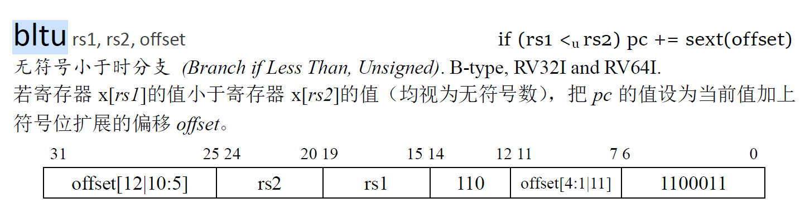

# lab 2分析与设计

lab 2共有三个任务：在原五级流水线的基础上增加实现的指令；实现握手总线；实现不同粒度的内存读写；

## 一、增加实现的指令与功能

### 1、bne（B-type）


若`rs1`与`rs2`的数据不相等，进行跳转；跳转的目标pc为pc + immediate；立即数的[12 : 1]被打散存在指令中，扩展后的立即数为：

```verilog
immediate = {
    {51{instruction[31]}},	// immediate [63 : 13]	
    instruction[31],		// immediate [12]
    instruction[7],			// immediate [11]
    instruction[30 : 25],	// immediate [10 : 5]
    instruction[11 : 8], 	// immediate [4 : 1]
    0 						// immediate [0]
};
```

alu操作数为两个寄存器数据，操作为`not_equal`；

### 2、blt（B-type）


若`rs1`号寄存器的数据 < `rs2`号寄存器的数据，进行跳转（此处>=运算为把寄存器数据视为**二进制补码，即有符号数**后得到的计算结果）；跳转目标pc为pc + immediate；立即数的[12 : 1]被打散存在指令中，扩展后的立即数与`bne`指令一致；

alu操作数为两个寄存器数据，操作为`less`；

### 3、bge（B-type）


若`rs1`号寄存器的数据 >= `rs2`号寄存器的数据，进行跳转（此处>=运算为把寄存器数据视为**二进制补码，即有符号数**后得到的计算结果）；跳转目标pc为pc + immediate；立即数的[12 : 1]被打散存在指令中，扩展后的立即数与`bne`指令一致；

alu操作数为两个寄存器数据，操作为`greater`；

### 4、bltu（B-type）



若`rs1`号寄存器的数据 < `rs2`号寄存器的数据，进行跳转（此处<运算为把寄存器数据视为**无符号数**后得到的计算结果）；跳转目标pc为pc + immediate；立即数的[12 : 1]被打散存在指令中，扩展后的立即数与`bne`指令一致；

alu操作数为两个寄存器数据，操作为`less_u`；

### 5、bgeu（B-type）


若`rs1`号寄存器的数据 >= `rs2`号寄存器的数据，进行跳转（此处<运算为把寄存器数据视为**无符号数**后得到的计算结果）；跳转目标pc为pc + immediate；立即数的[12 : 1]被打散存在指令中，扩展后的立即数与`bne`指令一致；

alu操作数为两个寄存器数据，操作为`greater_u`；

### 6、slti（I-type）


比较`rs1`寄存器数据与扩展后的立即数，把比较的结果写入`rd`寄存器（0或1）：若`[rs1]` < `immediate`为1，反之为0。（此处比较为**二进制补码即有符号数**的比较）

alu操作数1为寄存器数据，操作数2为扩展后的立即数，立即数扩展为正常符号扩展（到64位）；alu操作为`less`；

###  7、sltiu（I-type）


比较`rs1`寄存器数据与扩展后的立即数，把比较的结果写入`rd`寄存器（0或1）：若`[rs1]` < `immediate`为1，反之为0。（此处比较为**无符号数**的比较）

alu操作数1为寄存器数据，操作数2为扩展后的立即数，立即数扩展为正常符号扩展（到64位）；alu操作为`less_u`；

### 8、slli（I-type）


把`rs1`的数据左移`shamt`位，低位补0，结果写入`rd`；（因为实现位`RV64I`，所以`shamt`始终有效）；`shamt`为6位，无符号扩展到64：

```verilog
immediate = { 
    58'b0, 
    shamt			//instruction[25 : 20]
};
```

alu操作数1为寄存器数据，操作数2为扩展后的`shamt`，alu操作为`shiftl`；

### 9、srli（I-type）


把`rs1`的数据右移`shamt`位，高位补0，结果写入`rd`；`shamt`为6位，无符号扩展到64位；

alu操作数1为寄存器数据，操作数2为扩展后的`shamt`，alu操作为`shiftr`；

### 10、srai（I-type）


把`rs1`的数据**算数右移**，空位用`rs1`的最高位补充，结果写入`rd`；`shamt`为6位，无符号扩展到64；

alu操作数1为寄存器数据，操作数2为扩展后的`shamt`；alu操作为`shiftr_s`；

### 11、addiw（I-type）


将`rs1`与扩展后的立即数相加，结果截断为32位，低32位取计算结果，高32位符号扩展；

alu操作数1为寄存器数据，操作数2为扩展后的立即数；alu操作为`add`；

计算出结果后需要进行32位截断（decode阶段产生截断信号）；

### 12、slliw（I-type）


将`rs1`进行逻辑左移`shamt`位（需要无符号扩展），结果截断为32位，低32位取计算结果，高32位符号扩展；

alu操作数1为寄存器数据，操作数2为扩展后的立即数；alu操作为`shiftl`；

计算出结果后需要进行32位截断（decode阶段产生截断信号）；`shamt[5] = 0`时才进行操作。

### 13、srliw（I-type）


将`rs1`进行逻辑右移`shamt`位（需要无符号扩展），结果截断为32位，低32位取计算结果，高32位符号扩展；

alu操作数1为寄存器数据，操作数2为扩展后的立即数；alu操作为`shiftr`；

### 14、sraiw（I-type）


取`rs1`的低32位，进行算数右移`shamt`位，空位符号扩展；

alu操作数1为寄存器数据，操作数2为扩展后的立即数；alu操作为`shiftr_s`；

计算出结果后需要进行32位截断（decode阶段产生截断信号）；`shamt[5] = 0`时才进行操作。

### 15、sll（R-type）


把`rs1`寄存器数据左移`rs2`位（逻辑左移），结果写入`rd`寄存器；`rs2`的数据经过处理得到`srcb`：

```verilog
srcb = {
    58'b0,			// 高位补0
    rd2[5 : 0]		// rd2的低六位作为移位数据
}
```

alu操作数1为寄存器数据`[rs1]`，操作数2为经过处理的寄存器数据`[rs2]`；alu操作为`shiftl`；

### 16、slt（R-type）


比较`rs1`号寄存器与`rs2`号寄存器的数据大小，若`rs1`小结果为1，反之为0；把结果写入`rd`；

alu操作数为两个寄存器数据，alu操作为`less`；

### 17、sltu（R-type）


比较`rs1`号寄存器与`rs2`号寄存器的数据大小，若`rs1`小结果为1，反之为0；把结果写入`rd`；（小于为无符号比较小于）

alu操作数为两个寄存器数据，alu操作为`less_u`；

### 18、srl（R-type）


把`rs1`寄存器数据右移`rs2`位（逻辑右移），结果写入`rd`寄存器；`rs2`的数据经过处理得到`srcb`，处理同`sll`

alu操作数1为寄存器数据`[rs1]`，操作数2为经过处理的寄存器数据`[rs2]`；alu操作为`shiftr`；

### 19、sra（R-type）


把`rs1`寄存器数据右移`rs2`位（算术右移），结果写入`rd`寄存器；`rs2`的数据经过处理得到`srcb`，处理同`sll`；

alu操作数1为寄存器数据`[rs1]`，操作数2为经过处理的寄存器数据`[rs2]`；alu操作为`shiftr_s`；

### 20、addw（R-type）


将`rs1`与`rs2`相加，结果截断为32位，低32位取计算结果，高32位符号扩展；

alu操作数1为寄存器数据，操作数2为扩展后的立即数；alu操作为`add`；

计算出结果后需要进行32位截断（decode阶段产生截断信号）；

### 21、subw（R-type）


将`rs1`与`rs2`相减，结果截断为32位，低32位取计算结果，高32位符号扩展；

alu操作数1为寄存器数据，操作数2为扩展后的立即数；alu操作为`sub`；

计算出结果后需要进行32位截断（decode阶段产生截断信号）；

### 22、sllw（R-type）


取`rs1`逻辑左移`rs2`位，`rs2`寄存器数据处理后得到一个5位数据，为移位的位数：

```verilog
shamt = {
    59'b0,			// 高位补0
    rs2[4 : 0]		// 低5位
}
```

结果取低32位，高32位符号扩展；

alu操作数1为寄存器数据，操作数2为扩展后的立即数；alu操作为`shiftl`；移位后需要进行立即数扩展

### 23、srlw（R-type）


取`rs1`逻辑右移`rs2`位，`rs2`寄存器数据处理后得到一个5位数据，为移位的位数，处理同`sllw`

结果取低32位，高32位符号扩展；

alu操作数1为寄存器数据，操作数2为扩展后的立即数；alu操作为`shiftr`；移位后需要进行立即数扩展

### 24、sraw（R-type）


取`rs1`算术右移`rs2`位，`rs2`寄存器数据处理后得到一个5位数据，为移位的位数，处理同`sllw`

结果取低32位，高32位符号扩展；

alu操作数1为寄存器数据，操作数2为扩展后的立即数；alu操作为`shiftr_s`；移位后需要进行立即数扩展；

## 二、实现增加指令添加的逻辑

### 1、alu的操作类型

alu的操作在原有的基础上添加以下操作：

`not_equal`：判断`srca`和`srcb`是否不相等；

`less`：若`srca` < `srcb`，结果为1，反之为0；（按补码比较）

`greater`：若`srca` > `srcb`，结果为1，反之为0；（按补码比较）

`less_u`：若`srca` < `srcb`，结果为1，反之为0；（按无符号整数比较）

`greater_u`：若`srca` > `srcb`，结果为1，反之为0；（按无符号整数比较）

`shiftl`：把`srca`逻辑左移`srcb`位；

`shiftr`：把`srca`逻辑右移`srcb`位；

`shiftr_s`：把`srca`算数右移`srcb`位；

### 2、立即数的扩展类型

在原有的基础上，增加一种`decode`阶段的立即数扩展情况：

即移位的情况下，将`shamt`从6位无符号扩展为64位，便于在execute阶段直接计算；处理如下：

```verilog
immediate = { 
    58'b0, 
    shamt			//instruction[25 : 20]
};
```

### 3、操作数的处理类型

同样是处理移位的逻辑，当进行R-type的移位操作，需要将操作数2处理为相应的移位数，两种情况：

（1）64位操作

```verilog
srcb = {
    58'b0,			// 高位补0
    rd2[5 : 0]		// rd2的低六位作为移位数据
}
```

（2）32位操作

```verilog
srcb = {
    58'b0,			// 高位补0
    rd2[4 : 0]		// rd2的低五位作为移位数据
}
```

### 3、alu的操作过程

由于存在32位运算的几条指令：`addiw`、`slliw`……

这些指令需要在32位的背景下进行运算，然后扩展为64位的数据。在此基础上将alu修改为三个过程：

（1）计算前的截取数据（两个操作数都要截断）：根据信号判断是否需要对数据进行截断处理；

（2）将处理后的数据交由运算单元计算；

（3）计算后对数据进行位扩展：根据信号判断是否需要截断32位高位符号扩展；

因为在32位运算的情况下，截断和位扩展的操作其实是运算的一部分，因此一并放在alu中进行，减少execute流水段复杂的处理逻辑。

## 三、握手总线

