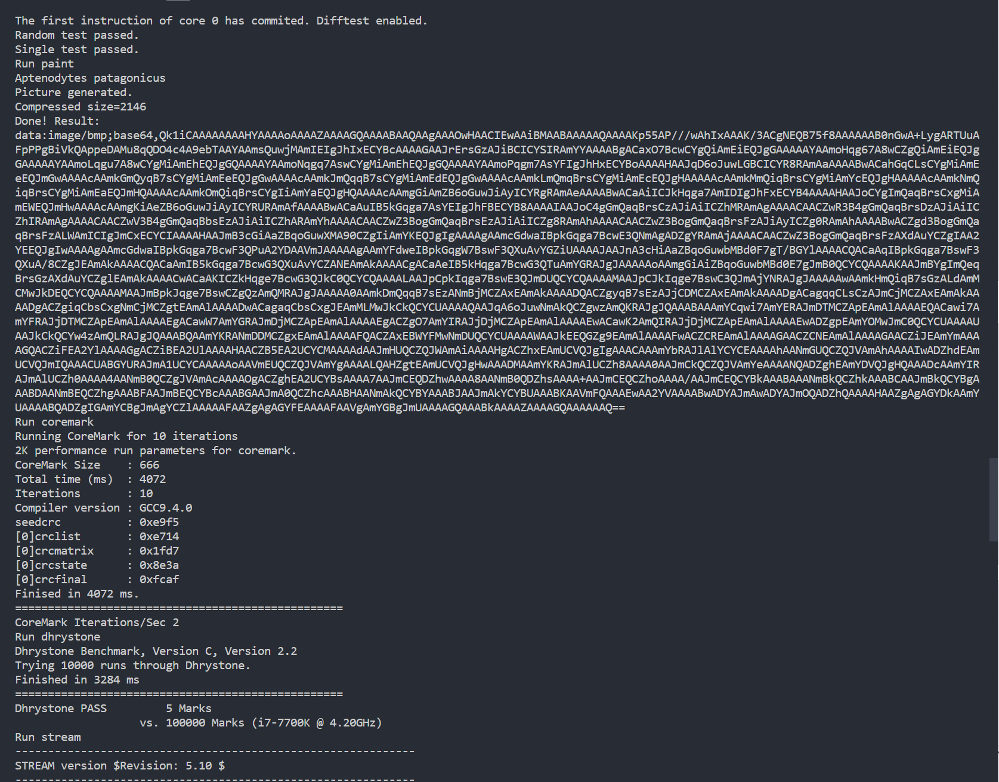
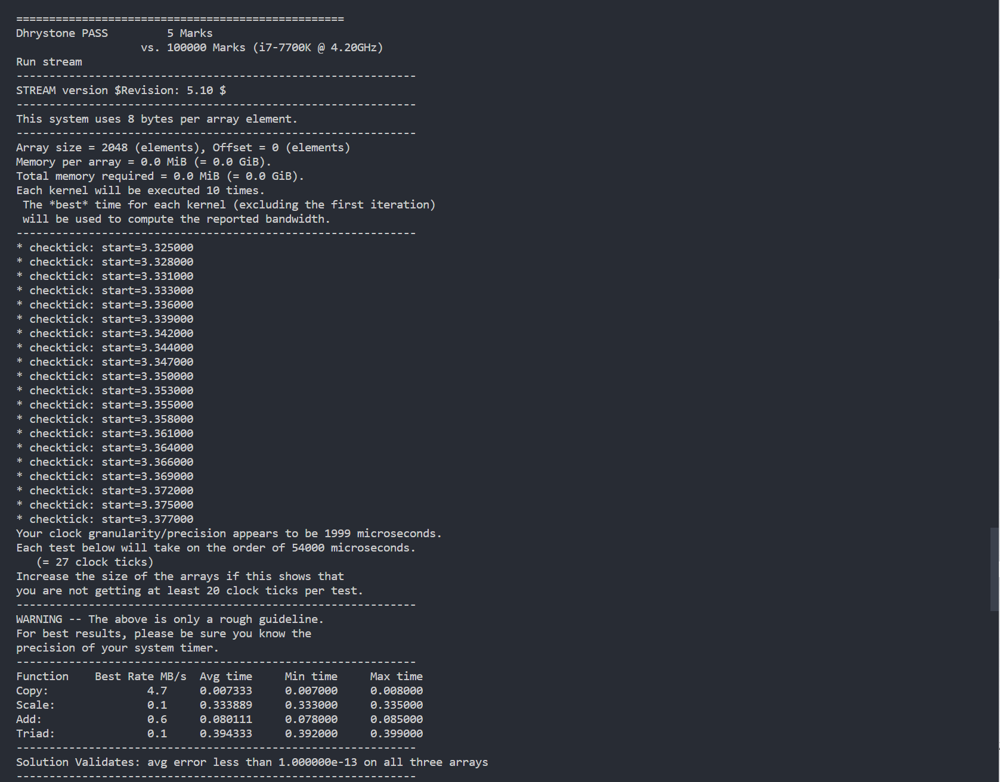
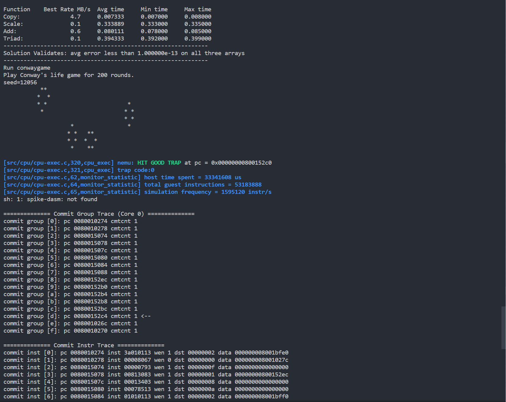
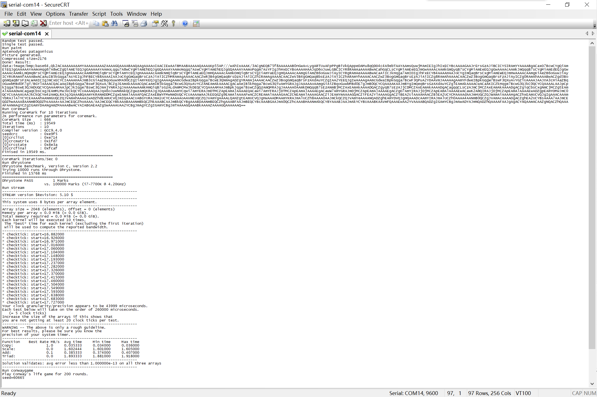
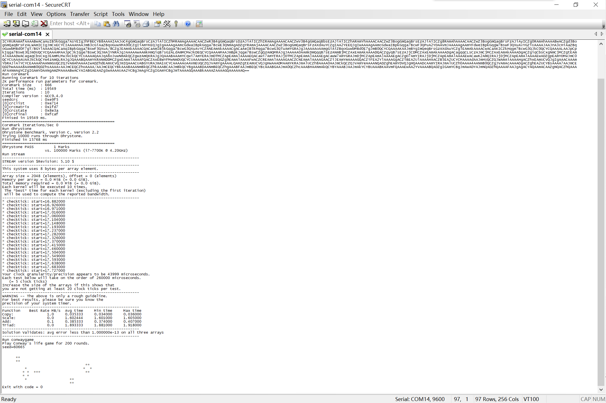

# lab 2实验报告

20302010043 苏佳迪

## 一、流水线的改动

为了支持访存的随机延迟，流水线做出了以下改动：

### 1、fetch阶段访存导致的流水线阻塞

在还没有取出指令时对流水线进行阻塞，只阻塞fetch流水段，后续流水段让其继续流动，同时插入气泡。即需要保持`pc`寄存器的数据，同时对`fetch_decode`寄存器进行复位清除逻辑，也就是插入气泡，使得到指令前的错误数据不会进入流水线。

即给`pc`添加阻塞信号，阻塞条件为`ireq.valid == 1 && iresp.data_ok == 0`；给`fetch_decode`寄存器添加复位信号，复位条件为与`pc`的阻塞信号相同。

```verilog
assign stall = ireq.valid == 1 && iresp.data_ok == 0;
assign flush = ireq.valid == 1 && iresp.data_ok == 0;
```

对**`pc`的阻塞信号与`fetch_decode`的清除信号**的逻辑如下：

当`ireq.valid == 1 && iresp.data_ok == 0`时，说明发起了一次访存请求并且响应数据未就位，此时需要阻塞`fetch`流水段，并在`decode`阶段插入气泡；

```verilog
assign stall = ireq.valid == 1 && iresp.data_ok == 0;
assign flush = ireq.valid == 1 && iresp.data_ok == 0;
// 注：此信号并非包含所有情况
```

对响应数据的获得无需进行判断，只需要连线即可，若数据还未就位，由于阻塞和清除信号的存在不会有错误指令流入流水线。

### 2、memory阶段访存导致的流水线阻塞

memory访存时需要阻塞的流水段：`fetch`、`decode`、`execute`与`memory`，即产生`pc`、`fetch_decode`、`decode_execute`与`execute_memory`寄存器的阻塞信号；

需要清除的流水段：`writeback`，由于`memory`的数据未就位，`writeback`执行完后应该插入一个气泡，即`memory_writeback`寄存器的清除信号；

```verilog
assign stall = dreq.valid == 1 && dresp.data_ok == 0;
assign flush = dreq.valid == 1 && dresp.data_ok == 0;
// 注：此信号并非包含所有情况
```

`dreq.valid`信号的逻辑：

```verilog
assign dreq.valid = dataE_out.ctl.memwrite || dataE_out.ctl.memread;
```

### 3、流水线控制冒险问题

当在`execute`流水段判断到需要跳转时，此时`fetch`流水段在进行取指（一条错误指令），`decode`流水段在进行译码（气泡或一条错误指令）；而`pc_next`已经更新为正确的跳转地址，而由于当前`fetch`阶段还没有取出指令，导致`pc`在阻塞，`pc_next`无法进入流水段；那么在下一个周期若取指令未完成，`execute`阶段的数据向后移动，**导致跳转信号丢失**，需要处理跳转的问题。

**一种可行的方案如下**：

当`execute`流水段指出指令为跳转指令时，同一周期内将`fetch`与`execute`流水段阻塞，`decode`与`memory`流水段插入气泡，（`fetch_decode`与`execute_memory`清除信号拉高）。这种状态持续到当前取指完成，取指完成后的下一个周期上升沿，应该开始`pc`为跳转地址的取指；此时未跳转的错误指令已经被清除出流水线，只需等待指令；

取指刚完成的那个周期：

- `fetch`阶段：`fetch_delay`信号为0，下一个周期不再阻塞；
- `decode`阶段：`fetch_delay`信号为0，下个周期不再清除；`jump`信号为1，下个周期清除；综合效果为清除；
- `execute`阶段：`fetch_delay`信号为0，下个周期不再阻塞；
- `memory`阶段与`writeback`阶段：下个周期不再插入气泡；

取指完成的下一个周期：

- `pc`寄存器不再阻塞，进行跳转指令的取指（fetch阶段）；
- `decode`清除掉错误指令，当前为气泡，等待fetch传入正确的指令；
- `execuet``memory`与`writeback`都是为传入的气泡；

如果在execute阶段指出跳转的周期中，`iresp.data_ok`已经为1，即错误指令取指完成；那么`fetch_decode`的清除信号和`decode_execute`的清除信号会拉高（jump），把`fetch`与`decode`流水段可能有的错误指令清除掉，流水线工作正常。

综上：各个寄存器的控制信号做以下增加：

```verilog
// 当execute阶段指出是跳转指令时，阻塞fetch与execute流水段
assign fetch_stall = dataE.ctl.jump && fetch_delay;
assign execute_stall = dataE.ctl.jump && fetch_delay;

// 当execute阶段为跳转指令时，清除decode与memory，decode阶段信号不需要添加，memory的清除信号添加
assign memory_flush = dataE.ctl.jump && fetch_delay;
```

注：以上信号为解决控制冲突的信号，还有其他情况，并不代表最终的流水线控制信号。

### 4、转发器问题

原来的转发器为组合逻辑，由于`execute`阶段阻塞，但`memory`阶段清除，导致转发出的`execute`阶段数据出错（转发数据源丢失），即转发器受阻塞影响导致数据转发失效，需要修改转发器。

转发器中的数据应该满足以下条件：

- 在对应流水段阻塞期间，不会由于流水段的组合逻辑改变结果（只有在指令向后流动的时候才把新的数据更新），即**只有当指令向后流动时，才会根据当前指令的结果更新转发器**，在指令的阻塞期间转发器也要阻塞，避免转发器数据随着指令运行结果改变导致反过来影响指令结果的情况；

- 不被气泡覆盖，**如果当前指令时为了阻塞而插入的气泡，说明转发器不应该更新数据**，防止丢失转发源导致数据冲突；

由上述两个条件得到修改后的转发器：

需要同步时钟信号与阻塞信号，当对应的指令阻塞或为气泡时，阻塞转发器，保持上次转发的数据：

```verilog
// 输入端口的stall信号包括指令阻塞和指令气泡两个情况
always_ff @( posedge clk ) begin
    if (~stall) begin
        if( regwrite ) begin
            dataForward.valid = 1'b1;
            dataForward.dst = dst;
            dataForward.data = data;
        end 
        else begin
            dataForward.valid = 1'b0;
        end
    end
end
```

## 二、测试结果

### 1、verilator仿真测试结果







绘制完成的图像如下，绘制用时`4646`毫秒；


`coremark`测试得到`CoreMArk Iterations/Sec` 参数为2；`dhrystone`测试得分为5分；

### 2、上板串口软件测试结果

#### 总的测试结果

（字体原因可能不清晰，下面有每部分的较清晰的截图）





绘制完成的图像如下，绘制图片用时`22578`毫秒；


`coremark`测试得到`CoreMArk Iterations/Sec` 参数为2；`dhrystone`测试得分为1分；

#### 单独每一项测试结果

`paint`：

串口软件输出


`coremark`：


`dhrystone`：


`stream`：


输出`avg error less than 1.000000e-13 on all three arrays`说明测试通过；

`conwaygame`：


