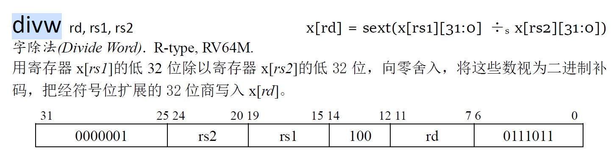
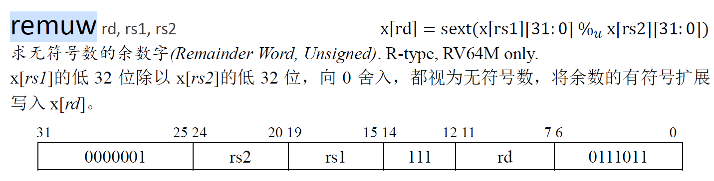

# lab 3分析与设计

lab 3共有两个任务：

- 在原有的基础上增加实现乘除法指令，要求实现多周期乘除法器，不能用`/`和`%`运算符；
- 实现缓存，优化处理器访存；

## 一、增加实现的指令与功能

### 1、mul（R-type）


把两个寄存器数据`rd1`和`rd2`相乘的结果写入目标寄存器；

alu操作为：`MUL`，结果写回寄存器；

### 2、mulw（R-type）


把两个寄存器数据`rd1`和`rd2`相乘的结果64位结果，截取低32位，进行符号扩展后的结果写入目标寄存器；

alu操作为`MUL`，结果写回寄存器；

alu的处理逻辑为：首先把两个数据进行截断，得到低32位（高位无符号扩展），得到后把两个数据送入乘法器运算，得到的结果截取低32位进行扩展得到alu结果；

### 3、div（R-type）


把两个寄存器数据`rd1`和`rd2`相除的结果写入目标寄存器；

alu操作为：`DIV`，结果写回寄存器；

### 4、divu（R-type）


把两个寄存器数据`rd1`和`rd2`无符号相除的结果写入目标寄存器，也就是把数据视为无符号数；

alu操作为：`DIVU`，结果写回寄存器；

### 5、divw（R-type）



把两个寄存器数据`rd1`和`rd2`低32位进行相除的结果写入目标寄存器；

alu操作为：`DIV`，结果写回寄存器；

alu的处理过程与`mulw`一致，先截取操作数，进行计算，随后扩展得到的结果；

### 6、divuw（R-type）


把两个寄存器数据`rd1`和`rd2`低32位进行无符号相除的结果写入目标寄存器，把数据视为无符号数；

alu操作为：`DIVU`，结果写回寄存器；

alu的处理过程与`mulw`一致，先截取操作数，进行计算，随后扩展得到的结果；

### 7、rem（R-type）


把两个寄存器数据`rd1`和`rd2`余数写入目标寄存器，即取模运算；

alu操作为：`MOD`，结果写回寄存器；

### 8、remu（R-type）


把两个寄存器数据`rd1`和`rd2`余数写入目标寄存器，数据视为无符号数；

alu操作为：`MODU`，结果写回寄存器；

### 9、remw（R-type）


把两个寄存器数据`rd1`和`rd2`低32位进行取模的结果写入目标寄存器；

alu操作为：`MOD`，结果写回寄存器；

alu的处理过程与`mulw`一致，先截取操作数，进行计算，随后扩展得到的结果；

### 10、remuw（R-type）



把两个寄存器数据`rd1`和`rd2`低32位进行无符号取模的结果写入目标寄存器；

alu操作为：`MODU`，结果写回寄存器；

alu的处理过程与`mulw`一致，先截取操作数，进行计算，随后扩展得到的结果；

## 二、alu的改进

为了支持乘除法指令，需要实现多周期的：乘法器`multiplier`，除法器`divider`和取模器`modulus`；三种运算都采用有限状态机控制的方式，通过竖式计算的逻辑实现电路计算；（`multiplier.sv`和`divider.sv`为两个参考的32位多周期乘除法器）

假设三种运算器都实现后，alu中应改进为时序逻辑并始终连接运算器，以乘法器为例，

乘法器的输入输出端口如下：

```verilog
module multiplier (
    // 输入端口：时钟信号，复位信号，有效信号，符号计算信号与两个操作数
	input logic clk, reset, valid, sign,
    input u64 srca, srcb,
    // 输出端口：计算结束的握手信号与计算结果
    output logic done,
    output u64 result
);
```

alu的乘法**运算逻辑**如下：

- alu中判断是否为乘法操作，如果命中，则把乘法器有效信号置为1，发起一次乘法运算请求；
- 无论alu中的运算是什么种类，`multiplier`应始终连接两个操作数；
- 乘法操作时，`multiplier`接收到`valid`信号，开始进行乘法计算；
- alu中始终阻塞，当`multiplier`的握手信号`done`为1时，说明计算结果已有效，在下一周期完成一次握手；
- 完成握手后运算结束，alu进行一次握手，开始处理下一条指令；

综上，alu应该由组合逻辑调整为时序逻辑，接收同步时钟信号，且乘法器的线路逻辑如下：

```verilog
module alu(
	// ...
);
    // 处理操作数
    // ...
    
    // 进行计算的组合逻辑
    always_comb begin
        unique case(alu_func)
            // 其他运算...
            // 乘法运算，乘法运算置位，开始运算
            MUL : mul_valid = 1'b1;
        endcase
    end
    
    // 处理结果
    // ...
    
    // 对外生成阻塞信号，运算器未计算结束时
    assign stall = (mul_valid || div_valid || mod_valid) && ~done;
    
    // 增加时序处理握手
    always_ff(posedge clk) begin
        // 上次运算结束，且下次运算不是乘法，则把mul_valid置为0；
        if(done && (alu_func != MUL) ) begin
        	mul_valid = 1'b0;
        end
    end
    
    // 连接乘法器
    multiplier multiplier(
        .clk(clk), .reset(reset), 
        .valid(mul_valid), .sign(sign),
        .srca(srca), .srcb(srcb),
        .done(done),
        .result(result)
    );
endmodule
```

除法器和取模器逻辑相同，需要增设对应的控制信号。

## 三、缓存设计

### 1、缓存参数

本次lab需要实现的缓存参数如下：

- word = 8 Byte									1个字为8字节
- cache line = 16 words                      1个cache块为16字                            块内偏移offset为4位
- cache ways = 4                                  cache结构为4路组相联
- cache sets = 4                                    cache共4组                                        缓存索引index为2位
- cache lines = 16                                 cache存储共16块

### 2、缓存的端口设计

缓存处于cpu和memory之间，它的行为如下：

与cpu交互的一对端口：

- 接收cpu传入的请求信号，包括请求是否有效`vaild`，请求类型由`strobe`表示，请求地址`address`，请求数据`data`；
- 输出cpu访存请求的响应信号，包括握手信号`data_ok`和读取的数据；

与memory交互的一对端口：

- 发起对主存的访存请求信号，包括请求是否有效`valid`，请求类型由`strobe`表示，请求的块地址`address`，请求的数据块`data`；
- 接收主存的请求响应信号，包括单个数据握手信号与整个块的握手信号，以及读取到的块数据；

因此cache的端口设计如下，以`DCache`数据缓存为例：

```verilog
module DCache(
	input clk, reset,
    // 与处理器的通信端口
    input dbus_req_t dreq,			// 处理器的访存请求
    output dbus_resp_t dresp,		// 处理器的访存响应
    // 与主存的通信端口
    output cbus_req_t creq,			// 对主存发起的访存请求
    input cbus_resq_t cresp,			// 从主存得到的响应
);
    // ... 
endmodule
```

### 3、缓存的状态转化与行为

采用有限状态机控制缓存，缓存在不同状态下有不同的行为和下一状态。

缓存状态分为四种：空闲`IDLE`、标志比较`COMPARE`,取数`FETCH`与写回`WRITEBACK`，三者结合输入对应不同的输出与`state_nxt`

（即有限状态机的`input + state -> output + state_nxt`）

状态定义：

```verilog
localparam type state_t = enum logic[2:0] {
    IDLE, COMPARE, ALLOCATE, WRITEBACK
};
```

四个状态的行为与状态函数：

#### （1）IDLE状态

`IDLE`的缓存处在空闲（或校验数据）的状态时等待处理器的请求；

因为`IDLE`状态下缓存不会处于向主存通信的状态，所以输入的`cresq`信号为无效信号不需要考虑，只需要考虑`dreq`的状态函数关系：

`dreq`中的控制信号只有`valid`一个，以下为`valid`不同信号对状态机的影响（分析`output` 与`state_nxt`）：

- `valid == 0`，即未发起有效请求，因此缓存下个周期状态仍未`IDLE`空闲状态，输出为无效数据（`data_ok == 0`）；
- `valid == 1`，即发起有效请求，因此缓存下个周期转换为`COMPARE`状态，进行cache内访存；

#### （2）COMPARE状态

`COMPARE`的缓存处在判断此次请求是否命中的状态，cache通过从`meta_ram`读取的`meta`判断是否命中（判断`meta.valid`和`meta.tag`），分为两种情况：`hit`与`miss`：

- `hit`时：

    若命中的话，此时`dresp.data`已经为从`data_ram`中读取到的数据，不需要额外的逻辑去得到命中后得到的数据；判断读写请求的情况（`|strobe`），若为写请求，则设置`meta_ram`和`data_ram`的写使能为1，数据为cpu请求的数据，（`meta`的`valid`和`tag`不需要修改，只需要修改`dirty`）；

    下一个状态为`IDLE`；

- `miss`时：

    若缺失的话，此时从读取到待替换的块地址，若`meta.dirty`为1即为脏数据，发起对主存的写请求，下个周期状态为`WRITEBACK`；

    若`meta.dirty`不是脏数据，直接发起读请求，下一个周期为`ALLOCATE`状态；

    不管是读还是写，都需要设置`creq.valid`为1，读的话`dreq.addr`为待读的块首地址（即`dreq.addr`的`tag`和`index`拼接）；写的话`dreq.addr`为要替换的块首地址（即要替换的`meta.tag`和`index`拼接）；

#### （3）ALLOCATE状态

`ALLOCATE`状态下，缓存处于向主存发送读请求的状态，此时cpu被阻塞，无需考虑`dreq`的输入，输出和下一个状态取决于主存的响应输入（即`cresp`），只需要考虑`cresp`的状态函数关系：

`cresp`中的控制信号有两个：单个数据的握手信号`ready`与 整个事务握手信号`last`，四种组合：`00`、`01`、`10`和`11`，其中`01`情况不存在，考虑剩余三种：

- `00`（即单个与整个事务握手信号均为0），说明仍需等待数据响应，下个周期状态仍为`ALLOCATE`；

- `10`（单个数据握手，但事务不握手），说明一个数据读取完成，接着需要读取下一个地址的字（整个块还未完成），

    这个周期中需要把读到的数据存储，即需要把写回的块地址增加8，然后继续等待下一个字，下个周期状态仍未`ALLOCATE`；

- `11`（单个数据握手，整个事务握手），说明在当前周期整个块的数据传输完成，需要在下个周期前完成存储最后一个块（赋值：`dram.data = cresp.data`），下个周期处理阻塞的处理器请求，即状态为`COMPARE`；

    （此外`ALLOCATE`状态下应该同时修改`meta.tag`，因为块标志随着读取内存而改变）

#### （4）WRITEBACK状态

`WRITEBACK`状态下，缓存出去向内存中发送写请求的状态，此时cpu被阻塞，逻辑和`ALLOCATE`相同：

`00`与`10`状态下继续写入数据，需要调整`creq.data`，调整为块内下一个字数据，下个状态仍为`WRITEBACK`，

`11`状态下事务握手，写请求结束，下个周期为`ALLOCATE`状态，以块为单位读取；

### 4、组相联中cache set的结构

cache采取逻辑与存储分离的结构，cache分为两部分：

`ram`中存储的data和meta（例化`data_ram`和`meta_ram`两个存储元件）`cache_set_array`中存储的每个cache line的首地址；在`ram`中，data与meta都以word为单位进行存储，一个cache块占16个存储单元；

- 考虑如何读出cache line（逐个字读）

    `data_ram`为单端口，读取时应该根据`meta`进行判断是否命中以及命中的cache line在`ram`中的地址（data和meta的存储地址相同对应），将该地址传给`data_ram`从而实现正确的cache line读取，读取到的cache再offset；

- 考虑如何写入cache line（逐个字写）

    从cache set的数组中判断替换地址（即要写入的块地址），并以字为单元逐个写入（调整）；

**ram结构：16个块每个块16个字，data_ram共256个存储单元，地址宽为16`。**ram为单端口，即一次只会读出一个，需要把cache命中的地址传入（包括offset在内），直接精确到字；（写相同）

以字为存储单元以供和cpu通信，同一个块内的数据连续存放（略去末3位）。

### 5、cache与cpu通信

cache与cpu通信依靠`dreq`与`dresp`，通信的数据单元为字。请求与端口响应信号：

```verilog
// dbus_req_t
typedef struct packed {
    logic    valid;   // 请求是否有效
    addr_t   addr;    // 请求地址（相较于主存的地址，由cache处理为缓存地址）
    msize_t  size;    // 请求的数据大小（字节数），为了支持不同粒度读写
    strobe_t strobe;  // 写请求时写入哪几个字节，若全写入即为'1，读请求为'0
    word_t   data;    // 待写入的数据
} dbus_req_t;

// dbus_resq_t
typedef struct packed {
    logic  addr_ok;  // 缓存是否已经接收访存地址
    logic  data_ok;  // 缓存响应数据的握手信号
    word_t data;     // 缓存响应的数据
} dbus_resp_t;
```

当cpu发起一次请求时：

读请求：cache从`addr`中截取到`index`组号，根据组号找到数据存储的`meta`，读取meta中的数据判断是否命中（**always_comb驱动**）；若命中，将该缓存块对应的块首地址赋给一个变量`position`，该变量连接`data_ram`的读端口，读取到对应的字直接返回；若未命中则与memory通信；

写请求：cache从`addr`中截取到要写入的`index`组号与`offset`块内偏移，根据`meta`判断是否命中（判断的是块是否命中），若命中，块首地址赋值给`position`，由此计算出cache中的存储地址，设置strobe与data写入数据，同时修改`meta`；若缺失则于memory通信；

### 6、cache与memory通信

cache与memory通信通过`creq`发起对主存的访存请求，通过`cresp`得到主存响应的数据；通信的数据单元为块，但是是以字为单元进行数据突发传输，即需要多次传输完成一次事务transaction；期间请求的数据地址始终为块的**首**地址不能改变。请求与响应端口的信号：

```verilog
// cbus_req_t
 typedef struct packed {
     logic    valid;     // 向主存发起的请求是否有效
     logic    is_write;  // 是否为一个写事务，写回
     msize_t  size;      // 一次的字节数（以块为事务，一个字一个字传）设置为8
     addr_t   addr;      // 写回的字的起始地址（同样一个字一个字写）始终保持为首地址，不能改变
     strobe_t strobe;    // 写回哪些字节，对于缓存来说只有'0与'1两种情况
     word_t   data;      // 写回的数据（一个字），与当前写回的地址对对应
     mlen_t   len;       // 突发的数量（写回的字的个数，一个cache line的个数）
	 axi_burst_type_t burst;
 } cbus_req_t;

// cbus_req_t
 typedef struct packed {
     logic  ready;  // 单个数据的握手信号
     logic  last;   // 整个事务握手
     word_t data;   // 主存响应的数据
 } cbus_resp_t;
```

当cache发起一次请求时：

读请求：读请求发生在`ALLOCATE`状态，cache应设置`creq`的相关信号，`valid`置为1，`is_write`置为0，`size`置为8，`addr`置为此次要读取的块首地址，需要tag、index拼接而成，不考虑块内位移，因为始终为块的首地址；`strobe`置为`'0`，表示不写入，`data`无效数据，`len`设置为`MLEN16`，表示一次突发传输16个字；所有上面的请求信息，在一次事务中必须保持不变；需要注意的是，读请求需要设置写入cache line的参数，每次`ready`为1的周期，需要把`cresp.data`存入当前缓存的对应地址（由offset和position得到），随后更新offset（自增1，准备存放下一个字），直到突发传输完成`last`为高电平。

写请求：写请求发生在`WRITEBACK`状态，cache应设置`creq`的相关信号，`valid`置为1，`is_write`置为0，`size`置为8，`addr`置为块的首地址，`strobe`置为`'1`，表示改字全部写入，`data`为当前字地址要写入的数据，`len`设置为`MLEN16`，表示突发传输16个字，除了`data`外，其他信息在一次事务中必须保持不变；需要注意的是，写请求需要设置读取cache line的参数，每次`ready`为1的周期，需要把`creq.data`向后更新一个字，即offset + 1，（position保持不变），读到下一个字设置到对内存的写请求中，直到突发传输完成。

## 四、缓存实现

### 1、参数

缓存实现中需要用到的参数：

（1）与处理器请求响应：`dreq`与`dresp`，其中`dreq`为输入无需定义，`dresp`为输出端口，需要定义和设置；

（2）与内存请求响应：`creq`与`cresp`，其中`cresp`为输入无需定义，`dreq`为输出端口，需要定义和设置；

（3）状态机相关：`state`与`state_nxt`，分别表示当前周期状态与下一周期状态；

（4）缓存访存相关：

​		`data_ram`，分别表示对数据存储器访存的接口信号；

​		`meta_write`，写入meta的信息与

​		`tag`、`index`与`offset`表示处理器请求地址的三个定位信号；

​		`meta`，表示当前操作的cache line的meta信息；

​		`position`，表示当前操作的data块首地址，可能是读也可能是写；

​		`cache_sets`：记录一个组中每个块的元信息与`data`块首地址；（内部有一个`meta_t[ASSOCIATIVITY]`与`addr[ASSOCIATIVITY]`）

​		

### 2、驱动

对各个信号的驱动方式：

（1）`dresp`信号：assign驱动每个属性，
