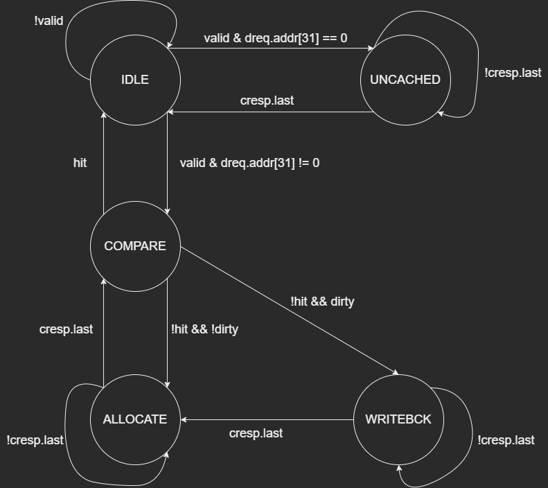

# lab 3实验报告

20302010043 苏佳迪

## 一、流水线的改动

为了支持多周期乘除法器，流水线做出以下调整：

### 1、支持乘多周期除法器

为了支持乘除法器的多周期运算，给`alu`和`execute`添加时钟与握手信号；当`execute_data_ok`为低电平时，说明`execute`在该周期未计算完成，此时需要阻塞`execute`以及之前的流水段，`memory`与`writeback`流水段继续流动并插入气泡，直到某个周期中`execute_data_ok`信号为高电平，恢复流动。

存在一种情况：`execute`计算乘除法，此时需要用到`memory`转发的数据，但`memory`为访存指令存在延迟，即`multiplier`和`divider`拿到的操作数据有可能是不对的，需要在拿到正确的数据后进行重新计算，解决方案为在满足上述条件时（具体到信号为`hazardOut.clear == 1`），将`multiplier`与`divider`的`reset`信号拉高，直到某一周期`memory`得到正确的结果`state_nxt`设置为`DOING`，下一周期开始计算。

### 2、转发器问题

`execute`阻塞，`memory`与`writeback`继续流动，此时会导致转发器数据覆盖，即memory会把writeback转发的数据覆盖掉（lab2时已经改进转发器解决无效数据转发的问题），若此时`execute`阻塞阶段需要用到writeback转发的数据就会导致执行错误。若通过`memory`阻塞的方式防止覆盖，在特定条件下会导致`ireq`和`dreq`循环访存一直阻塞，无法正常执行。

解决方案：添加两个备份转发器，当`execute`阻塞而`memory`不阻塞时，阻塞两个备份转发器，五个转发器进行转发；如下图：

通过两个备份转发器，在一般情况下，`forward4`与`forward5`转发器与`forward2`和`forward3`转发器的数据同步，在特殊条件下阻塞：

- `execute`阻塞而`memory`不阻塞时：`forward4`与`forward5`阻塞，1~3正常运行，备份execute之前的几条指令的转发数据，防止数据覆盖导致的数据源丢失；
- `memory`阻塞时，`forward5`阻塞保持`i3`转发的数据，`forward3`正常转发接收`i2`转发的数据；

## 二、缓存的设计

### 1、状态机

缓存状态有五种：空闲`IDLE`、标志比较`COMPARE`,取数`FETCH`、写回`WRITEBACK`与不经过缓存`UNCACHED`，转化关系如下：

（hit状态下存在1个周期的延迟）

### 2、LRU替换策略

**每个cache set定义一个组内数组**`addr_t [ASSOCIATIVITY - 1 : 0] used_line`，数组大小为关联度`ASSOCIATIVITY`，每个元素下标代表组内编号为下标的块，**数据为该块的`hit`情况，数据范围从0到ASSOCIATIVITY - 1**，该信号只会在`COMPARE`状态并且hit条件下修改，修改逻辑如下：

- 如果`i == position`，那么把`used_line[i]`置为0，表示最近一次访问；
- 如果`used_line[i] >= used_line[position_nxt]`，那么`assign used_line[i] = used_line[i]`；
- 如果`used_line[i] < used_line[position_nxt]`，那么`assign used_line[i] = used_line[i] + 1`；

通过这样的逻辑来控制`used_line`的访问情况始终保持在最近访问为`0`，最远访问为`ASSOCIAVITY - 1`；每个cache set维护一个数组，用该数组表示最近访问的情况，数据越小表示越近访问，数据越大表示越远访问；当组内需要进行替换时，通过组合逻辑定位到max的块，确定该块为要替换的块，替换完成后状态回到COMPARE时，因为hit信号拉高，会维护组内的这个数组，按上述逻辑进行调整。

## 三、测试结果

### 1、verilator测试

在verilator仿真测试的环境下，`TEST=paint`用时2294，如下图：

`TEST=coremark`测试结果为：`Interations/Sec 14`；`TEST=dhrystone`测试结果为：`10 Marks`；`TEST=stream`的测试结果为`Copy Best Rate = 8.4MB/s `；`TEST=conwaygame`测试结果如上。

#### 2、上板串口软件测试

在上板测试的环境下，`TEST=paint`用时1307，如下图：

`TEST=coremark`测试结果为：`Interations/Sec 17`；`TEST=dhrystone`测试结果为：`18 Marks`；`TEST=stream`的测试结果为`Copy Best Rate = 15.2MB/s `；`TEST=conwaygame`测试结果如上。