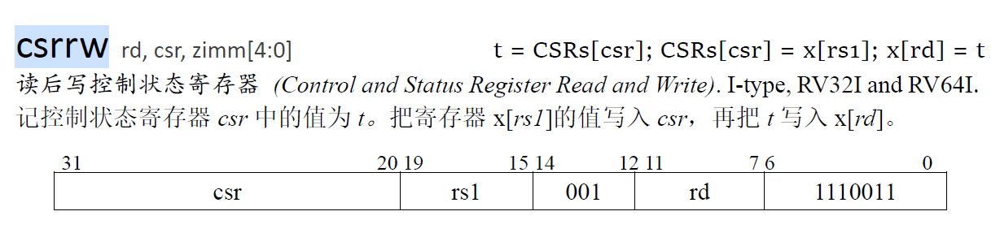
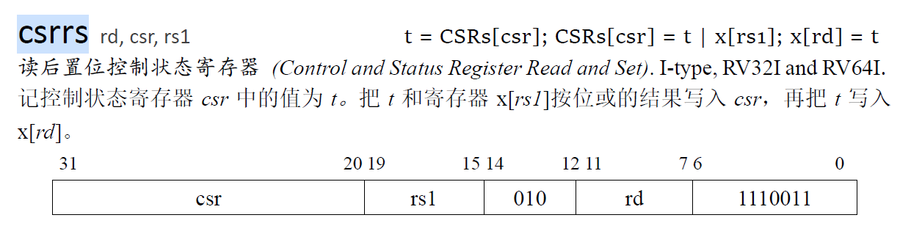
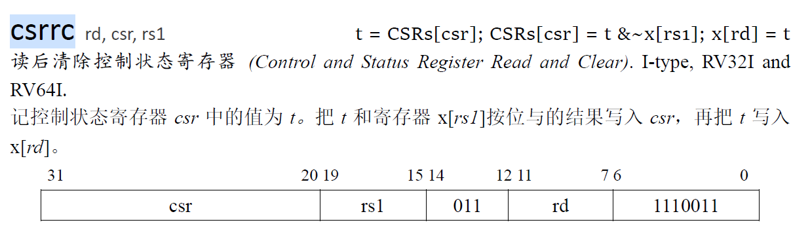
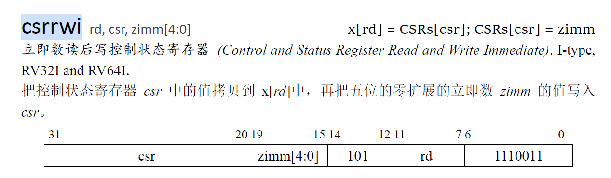
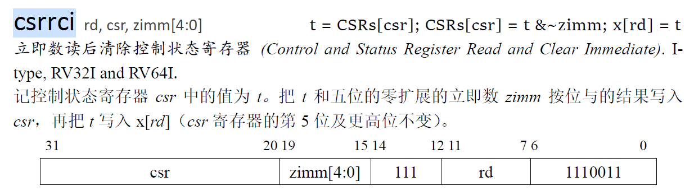
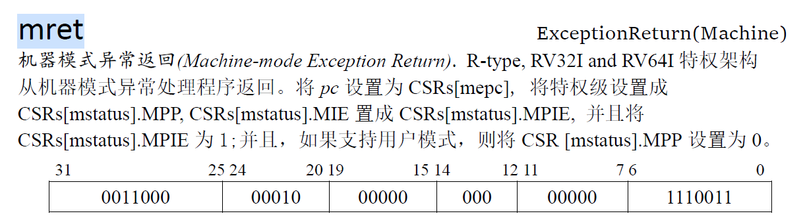
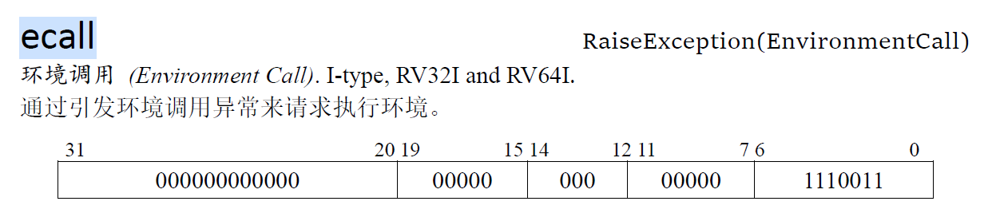

# lab 4分析与设计

lab 4要求为实现异常和中断机制：

- 需要实现 CSR 的 mstatus, mtvec, mip, mie, mscratch, mcause, mtval；选做：pmpcfg0, pmpaddr0
- 需要实现 mode 寄存器

## 一、增加的指令

对`csr`寄存器的说明：

`csr`是一组寄存器数据，表示全局的控制器状态，内含有多个功能域，根据寻址下标来判断指令需要读写的的功能域。地址位为12位，存在指令中的高12位。

对`mode`的说明：

`mode`同样为一个状态寄存器，字宽为2位，表示当前处理器的工作状态。

### 1、csrrw（I-type）



该指令需要实现两个操作：一是从`csr`寄存器中读取数据`CSRs[csr]`，写入`rd`号寄存器；二是读出`rs1`号寄存器，将该数据写入`csr`寄存器。

需要把旧的`csr`数据写入通用寄存器堆`regfile`的`rd`号数据，**该操作发生在写回阶段**，是一个正常的指令写回过程，decode时设置`dst`和`regwrite`，并将读到的`CSRs[csr]`作为srca传入execute并设置需要转发信号为0，避免转发；execute在得到后向后传递`regdata`最终在writeback写回。需要把通用寄存器`regfile`的`rs1`数据写入`CSRs`寄存器组，**该操作也发生在写回阶段**，执行阶段不仅计算需要写入通用寄存器堆的数据，同时也计算要写入控制状态寄存器的数据，向后传递并在`writeback`时交给`CSRs`（`CSRs`从`dataW`中读取输入端口数据），在下一个周期上升沿写入`CSRs`，该步需要decode产生`CSRs`的写使能和写入下标（12位）。

### 2、csrrs（I-type）



该指令需要实现两个操作：一是从`csr`寄存器中读取数据`CSRs[csr]`，写入`rd`号寄存器；二是读出`rs1`号寄存器，与旧的`csr`寄存器数据进行或运算后得到数据，将该数据写入`csr`寄存器。

需要把旧的`csr`数据写入通用寄存器堆`regfile`的`rd`号数据，**该操作发生在写回阶段**，是一个正常的指令写回过程，decode时设置`dst`和`regwrite`，并将读到的`CSRs[csr]`作为srca传入execute并设置需要转发信号为0，避免转发；execute在得到后向后传递`regdata`最终在writeback写回。需要把通用寄存器`regfile`的`rs1`数据处理后写入`CSRs`寄存器组，**该操作也发生在写回阶段**，decode时设置`csr_a`和`csr_b`，同时设置二者的转发信号（理论上只需要`csr_b`），执行阶段不仅计算需要写入通用寄存器堆的数据，同时也计算要写入控制状态寄存器的数据，向后传递并在`writeback`时交给`CSRs`（`CSRs`从`dataW`中读取输入端口数据），在下一个周期上升沿写入`CSRs`，该步需要decode产生`CSRs`的写使能和写入下标（12位）。

### 3、csrrc（I-type）



该指令需要实现两个操作：一是从`csr`寄存器中读取数据`CSRs[csr]`，写入`rd`号寄存器；二是读出`rs1`号寄存器，与旧的`csr`寄存器数据进行与运算后得到数据，将该数据写入`csr`寄存器。

需要把旧的`csr`数据写入通用寄存器堆`regfile`的`rd`号数据，**该操作发生在写回阶段**，是一个正常的指令写回过程，decode时设置`dst`和`regwrite`，并将读到的`CSRs[csr]`作为srca传入execute并设置需要转发信号为0，避免转发；execute在得到后向后传递`regdata`最终在writeback写回。需要把通用寄存器`regfile`的`rs1`数据处理后写入`CSRs`寄存器组，**该操作也发生在写回阶段**，decode时设置`csr_a`和`csr_b`，同时设置二者的转发信号（理论上只需要`csr_b`），执行阶段不仅计算需要写入通用寄存器堆的数据，同时也计算要写入控制状态寄存器的数据，向后传递并在`writeback`时交给`CSRs`（`CSRs`从`dataW`中读取输入端口数据），在下一个周期上升沿写入`CSRs`，该步需要decode产生`CSRs`的写使能和写入下标（12位）。

### 4、csrrwi（I-type）



该指令需要实现两个操作：一是从`csr`寄存器中读取数据`CSRs[csr]`，写入`rd`号寄存器；二是得到立即数immediate，将零扩展后的立即数写入`csr`寄存器。

需要同时处理两个寄存器（一个控制状态寄存器，一个通用寄存器）

需要把旧的`csr`数据写入通用寄存器堆`regfile`的`rd`号数据，**该操作发生在写回阶段**，是一个正常的指令写回过程，decode时设置`dst`和`regwrite`，并将读到的`CSRs[csr]`作为srca传入execute并设置需要转发信号为0，避免转发；execute在得到后向后传递`regdata`最终在writeback写回。需要把通用寄存器`regfile`的`rs1`数据处理后写入`CSRs`寄存器组，**该操作也发生在写回阶段**，decode时**添加堆`csr`指令的立即数译码**，设置`csr_a`和`csr_b`，同时设置二者的转发信号（理论上只需要`csr_b`），执行阶段进行无修改计算，向后传递并在`writeback`时交给`CSRs`（`CSRs`从`dataW`中读取输入端口数据），在下一个周期上升沿写入`CSRs`，该步需要decode产生`CSRs`的写使能和写入下标（12位）。

### 5、csrrsi（I-type）


该指令需要实现两个操作：一是从`csr`寄存器中读取数据`CSRs[csr]`，写入`rd`号寄存器；二是得到立即数immediate，将零扩展后的立即数与原来的数据进行或运算写入`csr`寄存器。

需要同时处理两个寄存器（一个控制状态寄存器，一个通用寄存器）

需要把旧的`csr`数据写入通用寄存器堆`regfile`的`rd`号数据，**该操作发生在写回阶段**，是一个正常的指令写回过程，decode时设置`dst`和`regwrite`，并将读到的`CSRs[csr]`作为srca传入execute并设置需要转发信号为0，避免转发；execute在得到后向后传递`regdata`最终在writeback写回。需要把通用寄存器`regfile`的`rs1`数据处理后写入`CSRs`寄存器组，**该操作也发生在写回阶段**，decode时**添加堆`csr`指令的立即数译码**，设置`csr_a`和`csr_b`，同时设置二者的转发信号（理论上只需要`csr_b`），执行阶段进行**或运算**计算，向后传递并在`writeback`时交给`CSRs`（`CSRs`从`dataW`中读取输入端口数据），在下一个周期上升沿写入`CSRs`，该步需要decode产生`CSRs`的写使能和写入下标（12位）。

### 6、csrrci（I-type）



该指令需要实现两个操作：一是从`csr`寄存器中读取数据`CSRs[csr]`，写入`rd`号寄存器；二是得到立即数immediate，将零扩展后的立即数与原来的数据进行与运算，然后写入`csr`寄存器。

需要同时处理两个寄存器（一个控制状态寄存器，一个通用寄存器）

需要把旧的`csr`数据写入通用寄存器堆`regfile`的`rd`号数据，**该操作发生在写回阶段**，是一个正常的指令写回过程，decode时设置`dst`和`regwrite`，并将读到的`CSRs[csr]`作为srca传入execute并设置需要转发信号为0，避免转发；execute在得到后向后传递`regdata`最终在writeback写回。需要把通用寄存器`regfile`的`rs1`数据处理后写入`CSRs`寄存器组，**该操作也发生在写回阶段**，decode时**添加堆`csr`指令的立即数译码**，设置`csr_a`和`csr_b`，同时设置二者的转发信号（理论上只需要`csr_b`），执行阶段进行无修改计算，向后传递并在`writeback`时交给`CSRs`（`CSRs`从`dataW`中读取输入端口数据），在下一个周期上升沿写入`CSRs`，该步需要decode产生`CSRs`的写使能和写入下标（12位）。

### 7、mret（R-type）



该指令实现从异常返回原指令位置，需要实现对控制状态的维护，包括：

```verilog
// 对csr外部状态的修改，在execute阶段执行
pc <- CSRs[mpec];                            // 跳转到原来的位置，需要设置跳转信号与pc_nxt
// 对csr内部状态的修改，在writeback阶段执行
CSRs[mstatus].mie <- CSRs[mstatus].mpie;    // 设置回原来的全局中断状态
CSRs[mstatus].mpie <- 1'b1;
CSRs[mstatus].mpp <- 2'b0;                        // 支持用户模式设置mpp为0
CSRs[mode] <- CSRs[mstatus].mpp;                    // 返回原来的处理器权限模式
```

### 8、ecall（I-type）



该指令为直接引发进入异常，需要做三件事：更新`CSRs`寄存器内容；设置`pc`为异常处理程序入口；更新权限模式，具体维护操作包括：

```verilog
// 设置跳转地址
pc <- CSRs[mtvec];
// 更新权限模式
CSRs[mode] <- 3;
// 更新CSRs寄存器
CSRs[mepc] <- pc + 4;                        // 设置返回地址
CSRs[mcause][63] <- 1 if interrupt else 0;
CSRs[mcause][62:0] <- code;                    // 设置异常原因
CSRs[mstatus].mpie <- CSRs[mstatus].mie;        // 保存处理异常前的全局中断使能
CSRs[mstatus].mie <- 0;                        // 设置全局中断使能为0
CSRS[mstatus].mpp <- mode;                    // 保存处理异常前的权限模式
CSRs[mtval] <- value; 
```

## 二、异常处理

此次lab中需要处理的异常类型：

- 指令地址不对齐

- 数据地址不对齐（读、写）

- 非法指令

- ecall

lab4的异常在`writeback`段处理，这里的处理是指在`writeback`时，该指令异常可能在`fetch`、`decode`、与`memory`阶段发现：`fetch`阶段判断指令地址是否对齐，若不对齐则不发起访存请求；`decode`判断是否为非法指令或ecall；`memory`阶段判断访存地址是否对齐，若访存地址不对齐则不发起访存请求；当异常指令流到`writeback`时进行处理（即设置`CSRs`寄存器，进行异常处理），同时设置pc为异常处理地址（`pc_select`增加一个输入选择端口）。为了支持异常指令流入`writeback`时得到对应的异常信息，需要记录异常检测期间得到的异常信息并在流水线中传递，一直传递到`writeback`从而处理。

- 当异常信号在write back阶段时，检查异常情况，若发现出现异常则将所有`flush`信号拉高，并设置`pc_nxt`为异常处理入口pc，同时将异常信息设置到`CSRs`寄存器中（`mepc`、`mcause`、`mstatus`、`mtval`与`mode`字段）；
- 下个周期异常指令流出流水线，而`fetch`拿到新的pc开始取指（异常处理程序指令）；而`decode`及以后的流水段都已经刷新没有指令。

对于异常的检测，在每个流水段检测对应可能出现的异常，并在流水线中向后传递到`writeback`阶段。

对于异常的处理，当发现`dataW.exception`为高电位时，说明当前的W阶段指令出现异常，需要跳转到异常处理程序：`mtvec`即在W阶段设置pc跳转到`mtvec`；同时需要刷新流水线，清空`decode``execute``memory`与`writeback`，（reset信号拉高）。同时选中`pc`为`mtvec`并在下个周期开始取指。

## 三、中断实现

中断有三种：外部中断（`external`）、软件中断（`software`）和计时器中断（`timer`），三种中断对应优先级为：`ex` > `sw` > `tm`。

本次lab需要实现的中断类型为软件中断与计时器中断，不需要自己维护中断信号，中断控制器的信号已经维护好了，作为core核的输入端口，需要**在每次提交指令的时候检测是否有中断信号的出现**，如果有则触发中断，执行与异常处理时的同样操作。

中断的表现为一个随机到来的高电位信号，当某一种中断为高电位且流水线状态允许时，需要触发中断（此功能需要有一个专门的部件来检测），进入中断处理程序（跳转pc同时设置返回地址与其他csr参数），当遇到mret的时候返回，代表中断处理完成（与异常处理流程类似）

## 四、流水线改动

### 1、csr指令支持

流水线需要支持`csrrw`等指令执行写入后刷新，刷新即清除当前流水线中的所有指令（流水寄存器`reset`），同时设置从`csr`指令的下一条开始执行（pc跳转）。具体实现为：

实现**刷新**：当`dataW.csrwrite`为高位时，说明当前指令需要写入`csr`，此时该周期需要把`fetch_decode`（清除下个周期译码段），`decode_execute`（清除下个周期执行段）`execute_memory`（清除下个周期访存段）与`memory_writeback`（清除下个周期写回段）寄存器的`reset`信号拉高，完成下个周期的流水线刷新。同时**当W阶段的指令为`csr`指令时，避免`memory`的访存操作，避免刷新前写入错误的数据**。

实现**pc的更新**：当`dataW.csrwrite`为高位时，预期为下个周期流水线被刷新，同时`fetch`阶段开始`dataW.pc + 4`的取指，也就是在当前周期就应该将`dataW.pc + 4`设置为`pcselect`，进行下个周期的pc更新，且这个选择的优先级要高于`dataE.addr`的跳转地址的，因为一个周期中，`pcselect`接收到的非顺序pc只有两个来源`execute`与`writeback`，前者只是普通的跳转，优先级最低。因此当同时出现`execute`与`writeback`的跳转pc请求，响应后者的。

同时有一种情况：当前周期`dataW.csrwrite`为高电位，说明下周期重新开始执行指令，但如果该周期`pc`还没有握手，下周期的pc不会更新，而`writeback`会流出流水线，就导致在fetch取指完成后无法成功跳到`dataW.pc + 4`的位置，所以如果要刷新流水线时的fetch还在取指令，就阻塞整个流水线（包括`writeback`）不让其流动，等到`iresp.data_ok`为1时不再阻塞，某个周期`data_ok`时，将阻塞信号置为0，下个周期`writeback`流出，同时`fetch`的pc更新为`dataW.pc + 4`完成流水线的刷新。

### 2、进入异常

异常会在每个流水段检测，当`dataW.exception`为高位时，说明该指令出现异常需要处理，此时该周期需要把`fetch_decode`（清除下个周期译码段），`decode_execute`（清除下个周期执行段）`execute_memory`（清除下个周期访存段）与`memory_writeback`（清除下个周期写回段）寄存器的`reset`信号拉高，完成下个周期的流水线刷新。同时**当W阶段的发生异常时，避免`memory`的访存操作，避免刷新前写入错误的数据**。

实现**pc的更新**：当`dataW.exception`为高位时，预期为下个周期流水线被刷新，同时`fetch`阶段开始`mtvec`的取指，也就是在当前周期就应该将`mtvec`设置为`pcselect`，进行下个周期的pc更新，且这个选择的优先级要高于`dataE.addr`的跳转地址与`csr + 4`的刷新地址，此时一个周期中，`pcselect`接收到的非顺序pc只有两个来源`execute`与`writeback`，前者只是普通的跳转，优先级最低，后者可能出现两个情况：`csr`指令导致的刷新（`dataW.pc + 4`）与发生异常导致的刷新（`mtvec`），后者优先级高。**但如果该周期`pc`还没有握手**，下周期的pc不会更新，而`writeback`会流出流水线，就导致在fetch取指完成后无法成功跳到`mtvec`的位置，所以如果要刷新流水线时的fetch还在取指令，就阻塞整个流水线（包括`writeback`）不让其流动，等到`iresp.data_ok`为1时不再阻塞，某个周期`data_ok`时，将阻塞信号置为0，下个周期`writeback`流出，同时`fetch`的pc更新为`mtvec`完成流水线的刷新。

### 3、离开异常

逻辑与进入异常相同，检测从`exception`改为`mret`。

### 4、响应中断

首先是中断与处理中断信号的检测：中断信号是由外部随机时刻到来的，到来后持续到该中断被处理。因此需要考虑中断处理信号的设置：中断处理信号即标志开始处理中断的信号，当某个周期该信号为高电位时，下个周期将进入中断处理。

中断处理信号：根据外部的中断信号与内部的流水线状态决定是否需要开始中断。当某个中断信号为1时，说明在流水线允许的状态下下个周期开始中断，需要刷新流水线。不能进入中断的情况有以下几种：

- 处理器全局中断使能未开启（`csr.mstatus.mie == 0`）

- 流水线不便于无法刷新（包括`ireq`和`dreq`未握手的情况，需要等待流水线访存的握手后再处理）

- 流水线W阶段的下条有效指令pc不便于确认，因为若下周期处理中断的话，当前W阶段的指令将是最后提交的一条指令，当中断处理结束后需要返回到下一条指令继续执行。有以下几种情况：（1）`dataW.instruction`无效，需要等待有效的下个周期再处理中断；（2）流水线中的指令为错误指令，即存在跳转的情况，包括`jal`等指令的执行阶段跳转与更新csr导致的写回阶段跳转，则等待跳转完成后再处理中断，（此时也可以更新pc但需要需要设置`mepc`为跳转的目标地址，但似乎不太方便，若有异常除外）。

### 5、中断信号部件设计

中断信号部件需要管控什么时候进入中断，进入中断有两种情况：内部异常与外部中断，异常优先级大于中断。部件逻辑如下：

- 若`dataW`出现异常，则不管是否有中断信号，都要先处理W阶段的异常，`interrupt`信号拉高，且`pc`设置为发生异常的pc。

- 若`dataW`无异常，观察全局中断使能`mie`是否为高电位，若不是则静置中断信号不处理，直到使能为1。

- 若全局中断使能为1，判断流水线当前是否存在访存阻塞，如果有则等待访存全部握手再处理中断。

- 若流水线状态允许，判断是否存在跳转（`mret`、`csr_flush`与`jump`），即当前流水线的指令是错误指令，如果存在则等待跳转完成，再处理中断。

存在该部件后，进入中断程序时的`pc`控制就由该部件负责，`interrupt`信号控制是否进入中断（`pc`设置为`mtvec`），`return_pc`信号控制中断处理结束后返回的位置。

为实现以上检测，该部件输入端口如下：

| 信号             | 说明                            |
|:--------------:|:-----------------------------:|
| `exint`        | 外部中断信号                        |
| `swint`        | 软件中断信号                        |
| `trint`        | 计时器中断信号                       |
| `mie`          | 全局中断使能                        |
| `dataW`        | 流水段W的指令信号，需要关注其是否发生异常，且指令是否有效 |
| `fetch_delay`  | 取指阶段是否阻塞（`ireq`未握手）           |
| `memory_delay` | 访存阶段是否阻塞（`dreq`未握手）           |
| `jump`         | 流水线当前是否存在跳转                   |
| `dataF`        | fetch流水段指令信号                  |
| `dataD`        | decode流水段指令信号                 |
| `dataE`        | execute流水段指令信号                |
| `dataM`        | memory流水段指令信号                 |

输出端口为：

| 信号               | 说明                            |
|:----------------:|:-----------------------------:|
| `interrupt`      | 是否进入中断处理程序                    |
| `return_pc`      | 中断处理完成后返回执行的pc                |
| `interrupt_type` | 中断的类型，包括：异常中断，外部中断，软件中断，计时器中断 |

## 五、错误记录

### 1、异常出现时，未清除控制信号

当在某个流水段检测到异常信号后，没有及时清除流水控制信号，而是简单地记录异常发生，会导致异常指令错误执行造成脏数据及错误状态。

602e那条指令（未对齐的pc），我检测出来异常了，但是没有把控制信号置为0。结果这条指令instruction取出来了，并且经过了完整的流水线，在write back阶段把602e这个未对齐的pc写到了寄存器a1里面；而后面的程序需要用a1来重新设置mepc，所以我的mepc就一直是602e这个未对齐的pc，就一直返回出错。


