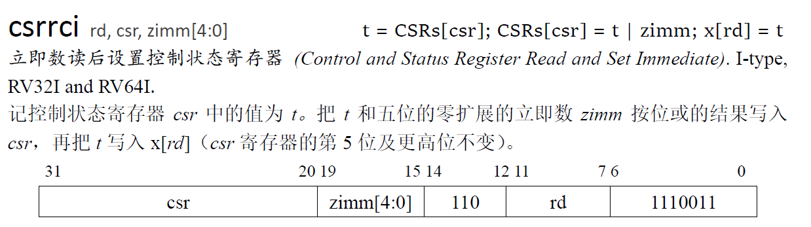

# lab 4分析与设计

lab 4要求为实现异常和中断机制：

- 需要实现 CSR 的 mstatus, mtvec, mip, mie, mscratch, mcause, mtval；选做：pmpcfg0, pmpaddr0
- 需要实现 mode 寄存器

## 一、增加的指令

对`csr`寄存器的说明：

`csr`是一组寄存器数据，表示全局的控制器状态，内含有多个功能域，根据寻址下标来判断指令需要读写的的功能域。地址位为12位，存在指令中的高12位。

对`mode`的说明：

`mode`同样为一个状态寄存器，字宽为2位，表示当前处理器的工作状态。

### 1、csrrw（I-type）


该指令需要实现两个操作：一是从`csr`寄存器中读取数据`CSRs[csr]`，写入`rd`号寄存器；二是读出`rs1`号寄存器，将该数据写入`csr`寄存器。

需要把旧的`csr`数据写入通用寄存器堆`regfile`的`rd`号数据，**该操作发生在写回阶段**，是一个正常的指令写回过程，decode时设置`dst`和`regwrite`，并将读到的`CSRs[csr]`作为srca传入execute并设置需要转发信号为0，避免转发；execute在得到后向后传递`regdata`最终在writeback写回。需要把通用寄存器`regfile`的`rs1`数据写入`CSRs`寄存器组，**该操作也发生在写回阶段**，执行阶段不仅计算需要写入通用寄存器堆的数据，同时也计算要写入控制状态寄存器的数据，向后传递并在`writeback`时交给`CSRs`（`CSRs`从`dataW`中读取输入端口数据），在下一个周期上升沿写入`CSRs`，该步需要decode产生`CSRs`的写使能和写入下标（12位）。

### 2、csrrs（I-type）


该指令需要实现两个操作：一是从`csr`寄存器中读取数据`CSRs[csr]`，写入`rd`号寄存器；二是读出`rs1`号寄存器，与旧的`csr`寄存器数据进行或运算后得到数据，将该数据写入`csr`寄存器。

需要把旧的`csr`数据写入通用寄存器堆`regfile`的`rd`号数据，**该操作发生在写回阶段**，是一个正常的指令写回过程，decode时设置`dst`和`regwrite`，并将读到的`CSRs[csr]`作为srca传入execute并设置需要转发信号为0，避免转发；execute在得到后向后传递`regdata`最终在writeback写回。需要把通用寄存器`regfile`的`rs1`数据处理后写入`CSRs`寄存器组，**该操作也发生在写回阶段**，decode时设置`csr_a`和`csr_b`，同时设置二者的转发信号（理论上只需要`csr_b`），执行阶段不仅计算需要写入通用寄存器堆的数据，同时也计算要写入控制状态寄存器的数据，向后传递并在`writeback`时交给`CSRs`（`CSRs`从`dataW`中读取输入端口数据），在下一个周期上升沿写入`CSRs`，该步需要decode产生`CSRs`的写使能和写入下标（12位）。

### 3、csrrc（I-type）


该指令需要实现两个操作：一是从`csr`寄存器中读取数据`CSRs[csr]`，写入`rd`号寄存器；二是读出`rs1`号寄存器，与旧的`csr`寄存器数据进行与运算后得到数据，将该数据写入`csr`寄存器。

需要把旧的`csr`数据写入通用寄存器堆`regfile`的`rd`号数据，**该操作发生在写回阶段**，是一个正常的指令写回过程，decode时设置`dst`和`regwrite`，并将读到的`CSRs[csr]`作为srca传入execute并设置需要转发信号为0，避免转发；execute在得到后向后传递`regdata`最终在writeback写回。需要把通用寄存器`regfile`的`rs1`数据处理后写入`CSRs`寄存器组，**该操作也发生在写回阶段**，decode时设置`csr_a`和`csr_b`，同时设置二者的转发信号（理论上只需要`csr_b`），执行阶段不仅计算需要写入通用寄存器堆的数据，同时也计算要写入控制状态寄存器的数据，向后传递并在`writeback`时交给`CSRs`（`CSRs`从`dataW`中读取输入端口数据），在下一个周期上升沿写入`CSRs`，该步需要decode产生`CSRs`的写使能和写入下标（12位）。

### 4、csrrwi（I-type）


该指令需要实现两个操作：一是从`csr`寄存器中读取数据`CSRs[csr]`，写入`rd`号寄存器；二是得到立即数immediate，将零扩展后的立即数写入`csr`寄存器。

需要同时处理两个寄存器（一个控制状态寄存器，一个通用寄存器）

需要把旧的`csr`数据写入通用寄存器堆`regfile`的`rd`号数据，**该操作发生在写回阶段**，是一个正常的指令写回过程，decode时设置`dst`和`regwrite`，并将读到的`CSRs[csr]`作为srca传入execute并设置需要转发信号为0，避免转发；execute在得到后向后传递`regdata`最终在writeback写回。需要把通用寄存器`regfile`的`rs1`数据处理后写入`CSRs`寄存器组，**该操作也发生在写回阶段**，decode时**添加堆`csr`指令的立即数译码**，设置`csr_a`和`csr_b`，同时设置二者的转发信号（理论上只需要`csr_b`），执行阶段进行无修改计算，向后传递并在`writeback`时交给`CSRs`（`CSRs`从`dataW`中读取输入端口数据），在下一个周期上升沿写入`CSRs`，该步需要decode产生`CSRs`的写使能和写入下标（12位）。

### 5、csrrsi（I-type）



该指令需要实现两个操作：一是从`csr`寄存器中读取数据`CSRs[csr]`，写入`rd`号寄存器；二是得到立即数immediate，将零扩展后的立即数与原来的数据进行或运算写入`csr`寄存器。

需要同时处理两个寄存器（一个控制状态寄存器，一个通用寄存器）

需要把旧的`csr`数据写入通用寄存器堆`regfile`的`rd`号数据，**该操作发生在写回阶段**，是一个正常的指令写回过程，decode时设置`dst`和`regwrite`，并将读到的`CSRs[csr]`作为srca传入execute并设置需要转发信号为0，避免转发；execute在得到后向后传递`regdata`最终在writeback写回。需要把通用寄存器`regfile`的`rs1`数据处理后写入`CSRs`寄存器组，**该操作也发生在写回阶段**，decode时**添加堆`csr`指令的立即数译码**，设置`csr_a`和`csr_b`，同时设置二者的转发信号（理论上只需要`csr_b`），执行阶段进行**或运算**计算，向后传递并在`writeback`时交给`CSRs`（`CSRs`从`dataW`中读取输入端口数据），在下一个周期上升沿写入`CSRs`，该步需要decode产生`CSRs`的写使能和写入下标（12位）。

### 6、csrrci（I-type）


该指令需要实现两个操作：一是从`csr`寄存器中读取数据`CSRs[csr]`，写入`rd`号寄存器；二是得到立即数immediate，将零扩展后的立即数与原来的数据进行与运算，然后写入`csr`寄存器。

需要同时处理两个寄存器（一个控制状态寄存器，一个通用寄存器）

需要把旧的`csr`数据写入通用寄存器堆`regfile`的`rd`号数据，**该操作发生在写回阶段**，是一个正常的指令写回过程，decode时设置`dst`和`regwrite`，并将读到的`CSRs[csr]`作为srca传入execute并设置需要转发信号为0，避免转发；execute在得到后向后传递`regdata`最终在writeback写回。需要把通用寄存器`regfile`的`rs1`数据处理后写入`CSRs`寄存器组，**该操作也发生在写回阶段**，decode时**添加堆`csr`指令的立即数译码**，设置`csr_a`和`csr_b`，同时设置二者的转发信号（理论上只需要`csr_b`），执行阶段进行无修改计算，向后传递并在`writeback`时交给`CSRs`（`CSRs`从`dataW`中读取输入端口数据），在下一个周期上升沿写入`CSRs`，该步需要decode产生`CSRs`的写使能和写入下标（12位）。

### 7、mret（R-type）


该指令实现从异常返回原指令位置，需要实现对控制状态的维护，包括：

```verilog
// 对csr外部状态的修改，在execute阶段执行
pc <- CSRs[mpec];							// 跳转到原来的位置，需要设置跳转信号与pc_nxt
mode <- CSRs[mstatus].mpp;					// 返回原来的处理器权限模式
// 对csr内部状态的修改，在writeback阶段执行
CSRs[mstatus].mie <- CSRs[mstatus].mpie;	// 设置回原来的全局中断状态
CSRs[mstatus].mpie <- 1'b1;
CSRs[mstatus].mpp <- 2'b0;						// 支持用户模式设置mpp为0
```

### 8、ecall（I-type）


该指令为直接引发进入异常，需要做两件事：更新`CSRs`寄存器内容；设置`pc`为异常处理程序入口。具体维护操作包括：

```verilog
// 设置跳转地址
pc_nxt <- CSRs[mtvec];
// 更新CSRs寄存器
CSRs[mepc] <- pc + 4;		// 设置返回地址
CSRs[mcause][63] <- 1 if interrupt else 0;
CSRs[mcause][62:0] <- code;		// 设置异常原因
CSRs[mpie] <- CSRs[mstatus].mie;// 保存处理异常前的全局中断使能
CSRs[mstatus].mie <- 0;			// 设置全局中断使能为0
mstatus.mpp <- mode;			// 保存处理异常前的权限模式
```

## 二、触发异常与中断

