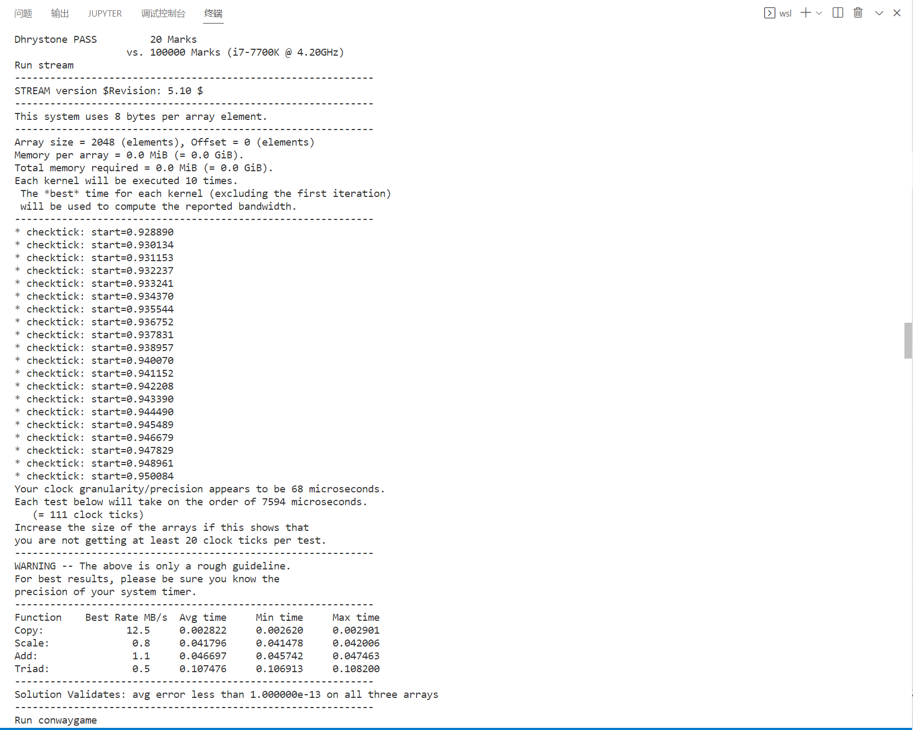
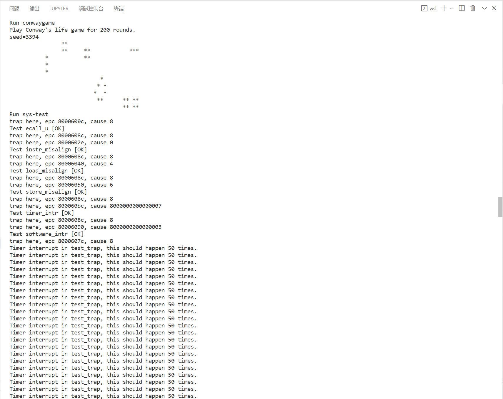
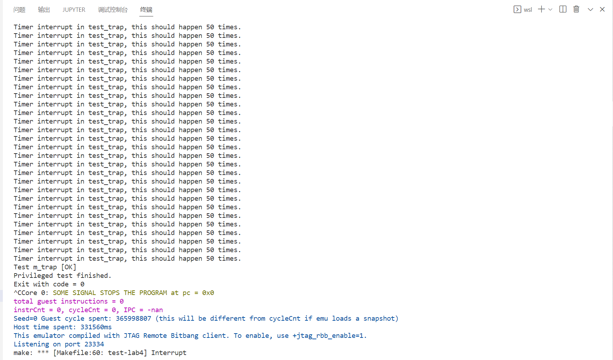

# lab 4实验报告

20302010043 苏佳迪

## 一、流水线的改动

为了支持异常处理，流水线做出以下调整：

### 1、csr指令支持

流水线需要支持`csrrw`等指令执行写入后刷新，刷新即清除当前流水线中的所有指令（流水寄存器`reset`），同时设置从`csr`指令的下一条开始执行（pc跳转）。具体实现为：

实现**刷新**：当`dataW.csrwrite`为高位时，说明当前指令需要写入`csr`，此时该周期需要把`fetch_decode`（清除下个周期译码段），`decode_execute`（清除下个周期执行段）`execute_memory`（清除下个周期访存段）与`memory_writeback`（清除下个周期写回段）寄存器的`reset`信号拉高，完成下个周期的流水线刷新。同时**当W阶段的指令为`csr`指令时，避免`memory`的访存操作，避免刷新前写入错误的数据**。

实现**pc的更新**：当`dataW.csrwrite`为高位时，预期为下个周期流水线被刷新，同时`fetch`阶段开始`dataW.pc + 4`的取指，也就是在当前周期就应该将`dataW.pc + 4`设置为`pcselect`，进行下个周期的pc更新，且这个选择的优先级要高于`dataE.addr`的跳转地址的，因为一个周期中，`pcselect`接收到的非顺序pc只有两个来源`execute`与`writeback`，前者只是普通的跳转，优先级最低。因此当同时出现`execute`与`writeback`的跳转pc请求，响应后者的。

同时有一种情况：当前周期`dataW.csrwrite`为高电位，说明下周期重新开始执行指令，但如果该周期`pc`还没有握手，下周期的pc不会更新，而`writeback`会流出流水线，就导致在fetch取指完成后无法成功跳到`dataW.pc + 4`的位置，所以如果要刷新流水线时的fetch还在取指令，就阻塞整个流水线（包括`writeback`）不让其流动，等到`iresp.data_ok`为1时不再阻塞，某个周期`data_ok`时，将阻塞信号置为0，下个周期`writeback`流出，同时`fetch`的pc更新为`dataW.pc + 4`完成流水线的刷新。

### 2、进入异常

异常会在每个流水段检测，当`dataW.exception`为高位时，说明该指令出现异常需要处理，此时该周期需要把`fetch_decode`（清除下个周期译码段），`decode_execute`（清除下个周期执行段）`execute_memory`（清除下个周期访存段）与`memory_writeback`（清除下个周期写回段）寄存器的`reset`信号拉高，完成下个周期的流水线刷新。同时**当W阶段的发生异常时，避免`memory`的访存操作，避免刷新前写入错误的数据**。

实现**pc的更新**：当`dataW.exception`为高位时，预期为下个周期流水线被刷新，同时`fetch`阶段开始`mtvec`的取指，也就是在当前周期就应该将`mtvec`设置为`pcselect`，进行下个周期的pc更新，且这个选择的优先级要高于`dataE.addr`的跳转地址与`csr + 4`的刷新地址，此时一个周期中，`pcselect`接收到的非顺序pc只有两个来源`execute`与`writeback`，前者只是普通的跳转，优先级最低，后者可能出现两个情况：`csr`指令导致的刷新（`dataW.pc + 4`）与发生异常导致的刷新（`mtvec`），后者优先级高。**但如果该周期`pc`还没有握手**，下周期的pc不会更新，而`writeback`会流出流水线，就导致在fetch取指完成后无法成功跳到`mtvec`的位置，所以如果要刷新流水线时的fetch还在取指令，就阻塞整个流水线（包括`writeback`）不让其流动，等到`iresp.data_ok`为1时不再阻塞，某个周期`data_ok`时，将阻塞信号置为0，下个周期`writeback`流出，同时`fetch`的pc更新为`mtvec`完成流水线的刷新。

### 3、离开异常

逻辑与进入异常相同，检测从`exception`改为`mret`。

### 4、响应中断

首先是中断与处理中断信号的检测：中断信号是由外部随机时刻到来的，到来后持续到该中断被处理。因此需要考虑中断处理信号的设置：中断处理信号即标志开始处理中断的信号，当某个周期该信号为高电位时，下个周期将进入中断处理。

中断处理信号：根据外部的中断信号与内部的流水线状态决定是否需要开始中断。当某个中断信号为1时，说明在流水线允许的状态下下个周期开始中断，需要刷新流水线。不能进入中断的情况有以下几种：

* 处理器全局中断使能未开启（`csr.mstatus.mie == 0`）

* 流水线不便于无法刷新（包括`ireq`和`dreq`未握手的情况，需要等待流水线访存的握手后再处理）

* 流水线W阶段的下条有效指令pc不便于确认，因为若下周期处理中断的话，当前W阶段的指令将是最后提交的一条指令，当中断处理结束后需要返回到下一条指令继续执行。有以下几种情况：（1）`dataW.instruction`无效，需要等待有效的下个周期再处理中断；（2）流水线中的指令为错误指令，即存在跳转的情况，包括`jal`等指令的执行阶段跳转与更新csr导致的写回阶段跳转，则等待跳转完成后再处理中断，（此时也可以更新pc但需要需要设置`mepc`为跳转的目标地址，但似乎不太方便，若有异常除外）。

## 二、测试通过截图

